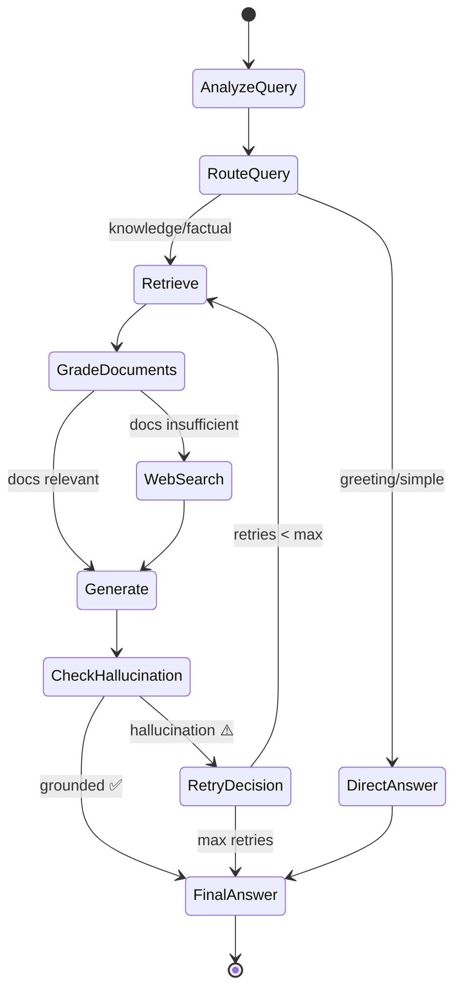
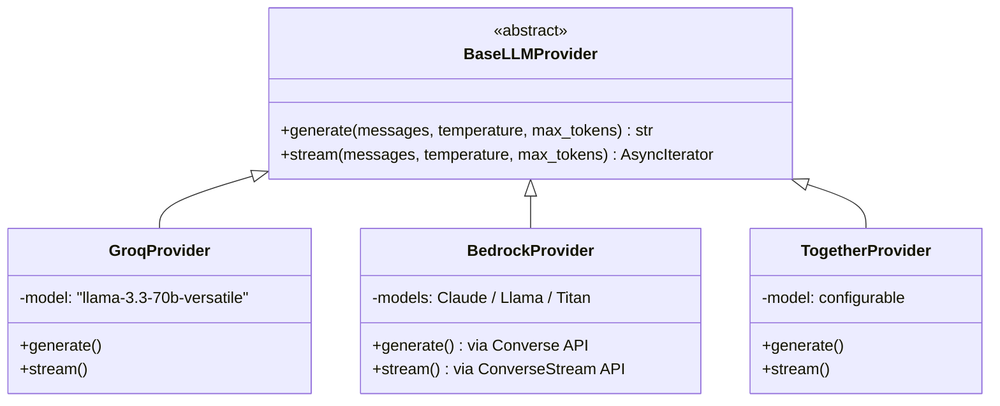
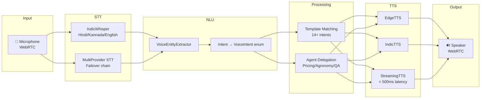
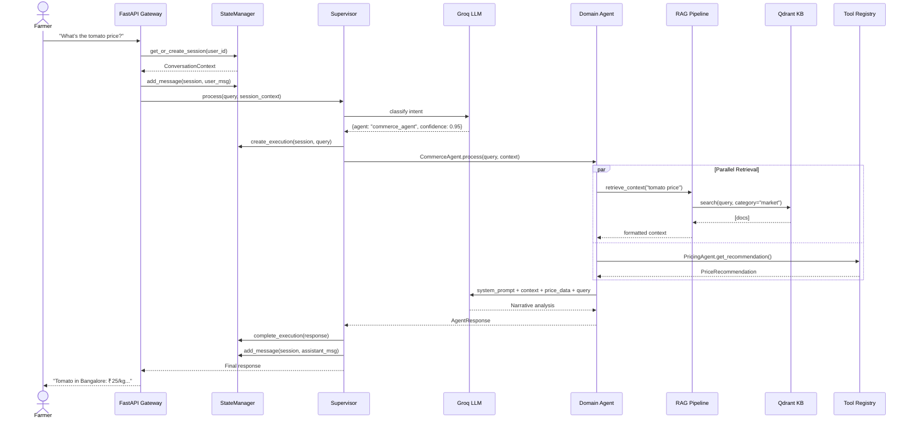
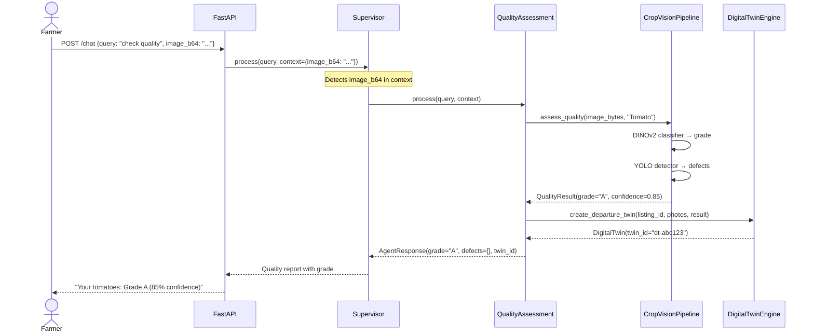
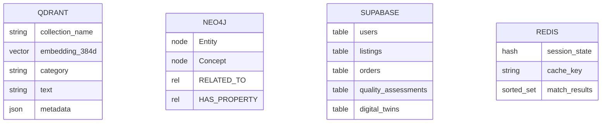

# CropFresh AI — Complete System Design

> **Date:** 2026-03-04  
> **Version:** 2.0.0  
> **Author:** CropFresh AI Team  
> **Status:** Audit + Redesign — Gaps Identified & Fix Planned

---

## 1. Executive Summary

CropFresh AI is a multi-agent RAG platform that connects Karnataka farmers with buyers using AI-powered intelligence. The system comprises **19 specialized agents**, a **3-technique RAG pipeline**, **multi-provider LLM support**, **16+ tools**, and a **voice-first interface** supporting Hindi, Kannada, and English.

### Current State (As-Is)

| Component         | Status                                                  |
| ----------------- | ------------------------------------------------------- |
| Agents Built      | 19 agents implemented across `src/agents/`              |
| Agents Wired      | ❌ **0 agents registered** in `main.py` lifespan        |
| Memory Management | ❌ `AgentStateManager` exists but **not instantiated**  |
| Tool Registry     | ❌ `ToolRegistry` exists but **not created** at startup |
| Knowledge Base    | ⚠️ Only `KnowledgeAgent` connects to Qdrant, not shared |
| Multi-Modal Input | ❌ No photo routing to QualityAssessment                |
| Voice Pipeline    | ✅ STT/TTS/VAD functional (separate WebSocket path)     |

### Target State (To-Be)

All 15 routable agents wired via `agent_registry.py` factory, shared `AgentStateManager` for memory, shared `ToolRegistry` + `KnowledgeBase`, multi-modal input routing (text + voice + photo).

---

## 2. High-Level Architecture

```mermaid
graph TB
    subgraph "User Interfaces"
        WEB["🌐 Web Chat UI"]
        VOICE["🎤 Voice WebRTC"]
        WHATSAPP["📱 WhatsApp Bot"]
        API["⚡ REST API"]
        PHOTO["📷 Photo Upload"]
    end

    subgraph "Gateway Layer"
        FASTAPI["FastAPI Server<br/>src/api/main.py"]
        WS["WebSocket Endpoint"]
    end

    subgraph "Orchestration Layer"
        SUPERVISOR["🧠 Supervisor Agent<br/>Intent Router"]
        REGISTRY["Agent Registry<br/>15 agents wired"]
        STATE["AgentStateManager<br/>Redis + In-Memory"]
    end

    subgraph "Core Domain Agents"
        AGRO["🌱 Agronomy"]
        COMMERCE["💰 Commerce"]
        PLATFORM["📱 Platform"]
        GENERAL["👋 General"]
        PRICING["📊 Pricing DPLE"]
        KNOWLEDGE["📚 Knowledge RAG"]
    end

    subgraph "Specialized Agents"
        QA["📷 Quality Assessment"]
        BM["🤝 Buyer Matching"]
        PP["📈 Price Prediction"]
        CL["📋 Crop Listing"]
        ADCL["🌾 ADCL Engine"]
        LR["🚚 Logistics Router"]
        RESEARCH["🔍 Research"]
        SCRAPER["🕷️ Web Scraping"]
        BROWSER["🌐 Browser"]
    end

    subgraph "RAG Pipeline"
        RAG_GRAPH["LangGraph RAG<br/>Adaptive + CRAG + Self-RAG"]
        KB["Knowledge Base<br/>Qdrant Vector DB"]
        EMBED["Embeddings<br/>all-MiniLM-L6-v2"]
    end

    subgraph "Tools Layer"
        TOOLS["Tool Registry"]
        AGMARK["Agmarknet Scraper"]
        ENAM["eNAM Client"]
        WEATHER["IMD Weather"]
        NEWS["News Sentiment"]
        ML["ML Forecaster"]
        DEEP["Deep Research"]
    end

    subgraph "LLM Providers"
        LLM["LLM Provider<br/>Abstraction Layer"]
        GROQ["Groq<br/>Llama-3.3-70B"]
        BEDROCK["AWS Bedrock<br/>Claude / Titan"]
        TOGETHER["Together AI<br/>Backup"]
    end

    subgraph "Data Stores"
        QDRANT["Qdrant Cloud"]
        NEO4J["Neo4j Graph DB"]
        SUPABASE["Supabase PostgreSQL"]
        REDIS["Redis Cache"]
    end

    subgraph "Voice Pipeline"
        STT["STT: IndicWhisper"]
        TTS["TTS: Edge/Indic"]
        VAD["Silero VAD"]
        VOICE_AG["Voice Agent"]
    end

    WEB & WHATSAPP & API --> FASTAPI
    PHOTO --> FASTAPI
    VOICE --> WS
    FASTAPI --> SUPERVISOR
    WS --> VOICE_AG
    SUPERVISOR --> REGISTRY
    REGISTRY --> STATE
    SUPERVISOR --> AGRO & COMMERCE & PLATFORM & GENERAL & PRICING & KNOWLEDGE
    SUPERVISOR --> QA & BM & PP & CL & ADCL & LR & RESEARCH & SCRAPER & BROWSER
    AGRO & COMMERCE & PLATFORM & KNOWLEDGE --> KB
    KB --> QDRANT
    PRICING --> AGMARK & ML & WEATHER & NEWS
    RAG_GRAPH --> KB & EMBED
    KNOWLEDGE --> RAG_GRAPH
    LLM --> GROQ & BEDROCK & TOGETHER
    VOICE_AG --> STT & TTS & VAD
    TOOLS --> AGMARK & ENAM & WEATHER & NEWS & ML & DEEP
    RESEARCH --> DEEP & KB & NEO4J
```



---

## 3. Agent Catalog — All 19 Agents

### 3.1 Core Domain Agents (BaseAgent Subclasses)

#### 3.1.1 Supervisor Agent — _The Router_

| Property     | Value                                                            |
| ------------ | ---------------------------------------------------------------- |
| **File**     | `src/agents/supervisor_agent.py`                                 |
| **Role**     | Central orchestrator — analyzes queries, routes to domain agents |
| **LLM**      | ✅ Intent classification (temp=0.1 for consistency)              |
| **RAG**      | ❌ Delegates to child agents                                     |
| **Fallback** | Rule-based keyword routing when LLM unavailable                  |

**Routing mechanism:**

1. LLM classifies intent → `RoutingDecision(agent_name, confidence, reasoning)`
2. Multi-agent support: `requires_multiple=True` + `secondary_agents` for cross-domain queries
3. Session context injected from `AgentStateManager` for conversation continuity
4. **NEW (planned):** Photo detection in context → auto-route to `quality_assessment_agent`

**Currently routes to (in prompt):** agronomy, commerce, platform, general, web_scraping, browser, research, buyer_matching, quality_assessment

**Missing from routing (GAP):** adcl, price_prediction, crop_listing, logistics, knowledge, voice

---

#### 3.1.2 Agronomy Agent

| Property          | Value                                                          |
| ----------------- | -------------------------------------------------------------- |
| **File**          | `src/agents/agronomy_agent.py`                                 |
| **Role**          | Crop cultivation, pest management, soil health, irrigation     |
| **LLM**           | ✅ `generate_with_llm()` — Groq Llama-3.3-70B                  |
| **RAG**           | ✅ `retrieve_context(query, categories=["agronomy", "crops"])` |
| **KB Categories** | agronomy, crops, pest_management, soil, irrigation             |

**Data flow:**

```
Query → retrieve_context(KB, categories) → format docs → system_prompt + context + query → LLM → AgentResponse
```

---

#### 3.1.3 Commerce Agent

| Property  | Value                                                      |
| --------- | ---------------------------------------------------------- |
| **File**  | `src/agents/commerce_agent.py`                             |
| **Role**  | Market prices, sell/hold recommendations, AISP calculation |
| **LLM**   | ✅ Narrative analysis                                      |
| **RAG**   | ✅ `retrieve_context(categories=["market", "commerce"])`   |
| **Tools** | PricingAgent for real-time mandi prices                    |

**Data flow:**

```
Query → extract entities → PricingAgent.get_recommendation() + KB docs → LLM narrative → AgentResponse
```

---

#### 3.1.4 Platform Agent

| Property | Value                                                            |
| -------- | ---------------------------------------------------------------- |
| **File** | `src/agents/platform_agent.py`                                   |
| **Role** | CropFresh app features, registration, orders, FAQs               |
| **LLM**  | ✅ Response generation                                           |
| **RAG**  | ✅ `retrieve_context(categories=["platform", "general", "faq"])` |

---

#### 3.1.5 General Agent — _Fallback_

| Property    | Value                                                        |
| ----------- | ------------------------------------------------------------ |
| **File**    | `src/agents/general_agent.py`                                |
| **Role**    | Greetings, general questions, unclear intents                |
| **LLM**     | ✅ Higher temperature (0.8) for conversational tone          |
| **RAG**     | ❌ No retrieval — LLM only                                   |
| **Special** | Handles "hello", "thanks", "bye" without LLM (keyword match) |

---

#### 3.1.6 Pricing Agent (DPLE)

| Property | Value                                                |
| -------- | ---------------------------------------------------- |
| **File** | `src/agents/pricing_agent.py`                        |
| **Role** | Real-time dynamic pricing with multi-signal analysis |
| **LLM**  | ✅ `_llm_analysis()` — rich signal-aware prompt      |
| **RAG**  | ❌ Uses live data tools (not KB)                     |

**4-Signal concurrent pipeline:**

```
asyncio.gather(
  ① Agmarknet live mandi prices      → current price anchor
  ② ML Forecaster (historical)       → 3/7/14-day forecast
  ③ IMD Weather forecast             → supply disruption signals
  ④ News Sentiment scraper           → demand shock indicators
) → heuristic AISP + LLM analysis → PriceRecommendation
```

---

#### 3.1.7 Knowledge Agent — _RAG Gateway_

| Property | Value                                                         |
| -------- | ------------------------------------------------------------- |
| **File** | `src/agents/knowledge_agent.py`                               |
| **Role** | High-level interface to full agentic RAG pipeline             |
| **LLM**  | ✅ Via RAG graph pipeline                                     |
| **RAG**  | ✅ Direct — calls `run_agentic_rag()` from `src/rag/graph.py` |

Primary entry point to the LangGraph-based RAG workflow.

---

#### 3.1.8 Voice Agent

| Property       | Value                                                               |
| -------------- | ------------------------------------------------------------------- |
| **File**       | `src/agents/voice_agent.py` (1040 lines)                            |
| **Role**       | Voice-first interface for illiterate farmers                        |
| **LLM**        | ✅ For complex responses after template matching                    |
| **RAG**        | ❌ Routes to other agents that have RAG                             |
| **Sub-agents** | PricingAgent, AgronomyAgent, QualityAgent, BuyerMatchingAgent, ADCL |

**Voice processing pipeline:**

```
🎤 Audio → STT (IndicWhisper / MultiProvider) → Text
  → VoiceEntityExtractor → VoiceIntent enum (14+ intents)
  → Intent Handler (template-based or agent delegation)
  → Response Text → TTS (EdgeTTS / IndicTTS) → 🔊 Audio
```

**Supported intents:**
`create_listing`, `check_price`, `track_order`, `my_listings`, `find_buyer`, `check_weather`, `get_advisory`, `register`, `dispute_status`, `quality_check`, `greeting`, `help`, `farewell`, `unknown`

---

#### 3.1.9 Web Scraping Agent

| Property    | Value                                                |
| ----------- | ---------------------------------------------------- |
| **File**    | `src/agents/web_scraping_agent.py`                   |
| **Role**    | Intelligent web scraping with LLM-powered extraction |
| **LLM**     | ✅ Schema-based structured data extraction           |
| **Modes**   | Markdown, CSS selector, LLM + Pydantic schema        |
| **Stealth** | Anti-detection headers, random delays                |

---

#### 3.1.10 Browser Agent

| Property | Value                                                 |
| -------- | ----------------------------------------------------- |
| **File** | `src/agents/browser_agent.py`                         |
| **Role** | Stealth browser automation for authenticated scraping |
| **LLM**  | ❌ Pure automation                                    |
| **Tech** | Playwright with anti-detection stealth                |

---

### 3.2 Modular Agents (Subdirectory Pattern)

Each follows: `agent.py` + supporting modules (`engine.py`, `models.py`, etc.)

#### 3.2.1 Quality Assessment Agent (CV-QG)

| Property        | Value                                                                      |
| --------------- | -------------------------------------------------------------------------- |
| **Directory**   | `src/agents/quality_assessment/`                                           |
| **Files**       | `agent.py`, `vision_models.py`, `dinov2_classifier.py`, `yolo_detector.py` |
| **LLM**         | ✅ Grade explanation                                                       |
| **Vision**      | ✅ DINOv2 classifier + YOLO detector                                       |
| **Integration** | Digital Twin Engine for departure/arrival comparison                       |

**Assessment flow:**

```
Photo (base64) → CropVisionPipeline
  → DINOv2 classifier → grade (A+/A/B/C)
  → YOLO detector → defect detection
  → Confidence check → HITL flag if < 0.7
  → DigitalTwinEngine.create_departure_twin()
  → GradeAssessment + QualityReport
```

**HITL triggers:** confidence < 0.7, A+ grade (requires verification), farmer upgrade request

---

#### 3.2.2 Buyer Matching Agent

| Property      | Value                                  |
| ------------- | -------------------------------------- |
| **Directory** | `src/agents/buyer_matching/`           |
| **Files**     | `agent.py` (570 lines)                 |
| **LLM**       | ✅ Match analysis                      |
| **Engine**    | `MatchingEngine` with 5-factor scoring |

**Matching factors (weighted):**

```
proximity     (0.30) — Haversine distance with exponential decay
quality       (0.25) — Grade alignment (A+/A/B/C ordering)
price_fit     (0.20) — Price alignment with overshoot penalty
demand_signal (0.15) — Frequency + recency from order history
reliability   (0.10) — Farmer reliability score
```

---

#### 3.2.3 Price Prediction Agent

| Property      | Value                                  |
| ------------- | -------------------------------------- |
| **Directory** | `src/agents/price_prediction/`         |
| **Files**     | `agent.py` (514 lines)                 |
| **LLM**       | ✅ Narrative analysis + LLM fallback   |
| **Tools**     | AgmarknetTool for 90-day price history |

**Prediction pipeline:**

```
Fetch 90-day history → Extract features (moving averages, momentum, seasonal multiplier)
  → Rule-based: 7d_avg × seasonal_mult × momentum_factor
  → Linear regression trend analysis (14-day)
  → Sell/hold recommendation from delta thresholds
  → PricePrediction with 7d + 30d forecasts
```

**Seasonal calendar:** Tomato, Onion, Potato, Cauliflower, Carrot, Okra — monthly multipliers for Karnataka.

---

#### 3.2.4 Crop Listing Agent

| Property      | Value                                                     |
| ------------- | --------------------------------------------------------- |
| **Directory** | `src/agents/crop_listing/`                                |
| **Files**     | `agent.py` (342 lines)                                    |
| **LLM**       | ✅ Optional (works without)                               |
| **Intents**   | create_listing, my_listings, cancel_listing, update_price |

**Entity extraction:** Supports Hindi/Kannada aliases (tamatar→Tomato, pyaaz→Onion, eerulli→Onion, aloo→Potato, bhindi→Okra, etc.)

---

#### 3.2.5 ADCL Engine (Adaptive Demand Crop Lifecycle)

| Property       | Value                                                                            |
| -------------- | -------------------------------------------------------------------------------- |
| **Directory**  | `src/agents/adcl/`                                                               |
| **Files**      | `engine.py`, `demand.py`, `scoring.py`, `seasonal.py`, `summary.py`, `models.py` |
| **Interface**  | ⚠️ Standalone engine — NOT a BaseAgent subclass                                  |
| **LLM**        | ✅ `summary.py` uses LLM for farmer-friendly output                              |
| **Fix Needed** | Wrapper agent to bridge into BaseAgent.process()                                 |

**Weekly report flow:**

```
Fetch 90-day buyer orders → aggregate_demand() → score_and_label()
  → seasonal sowing window check → price_agent.predict()
  → SummaryGenerator (LLM or template) → WeeklyReport
```

---

#### 3.2.6 Logistics Router (DPLE)

| Property       | Value                                                                                      |
| -------------- | ------------------------------------------------------------------------------------------ |
| **Directory**  | `src/agents/logistics_router/`                                                             |
| **Files**      | `engine.py`, `clustering.py`, `routing.py`, `cost.py`, `geo.py`, `vehicle.py`, `models.py` |
| **Interface**  | ⚠️ Standalone engine — NOT a BaseAgent subclass                                            |
| **LLM**        | ❌ Pure computational                                                                      |
| **Fix Needed** | Wrapper agent to bridge into BaseAgent.process()                                           |

**Route optimization:**

```
Pickup points → HDBSCAN clustering (min_cluster_size=2)
  → TSP solver (greedy) → Vehicle assignment by weight
  → Cost calculation with deadhead factor
  → RouteResult ranked by cost_per_kg (target < ₹2.5/kg)
```

---

#### 3.2.7 Digital Twin Engine

| Property      | Value                                                                         |
| ------------- | ----------------------------------------------------------------------------- |
| **Directory** | `src/agents/digital_twin/`                                                    |
| **Files**     | `engine.py`, `diff_analysis.py`, `liability.py`, `similarity.py`, `models.py` |
| **LLM**       | ❌ Pure computational                                                         |
| **Used By**   | QualityAssessmentAgent for departure/arrival comparison                       |

---

#### 3.2.8 Research Agent

| Property      | Value                                                                                                       |
| ------------- | ----------------------------------------------------------------------------------------------------------- |
| **Directory** | `src/agents/research/`                                                                                      |
| **Files**     | `research_agent.py`, `planner.py`, `source_discovery.py`, `verifier.py`, `citation_manager.py`, `memory.py` |
| **LLM**       | ✅ Planning, synthesis, verification                                                                        |
| **RAG**       | ✅ KnowledgeBase + Neo4j graph                                                                              |

---

#### 3.2.9 WhatsApp Bot Agent

| Property      | Value                                              |
| ------------- | -------------------------------------------------- |
| **Directory** | `src/agents/whatsapp_bot/`                         |
| **Status**    | ⚠️ Scaffold only (minimal `agent.py` at 480 bytes) |

---

## 4. RAG Pipeline Architecture

### 4.1 Core RAG Graph — `src/rag/graph.py`

Built with **LangGraph**, implementing a 3-technique hybrid pipeline:



### RAG Techniques Used

| Stage                      | Technique                 | Purpose                                                      |
| -------------------------- | ------------------------- | ------------------------------------------------------------ |
| `analyze_query_node`       | **Adaptive RAG**          | Classify query type, determine if retrieval needed           |
| `retrieve_node`            | Vector Search             | Fetch top-K docs from Qdrant via `KnowledgeBase.search()`    |
| `grade_documents_node`     | **Corrective RAG (CRAG)** | Grade document relevance, trigger web search if insufficient |
| `web_search_node`          | CRAG Fallback             | Web search when KB docs don't answer the query               |
| `generate_node`            | Generation                | Build context + system prompt → LLM generation               |
| `check_hallucination_node` | **Self-RAG**              | Verify answer is grounded in source documents                |
| `direct_answer_node`       | Bypass                    | Simple queries skip retrieval entirely                       |

### 4.2 Knowledge Base — `src/rag/knowledge_base.py`

| Property       | Value                                                             |
| -------------- | ----------------------------------------------------------------- |
| **Vector DB**  | Qdrant Cloud                                                      |
| **Embeddings** | `all-MiniLM-L6-v2` (384-dim)                                      |
| **Categories** | agronomy, crops, market, commerce, platform, faq, pest_management |
| **Search**     | Semantic similarity with category filtering                       |
| **Ingestion**  | Document chunking → embedding → upsert to Qdrant                  |

### 4.3 Advanced Agentic Orchestrator — `ai/rag/agentic_orchestrator.py`

A more sophisticated RAG pipeline (ADR-007) with:

| Component                  | Role                                                                               |
| -------------------------- | ---------------------------------------------------------------------------------- |
| **RetrievalPlanner**       | LLM-powered tool execution planner (Llama-3.1-8B-Instant)                          |
| **SpeculativeDraftEngine** | Parallel speculative generation — N drafts from doc subsets, verifier selects best |
| **AgenticSelfEvaluator**   | Confidence gating with faithfulness + relevance scores                             |

---

## 5. LLM Provider Architecture



| Provider        | Environment | Default Model             | Region       |
| --------------- | ----------- | ------------------------- | ------------ |
| **Groq**        | Development | `llama-3.3-70b-versatile` | —            |
| **Bedrock**     | Production  | `claude-sonnet`           | `ap-south-1` |
| **Together AI** | Backup      | Configurable              | —            |

**File:** `src/orchestrator/llm_provider.py`

---

## 6. Memory & State Management

**File:** `src/memory/state_manager.py`

### 6.1 Session Model

```python
ConversationContext:
  session_id: str
  user_id: Optional[str]
  messages: list[Message]          # Conversation history
  entities: dict[str, Any]         # Extracted entities (commodity, location, etc.)
  user_profile: dict[str, Any]     # Farmer/buyer, location, preferences
  current_agent: Optional[str]     # Currently active agent
  agent_stack: list[str]           # Agent delegation chain
  total_input_tokens: int          # Cost tracking
  total_output_tokens: int
```

### 6.2 Execution Tracking

```python
AgentExecutionState:
  execution_id: str
  session_id: str
  original_query: str
  selected_agent: str              # Which agent was routed to
  routing_confidence: float
  documents: list[dict]            # Retrieved RAG docs
  tool_results: list[dict]         # Tool execution results
  intermediate_thoughts: list[str] # Chain-of-thought
  grounding_score: float           # Quality metrics
  steps_executed: list[str]        # Full execution trace
```

### 6.3 Storage Strategy

| Feature                  | Implementation                                       |
| ------------------------ | ---------------------------------------------------- |
| **Primary**              | Redis (`redis.asyncio`) with 24-hour TTL             |
| **Fallback**             | In-memory `dict` when Redis unavailable              |
| **Windowing**            | Max 50 messages per session, FIFO eviction           |
| **Conversation Summary** | Last 10 messages formatted for LLM context injection |

### 6.4 Current Gap ❌

The `AgentStateManager` is **never instantiated** in `main.py`. No session tracking occurs. Agents process queries statelessly.

---

## 7. Tools Ecosystem

**File:** `src/tools/registry.py`

| Tool              | File                 | Category | Description                                   |
| ----------------- | -------------------- | -------- | --------------------------------------------- |
| Agmarknet Scraper | `agmarknet.py`       | commerce | Live APMC mandi prices                        |
| eNAM Client       | `enam_client.py`     | commerce | National electronic market data               |
| ML Forecaster     | `ml_forecaster.py`   | commerce | Historical price prediction with seasonality  |
| AISP Calculator   | `calculator.py`      | commerce | AI-Suggested Price calculation                |
| Weather (IMD)     | `imd_weather.py`     | agronomy | India Meteorological Department forecasts     |
| Weather           | `weather.py`         | agronomy | General weather data                          |
| News Sentiment    | `news_sentiment.py`  | commerce | Commodity news sentiment analysis             |
| Web Search        | `web_search.py`      | general  | General web search                            |
| Deep Research     | `deep_research.py`   | research | Multi-URL map-reduce analysis (10-15 sources) |
| Agri Scrapers     | `agri_scrapers.py`   | agronomy | Agricultural data scrapers                    |
| Browser Stealth   | `browser_stealth.py` | infra    | Anti-detection browser configuration          |
| Google AMED       | `google_amed.py`     | commerce | Google agricultural market data               |
| Realtime Data     | `realtime_data.py`   | commerce | Real-time market feeds                        |
| Session Manager   | `session_manager.py` | infra    | User session management                       |

### Tool Registry Pattern

```python
registry = ToolRegistry()
registry.register("agmarknet", AgmarknetTool(), category="commerce")

# Agents access tools via:
result = await agent.use_tool("agmarknet", commodity="Tomato", state="Karnataka")

# LLM tool-use schemas generated via:
schemas = registry.get_tool_schemas(categories=["commerce"])  # OpenAI function format
```

---

## 8. Voice Pipeline



### Voice Components

| Component        | File                             | Purpose                                  |
| ---------------- | -------------------------------- | ---------------------------------------- |
| VoiceAgent       | `src/agents/voice_agent.py`      | Orchestrator (1040 lines)                |
| STT              | `src/voice/stt.py`               | Speech-to-text (25KB)                    |
| TTS              | `src/voice/tts.py`               | Text-to-speech (16KB)                    |
| StreamingTTS     | `src/voice/streaming_tts.py`     | Low-latency streaming (13KB)             |
| VAD              | `src/voice/vad.py`               | Voice Activity Detection — Silero (18KB) |
| DuplexPipeline   | `src/voice/duplex_pipeline.py`   | Full-duplex with barge-in (18KB)         |
| WebRTC           | `src/voice/webrtc_transport.py`  | Real-time transport (17KB)               |
| EntityExtractor  | `src/voice/entity_extractor/`    | NLU — entity + intent (7 files)          |
| Pipecat          | `src/voice/pipecat/`             | Pipecat framework integration            |
| GroqStreaming    | `src/voice/groq_streaming.py`    | Streaming LLM for voice (12KB)           |
| BedrockStreaming | `src/voice/bedrock_streaming.py` | AWS Bedrock streaming (11KB)             |

---

## 9. Agent Connection Matrix

| Agent             | RAG          | LLM               | Tools            | Vision         | Memory     | DB       |
| ----------------- | ------------ | ----------------- | ---------------- | -------------- | ---------- | -------- |
| **Supervisor**    | ❌           | ✅ routing        | ❌               | ❌             | ✅ session | —        |
| **Agronomy**      | ✅ Qdrant    | ✅ gen            | ⚠️ weather       | ❌             | ❌ gap     | —        |
| **Commerce**      | ✅ Qdrant    | ✅ narrative      | ✅ Pricing       | ❌             | ❌ gap     | —        |
| **Platform**      | ✅ Qdrant    | ✅ gen            | ❌               | ❌             | ❌ gap     | —        |
| **General**       | ❌           | ✅ conversational | ❌               | ❌             | ❌ gap     | —        |
| **Pricing**       | ❌           | ✅ analysis       | ✅ 4 signals     | ❌             | ❌ gap     | —        |
| **Knowledge**     | ✅ Full RAG  | ✅ pipeline       | ✅ web search    | ❌             | ❌ gap     | Qdrant   |
| **Voice**         | ❌ delegates | ✅ fallback       | ❌               | ❌             | ❌ gap     | —        |
| **Quality**       | ❌           | ✅ grading        | ❌               | ✅ DINOv2+YOLO | ❌ gap     | —        |
| **Buyer Match**   | ❌           | ✅ scoring        | ❌               | ❌             | ✅ Redis   | —        |
| **Price Predict** | ❌           | ✅ narrative      | ✅ Agmarknet     | ❌             | ❌ gap     | —        |
| **Crop Listing**  | ❌           | ✅ optional       | ❌               | ❌             | ❌ gap     | Supabase |
| **Digital Twin**  | ❌           | ❌                | ❌               | ❌             | ❌         | —        |
| **Logistics**     | ❌           | ❌                | ❌               | ❌             | ❌         | —        |
| **ADCL**          | ❌           | ✅ summary        | ❌               | ❌             | ❌ gap     | Supabase |
| **Research**      | ✅ KB+Neo4j  | ✅ synthesis      | ✅ deep research | ❌             | ❌ gap     | Neo4j    |
| **Browser**       | ❌           | ❌                | ❌               | ❌             | ❌         | —        |
| **Web Scraping**  | ❌           | ✅ extraction     | ❌               | ❌             | ❌         | —        |
| **WhatsApp**      | —            | —                 | —                | —              | —          | scaffold |

---

## 10. Data Flow: Complete Query Lifecycle



### Multi-Modal Input Flow (Photo)



---

## 11. BaseAgent Inheritance Pattern

All domain agents follow this contract from `src/agents/base_agent.py`:

```python
class DomainAgent(BaseAgent):
    def __init__(self, llm, tool_registry, state_manager, knowledge_base):
        config = AgentConfig(
            name="domain_agent",
            description="...",
            kb_categories=["category1"],     # RAG filter
            tool_categories=["commerce"],    # Tool access
            temperature=0.5,
            max_tokens=800,
        )
        super().__init__(config, llm, tool_registry, state_manager, knowledge_base)

    def _get_system_prompt(self, context=None) -> str:
        return "Domain-specific system prompt..."

    async def process(self, query, context=None, execution=None) -> AgentResponse:
        # 1. RAG retrieval
        docs = await self.retrieve_context(query)

        # 2. Tool usage (optional)
        tool_result = await self.use_tool("tool_name", param1="value")

        # 3. LLM generation
        messages = [
            {"role": "system", "content": self._get_system_prompt()},
            {"role": "user", "content": f"Context: {docs}\n\nQuery: {query}"}
        ]
        answer = await self.generate_with_llm(messages)

        return AgentResponse(content=answer, agent_name=self.name, ...)
```

---

## 12. Database Architecture



| Database                  | Purpose                     | Used By                                  |
| ------------------------- | --------------------------- | ---------------------------------------- |
| **Qdrant Cloud**          | Vector embeddings for RAG   | KnowledgeBase, all RAG-enabled agents    |
| **Neo4j**                 | Entity/concept graph        | ResearchAgent for relationship queries   |
| **Supabase (PostgreSQL)** | Primary relational data     | CropListing, Orders, Users, ADCL reports |
| **Redis**                 | Session cache + match cache | AgentStateManager, BuyerMatchingAgent    |

---

## 13. Identified Gaps & Resolution Plan

### Critical Gaps

| #   | Gap                                   | Impact                                                                   | Fix                                         |
| --- | ------------------------------------- | ------------------------------------------------------------------------ | ------------------------------------------- |
| 1   | **Zero agents registered at startup** | Supervisor routes to nothing — all queries fail                          | Create `agent_registry.py` factory          |
| 2   | **No AgentStateManager instantiated** | No conversation memory, no session tracking                              | Initialize in lifespan, share to all agents |
| 3   | **No ToolRegistry created**           | Agents can't use tools (Agmarknet, Weather, etc.)                        | Initialize in registry, share to all agents |
| 4   | **KnowledgeBase not shared**          | Only KnowledgeAgent has Qdrant access                                    | Pass KB to all RAG-enabled agents           |
| 5   | **ADCL/Logistics not BaseAgent**      | Can't be routed by Supervisor                                            | Create wrapper agents                       |
| 6   | **6 agents missing from routing**     | ADCL, PricePredict, CropListing, Logistics, Knowledge, Voice unreachable | Update routing prompt + keywords            |
| 7   | **No photo input routing**            | QualityAssessment agent unreachable for images                           | Add image detection in Supervisor.process() |

### Resolution Architecture

```
main.py lifespan
  ├── create LLM provider (existing ✅)
  ├── create KnowledgeAgent (existing ✅)
  ├── NEW: create AgentStateManager(redis_url)
  ├── NEW: create ToolRegistry + register tools
  ├── NEW: create_agent_system(llm, kb, state_mgr, tools)
  │     ├── instantiate ALL 15 agents with shared deps
  │     ├── register each with SupervisorAgent
  │     └── return fully-wired supervisor
  └── store supervisor + state_manager on app.state
```

---

## 14. Tech Stack Summary

```
┌────────────────────────────────────────────────────┐
│  Frontend: Web Chat + Voice WebRTC + WhatsApp      │
│           + Photo Upload (multi-modal)             │
├────────────────────────────────────────────────────┤
│  API: FastAPI + WebSocket + CORS + API Key Auth    │
├────────────────────────────────────────────────────┤
│  Orchestration: SupervisorAgent (LangGraph)        │
│  Memory: AgentStateManager (Redis / In-Memory)     │
│  Tools: ToolRegistry (16+ tools)                   │
├────────────────────────────────────────────────────┤
│  Agents: 19 total                                  │
│  ├── 10 standalone (BaseAgent subclasses)          │
│  ├── 5 modular (subdirectory, BaseAgent)           │
│  ├── 2 standalone engines (+ wrapper agents)       │
│  ├── 1 scaffold (WhatsApp)                         │
│  └── 1 voice-only (WebSocket path)                 │
├────────────────────────────────────────────────────┤
│  RAG: LangGraph pipeline                           │
│  ├── Adaptive RAG (query routing)                  │
│  ├── Corrective RAG (doc grading + web fallback)   │
│  └── Self-RAG (hallucination checking)             │
├────────────────────────────────────────────────────┤
│  LLM: Groq / Bedrock / Together AI                │
│  Models: Llama-3.3-70B, Claude, Titan             │
├────────────────────────────────────────────────────┤
│  Vision: DINOv2 + YOLO (quality grading)           │
├────────────────────────────────────────────────────┤
│  Voice: STT(Whisper) + TTS(Edge/Indic) + VAD      │
│         + WebRTC + Pipecat + Full-Duplex + Barge-In│
├────────────────────────────────────────────────────┤
│  Data: Qdrant + Neo4j + Supabase + Redis           │
├────────────────────────────────────────────────────┤
│  Observability: OpenTelemetry + Prometheus + Loguru │
├────────────────────────────────────────────────────┤
│  Infra: Docker + uv + Python 3.11+                │
└────────────────────────────────────────────────────┘
```

---

## 15. File Structure Reference

```
Cropfresh_Ai/
├── src/
│   ├── agents/
│   │   ├── __init__.py                  # Module exports
│   │   ├── base_agent.py               # BaseAgent contract (413 lines)
│   │   ├── supervisor_agent.py         # Central router (553 lines)
│   │   ├── agronomy_agent.py           # Farming expert (261 lines)
│   │   ├── commerce_agent.py           # Market analyst (344 lines)
│   │   ├── platform_agent.py           # App guide (251 lines)
│   │   ├── general_agent.py            # Fallback (212 lines)
│   │   ├── pricing_agent.py            # DPLE pricing (447 lines)
│   │   ├── knowledge_agent.py          # RAG gateway (221 lines)
│   │   ├── voice_agent.py              # Voice-first (1040 lines)
│   │   ├── browser_agent.py            # Web automation (421 lines)
│   │   ├── web_scraping_agent.py       # Data extraction (483 lines)
│   │   ├── agent_registry.py           # 🆕 PLANNED — Factory
│   │   ├── adcl_wrapper_agent.py       # 🆕 PLANNED — ADCL bridge
│   │   ├── logistics_wrapper_agent.py  # 🆕 PLANNED — Logistics bridge
│   │   ├── adcl/                       # ADCL engine (7 files)
│   │   ├── buyer_matching/             # Buyer matching (1 file)
│   │   ├── quality_assessment/         # CV-QG agent (5+ files)
│   │   ├── price_prediction/           # Price forecast (1 file)
│   │   ├── crop_listing/               # Listing mgmt (1 file)
│   │   ├── digital_twin/              # Traceability (5 files)
│   │   ├── logistics_router/          # Route optimizer (8 files)
│   │   ├── research/                  # Deep research (6 files)
│   │   └── whatsapp_bot/             # Scaffold
│   ├── rag/
│   │   ├── graph.py                   # LangGraph RAG pipeline (426 lines)
│   │   └── knowledge_base.py          # Qdrant wrapper (377 lines)
│   ├── orchestrator/
│   │   └── llm_provider.py            # Multi-provider LLM (218 lines)
│   ├── memory/
│   │   └── state_manager.py           # Session management (422 lines)
│   ├── tools/
│   │   ├── registry.py                # Tool registry (387 lines)
│   │   ├── agmarknet.py               # APMC price scraper
│   │   ├── ml_forecaster.py           # Price prediction ML
│   │   ├── imd_weather.py             # Weather forecasts
│   │   ├── news_sentiment.py          # News analysis
│   │   ├── deep_research.py           # Map-reduce research
│   │   └── ...
│   ├── voice/
│   │   ├── stt.py                     # Speech-to-text (25KB)
│   │   ├── tts.py                     # Text-to-speech (16KB)
│   │   ├── vad.py                     # Voice Activity Detection (18KB)
│   │   ├── duplex_pipeline.py         # Full-duplex (18KB)
│   │   ├── webrtc_transport.py        # WebRTC (17KB)
│   │   └── entity_extractor/          # NLU (7 files)
│   └── api/
│       ├── main.py                    # FastAPI entry (330 lines)
│       ├── routes/                    # API routes
│       └── routers/                   # API routers
├── ai/rag/
│   └── agentic_orchestrator.py        # Advanced RAG (912 lines)
└── tests/
    ├── unit/                          # 20+ test files
    ├── integration/                   # DB + API tests
    ├── e2e/                          # Pipeline tests (empty)
    └── load/                         # Locust load tests
```

---

> **Next Step:** Implement `agent_registry.py`, wrapper agents, update `supervisor_agent.py` routing, and wire everything in `main.py` lifespan.
