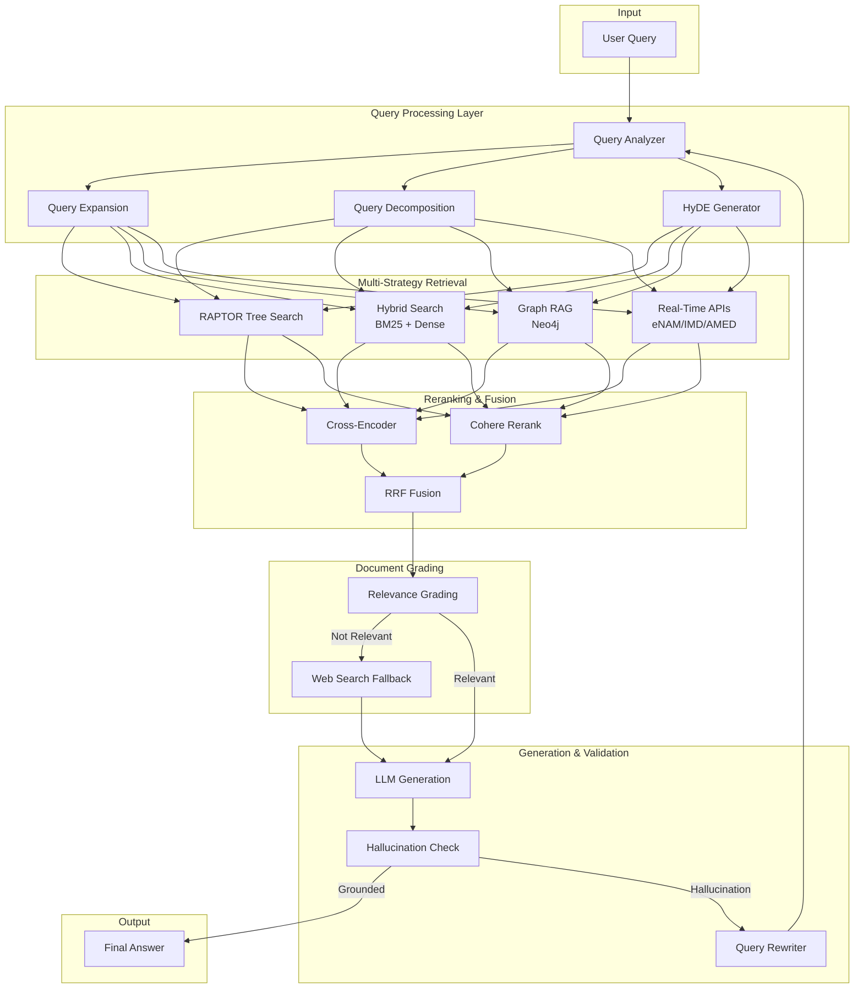
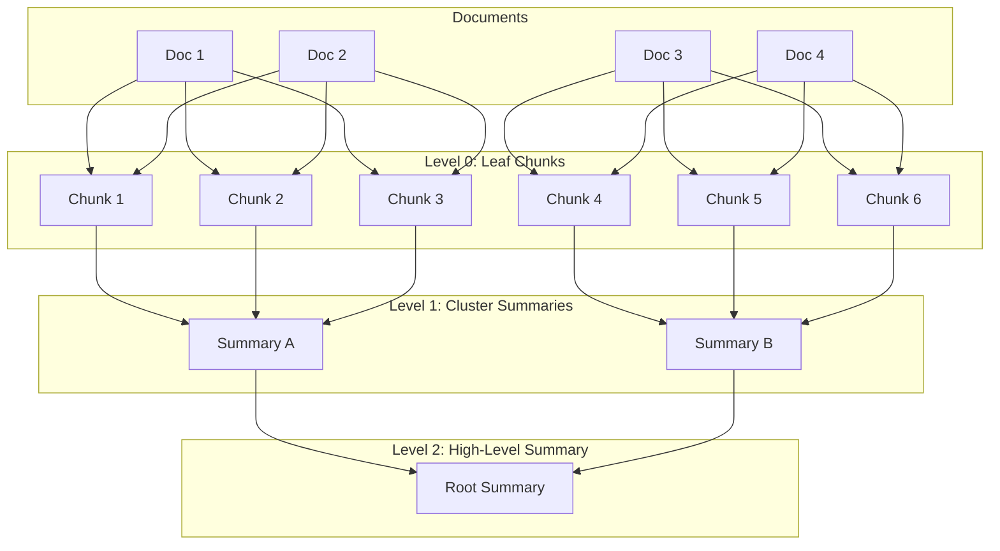

# Advanced RAG System Enhancement Plan

## Executive Summary

This plan outlines a comprehensive upgrade to transform the CropFresh AI RAG system from a solid foundation to a **production-grade, state-of-the-art** retrieval-augmented generation system. The enhancements focus on three core pillars:

1. **Real-Time Data Integration** - Connect with live agricultural data sources (eNAM, IMD, Google AMED)
2. **Advanced Retrieval Techniques** - Implement RAPTOR, contextual chunking, and enhanced reranking
3. **Production Hardening** - Add comprehensive observability, evaluation, and fault tolerance

---

## Current System Analysis

### What We Have ✅

| Component | Implementation | Status |
|-----------|---------------|--------|
| Vector Store | Qdrant Cloud | ✅ Working |
| Embeddings | BGE-M3 (1024-dim) | ✅ Working |
| Hybrid Search | BM25 + Dense + RRF | ✅ Implemented |
| Reranking | Cross-Encoder (MiniLM) | ✅ Implemented |
| Graph RAG | Neo4j AuraDB | ✅ Basic |
| Query Analyzer | LLM + Rule-based | ✅ Working |
| Document Grading | CRAG pattern | ✅ Working |
| Hallucination Check | Self-RAG pattern | ✅ Working |
| Observability | LangSmith | ✅ Basic |
| Web Search | Tavily + mock | ✅ Mock mode |
| Mandi Prices | Agmarknet tool | ⚠️ Mock mode |
| Weather | Weather tool | ⚠️ Mock mode |
| LangGraph Workflow | Agentic RAG | ✅ Working |

### What's Missing ❌

| Gap | Impact | Priority |
|-----|--------|----------|
| Live eNAM/Agmarknet API | Users get stale prices | 🔴 HIGH |
| Real weather API (IMD) | Inaccurate forecasts | 🔴 HIGH |
| RAPTOR hierarchical retrieval | Poor complex query handling | 🔴 HIGH |
| Contextual chunking | Lost context in chunks | 🟡 MEDIUM |
| Multi-query expansion | Limited recall | 🟡 MEDIUM |
| Parent document retrieval | Fragmented context | 🟡 MEDIUM |
| Cohere Rerank | Suboptimal ranking | 🟡 MEDIUM |
| Knowledge graph auto-build | Manual graph maintenance | 🟢 LOW |
| RAGAS evaluation | No quality metrics | 🟡 MEDIUM |
| Streaming responses | Poor UX | 🟢 LOW |

---

## Architecture Overview



---

## Phase 1: Real-Time Data Integration

> [!IMPORTANT]
> This is the highest priority phase. Users need live agricultural data for accurate decision-making.

### 1.1 eNAM API Integration

The Electronic National Agriculture Market (eNAM) provides live commodity prices from 1,000+ mandis.

#### [MODIFY] [agmarknet.py](file:///d:/Cropfresh%20Ai/cropfresh-service-ai/src/tools/agmarknet.py)

**Changes:**
- Add eNAM API client with OAuth authentication
- Implement real-time price streaming
- Add price trend analysis (7-day, 30-day)
- Create price alert notifications

```python
# New eNAM API endpoints
ENAM_BASE_URL = "https://enam.gov.in/web/commodity/all-commodity-dashboard"
ENAM_API_URL = "https://api.enam.gov.in/v1"

class ENAMClient:
    """eNAM API client for real-time mandi prices."""
    
    async def get_live_prices(
        self,
        commodity: str,
        state: str,
        mandi: str | None = None,
    ) -> list[MandiPrice]:
        """Fetch live prices from eNAM."""
        ...
    
    async def get_price_trends(
        self,
        commodity: str,
        state: str,
        days: int = 7,
    ) -> PriceTrend:
        """Get price trends over time."""
        ...
```

### 1.2 India Meteorological Department (IMD) API

Replace mock weather with real IMD data for accurate agricultural advisories.

#### [NEW] [imd_weather.py](file:///d:/Cropfresh%20Ai/cropfresh-service-ai/src/tools/imd_weather.py)

```python
class IMDWeatherClient:
    """IMD API client for weather data."""
    
    # IMD API endpoints
    CURRENT_URL = "https://api.imd.gov.in/v1/current"
    FORECAST_URL = "https://api.imd.gov.in/v1/forecast"
    ALERTS_URL = "https://api.imd.gov.in/v1/alerts"
    
    async def get_district_weather(
        self,
        state: str,
        district: str,
    ) -> DistrictWeather:
        """Get current weather for a district."""
        ...
    
    async def get_agro_advisory(
        self,
        state: str,
        district: str,
        crop: str | None = None,
    ) -> AgroAdvisory:
        """Get crop-specific weather advisory."""
        ...
```

### 1.3 Google AMED (Agricultural Monitoring and Event Detection)

Integrate Google's AMED API for crop monitoring and satellite-based insights.

#### [NEW] [google_amed.py](file:///d:/Cropfresh%20Ai/cropfresh-service-ai/src/tools/google_amed.py)

```python
class GoogleAMEDClient:
    """Google AMED API for agricultural monitoring."""
    
    async def get_crop_info(
        self,
        location: tuple[float, float],
        radius_km: float = 10,
    ) -> CropMonitoringData:
        """Get crop type and health for a location."""
        ...
    
    async def get_sowing_harvest_dates(
        self,
        location: tuple[float, float],
        crop: str,
    ) -> SeasonInfo:
        """Get expected sowing/harvest dates."""
        ...
```

---

## Phase 2: RAPTOR Hierarchical Retrieval

RAPTOR (Recursive Abstractive Processing for Tree-Organized Retrieval) enables answering both specific and abstract questions by building a tree of document summaries.

### 2.1 Implementation Overview



#### [NEW] [raptor.py](file:///d:/Cropfresh%20Ai/cropfresh-service-ai/src/rag/raptor.py)

**Key Components:**
- UMAP dimensionality reduction
- Gaussian Mixture Model (GMM) clustering
- LLM-based summarization
- Multi-level retrieval

```python
class RAPTORIndex:
    """
    RAPTOR Hierarchical Tree Index.
    
    Builds a tree structure from documents with:
    - Leaf nodes: Original chunks
    - Internal nodes: Cluster summaries
    - Root: High-level document summary
    """
    
    def __init__(
        self,
        embedding_manager: EmbeddingManager,
        llm: LLMProvider,
        max_cluster_size: int = 10,
        chunk_size: int = 500,
    ):
        self.embedding_manager = embedding_manager
        self.llm = llm
        self.max_cluster_size = max_cluster_size
        self.chunk_size = chunk_size
        
        # Tree structure
        self.nodes: dict[str, RAPTORNode] = {}
        self.levels: list[list[str]] = []  # Level -> node IDs
    
    async def build_tree(self, documents: list[Document]) -> int:
        """
        Build RAPTOR tree from documents.
        
        1. Chunk documents into leaf nodes
        2. Embed all chunks
        3. Cluster similar chunks (UMAP + GMM)
        4. Summarize each cluster
        5. Recursively cluster summaries until done
        """
        ...
    
    async def retrieve(
        self,
        query: str,
        top_k: int = 5,
        tree_traversal: str = "collapsed",  # "collapsed" or "tree"
    ) -> list[RAPTORNode]:
        """
        Retrieve from RAPTOR tree.
        
        Strategies:
        - collapsed: Search all levels together
        - tree: Start from root, traverse down
        """
        ...


class RAPTORNode(BaseModel):
    """Node in RAPTOR tree."""
    
    id: str
    text: str
    level: int  # 0 = leaf, higher = more abstract
    embedding: list[float]
    children: list[str] = []
    parent: str | None = None
    metadata: dict = {}
```

---

## Phase 3: Contextual Chunking

Enhance chunks with context to prevent information loss.

### 3.1 Context-Enriched Chunking

#### [NEW] [contextual_chunker.py](file:///d:/Cropfresh%20Ai/cropfresh-service-ai/src/rag/contextual_chunker.py)

```python
class ContextualChunker:
    """
    Context-enriched document chunking.
    
    Each chunk is augmented with:
    - Document title and source
    - Section headers (if any)
    - Preceding context summary
    - Key entities mentioned
    """
    
    CONTEXT_PROMPT = """You are generating context for a document chunk.
Given the full document and a specific chunk from it, generate a brief 
context statement (2-3 sentences) that explains:
1. What document this is from
2. What section/topic this chunk covers
3. Key entities mentioned

Document: {document}
Chunk: {chunk}

Context:"""
    
    async def chunk_with_context(
        self,
        document: Document,
        chunk_size: int = 500,
        chunk_overlap: int = 100,
    ) -> list[EnrichedChunk]:
        """
        Split document and add context to each chunk.
        """
        ...


class EnrichedChunk(BaseModel):
    """Chunk with contextual enrichment."""
    
    id: str
    text: str
    context: str  # LLM-generated context
    header: str  # Section header if present
    metadata: dict
    
    @property
    def enriched_text(self) -> str:
        """Return chunk with context for embedding."""
        return f"{self.context}\n\n{self.text}"
```

---

## Phase 4: Enhanced Query Processing

### 4.1 Multi-Query Expansion

Generate multiple query variations to improve recall.

#### [MODIFY] [query_analyzer.py](file:///d:/Cropfresh%20Ai/cropfresh-service-ai/src/rag/query_analyzer.py)

**Add:**
```python
class QueryExpander:
    """Generate multiple query variations for better recall."""
    
    EXPANSION_PROMPT = """Generate 3 alternative phrasings of this question 
that would help find relevant documents. Keep the same meaning but use 
different words and perspectives.

Original: {query}

Alternative 1:"""
    
    async def expand(self, query: str) -> list[str]:
        """Return original + expanded queries."""
        ...
```

### 4.2 HyDE (Hypothetical Document Embeddings)

Generate a hypothetical answer and use it for retrieval.

```python
class HyDERetriever:
    """
    Hypothetical Document Embeddings.
    
    Instead of embedding the query directly, generate a 
    hypothetical answer and embed that for retrieval.
    """
    
    async def retrieve_with_hyde(
        self,
        query: str,
        top_k: int = 5,
    ) -> list[Document]:
        # 1. Generate hypothetical answer
        hypothetical = await self._generate_hypothetical(query)
        
        # 2. Embed hypothetical answer
        embedding = self.embedding_manager.embed_query(hypothetical)
        
        # 3. Search with hypothetical embedding
        return await self.knowledge_base.search_by_vector(embedding, top_k)
```

---

## Phase 5: Advanced Reranking

### 5.1 Cohere Rerank Integration

#### [MODIFY] [reranker.py](file:///d:/Cropfresh%20Ai/cropfresh-service-ai/src/rag/reranker.py)

**Add:**
```python
class CohereReranker:
    """Cohere Rerank API for production reranking."""
    
    def __init__(self, api_key: str, model: str = "rerank-v3.5"):
        self.client = cohere.Client(api_key)
        self.model = model
    
    async def rerank(
        self,
        query: str,
        documents: list[Document],
        top_k: int = 5,
    ) -> RerankedResult:
        """Rerank using Cohere API."""
        response = self.client.rerank(
            model=self.model,
            query=query,
            documents=[doc.text for doc in documents],
            top_n=top_k,
        )
        ...


class EnsembleReranker:
    """Combine multiple rerankers for best results."""
    
    def __init__(
        self,
        rerankers: list[BaseReranker],
        weights: list[float] | None = None,
    ):
        self.rerankers = rerankers
        self.weights = weights or [1.0] * len(rerankers)
    
    async def rerank(
        self,
        query: str,
        documents: list[Document],
        top_k: int = 5,
    ) -> RerankedResult:
        """Ensemble reranking with RRF fusion."""
        ...
```

---

## Phase 6: Enhanced Graph RAG

### 6.1 Auto-Build Knowledge Graph from Documents

#### [MODIFY] [graph_store.py](file:///d:/Cropfresh%20Ai/cropfresh-service-ai/src/rag/graph_store.py)

```python
class KnowledgeGraphBuilder:
    """
    Automatically build knowledge graph from documents.
    
    Extracts:
    - Entities (crops, diseases, chemicals, farmers, buyers)
    - Relationships (GROWS, TREATS, AFFECTS, BUYS_FROM)
    """
    
    EXTRACTION_PROMPT = """Extract entities and relationships from this text.
Return JSON with:
- entities: [{name, type, properties}]
- relationships: [{source, relationship, target, properties}]

Entity types: CROP, FARMER, BUYER, DISEASE, PESTICIDE, LOCATION, MARKET
Relationship types: GROWS, TREATS, AFFECTS, LOCATED_IN, BUYS_FROM, SELLS_TO

Text: {text}
"""
    
    async def build_graph_from_document(
        self,
        document: Document,
    ) -> GraphExtractionResult:
        """Extract entities and relationships from a document."""
        ...
```

### 6.2 Multi-Hop Reasoning

```python
class MultiHopGraphRAG:
    """
    Multi-hop reasoning over knowledge graph.
    
    For complex questions requiring multiple graph traversals.
    """
    
    async def reason(
        self,
        query: str,
        max_hops: int = 3,
    ) -> GraphReasoningResult:
        """
        Execute multi-hop reasoning.
        
        1. Extract entities from query
        2. Start from entity nodes
        3. Traverse relationships up to max_hops
        4. Aggregate context from path
        """
        ...
```

---

## Phase 7: Production Hardening

### 7.1 Enhanced Observability

#### [MODIFY] [observability.py](file:///d:/Cropfresh%20Ai/cropfresh-service-ai/src/rag/observability.py)

**Add:**
```python
class RAGMetrics:
    """Production metrics for RAG pipeline."""
    
    # Retrieval metrics
    retrieval_latency_ms: float
    documents_retrieved: int
    hybrid_dense_count: int
    hybrid_sparse_count: int
    
    # Reranking metrics
    rerank_latency_ms: float
    relevance_scores: list[float]
    
    # Generation metrics
    generation_latency_ms: float
    tokens_used: int
    hallucination_detected: bool
    
    # Quality metrics
    context_relevance: float  # RAGAS metric
    answer_faithfulness: float  # RAGAS metric
    answer_relevance: float  # RAGAS metric
```

### 7.2 Caching Strategy

#### [NEW] [cache.py](file:///d:/Cropfresh%20Ai/cropfresh-service-ai/src/rag/cache.py)

```python
class RAGCache:
    """
    Multi-level caching for RAG.
    
    Levels:
    1. Query embedding cache
    2. Retrieval results cache
    3. LLM response cache
    """
    
    def __init__(
        self,
        redis_url: str,
        embedding_ttl: int = 3600,
        retrieval_ttl: int = 900,
        response_ttl: int = 300,
    ):
        ...
```

---

## Phase 8: Evaluation Framework

### 8.1 RAGAS Integration

#### [NEW] [evaluation.py](file:///d:/Cropfresh%20Ai/cropfresh-service-ai/src/rag/evaluation.py)

```python
class RAGASEvaluator:
    """
    RAGAS metrics for RAG evaluation.
    
    Metrics:
    - context_precision: How relevant are retrieved docs?
    - context_recall: Did we get all relevant docs?
    - faithfulness: Is answer grounded in context?
    - answer_relevancy: Does answer address the question?
    """
    
    async def evaluate(
        self,
        query: str,
        retrieved_docs: list[Document],
        answer: str,
        ground_truth: str | None = None,
    ) -> RAGASMetrics:
        ...
```

### 8.2 Evaluation Dataset

Create a comprehensive evaluation dataset for CropFresh domain.

```python
CROPFRESH_EVAL_DATASET = [
    # Agronomy queries
    {
        "query": "How to control tomato blight in Karnataka?",
        "expected_category": "agronomy",
        "ground_truth_keywords": ["fungicide", "neem", "crop rotation", "drainage"],
    },
    # Market queries
    {
        "query": "What is the current onion price in Nashik?",
        "expected_category": "market",
        "requires_real_time": True,
    },
    # Complex multi-hop
    {
        "query": "Which farmers in Kolar grow tomatoes and what prices can I get?",
        "expected_category": "graph+market",
        "requires_graph": True,
    },
    # ... 50+ more examples
]
```

---

## Verification Plan

### Automated Tests

1. **Unit Tests**
   - Each new component has pytest coverage
   - Mock API responses for external services
   - Test edge cases (empty results, API failures)

2. **Integration Tests**
   ```bash
   # Run full RAG pipeline test
   uv run pytest tests/rag/test_advanced_pipeline.py -v
   
   # Run with real APIs (requires keys)
   uv run pytest tests/rag/test_live_apis.py -v --live
   ```

3. **Evaluation Metrics**
   ```bash
   # Run RAGAS evaluation
   uv run python scripts/evaluate_rag.py --dataset cropfresh_eval
   ```

### Manual Verification

1. **Real-Time Data**
   - Verify eNAM prices match actual portal
   - Verify weather matches IMD website
   - Test data freshness indicators

2. **Retrieval Quality**
   - Test RAPTOR on complex abstract queries
   - Test contextual chunks on domain-specific questions
   - Compare hybrid vs dense-only results

3. **Production Readiness**
   - Load test with 100 concurrent users
   - Verify caching reduces API calls
   - Check LangSmith traces for latency

---

## User Review Required

> [!IMPORTANT]
> Please review and confirm the following decisions:

1. **API Keys Required**
   - eNAM API (gov.in registration)
   - IMD API (may require MoU)
   - Google AMED (GCP project)
   - Cohere Rerank (free tier available)

2. **Priority Order**
   - Should we prioritize real-time data (Phase 1) or RAPTOR (Phase 2)?

3. **Budget Considerations**
   - Cohere Rerank: ~$1 per 1000 searches
   - Google AMED: Usage-based pricing
   - Additional LLM calls for RAPTOR summaries

4. **Infrastructure**
   - Redis for caching (local or cloud?)
   - Additional Qdrant collections for RAPTOR tree

---

## Timeline Estimate

| Phase | Duration | Dependencies |
|-------|----------|--------------|
| Phase 1: Real-Time APIs | 3-4 days | API keys |
| Phase 2: RAPTOR | 4-5 days | Phase 1 |
| Phase 3: Contextual Chunking | 2-3 days | None |
| Phase 4: Query Processing | 2-3 days | None |
| Phase 5: Advanced Reranking | 2 days | Cohere key |
| Phase 6: Real-Time Knowledge | 3-4 days | Phase 1 |
| Phase 7: Enhanced Graph RAG | 3-4 days | Neo4j |
| Phase 8: Production Hardening | 3-4 days | All |
| Phase 9: Evaluation | 2-3 days | All |

**Total Estimated: 3-4 weeks**
