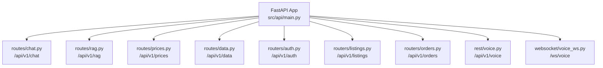

# CropFresh AI — API Endpoints Reference

> **Last Updated:** 2026-03-11
> **Base URL:** `http://localhost:8000` (dev) / `https://api.cropfresh.in` (prod)
> **Auth:** API Key (`X-API-Key` header) — skipped in dev mode
> **Content-Type:** `application/json`

---

## API Router Architecture



---

## 1. Chat API (`/api/v1/chat`)

**Source:** `src/api/routes/chat.py`

| Endpoint | Method | Description |
|----------|--------|-------------|
| `/api/v1/chat` | POST | Multi-turn conversation with agent routing |
| `/api/v1/chat/stream` | POST | SSE streaming responses |
| `/api/v1/chat/session` | POST | Create new session |
| `/api/v1/chat/agents` | GET | List available agents |

### POST `/api/v1/chat`

Query the multi-agent system. The SupervisorAgent routes to the best agent.

**Request:**
```json
{
  "query": "What is the price of tomato in Mysore?",
  "session_id": "uuid-string (optional)",
  "user_id": "farmer_123 (optional)",
  "agent_name": "commerce_agent (optional — force routing)",
  "language": "kn (optional)"
}
```

**Response:**
```json
{
  "response": "Tomato price in Mysore mandi is ₹25/kg.",
  "agent_name": "commerce_agent",
  "confidence": 0.92,
  "session_id": "uuid-string",
  "sources": ["Agmarknet APMC data", "knowledge_base"],
  "tools_used": ["agmarknet"],
  "suggested_actions": ["Check weekly trends", "Set price alert"]
}
```

### POST `/api/v1/chat/stream`

Same request as `/chat`, returns Server-Sent Events (SSE):

```
data: {"token": "Tomato"}
data: {"token": " price"}
data: {"token": " in"}
...
data: {"done": true, "agent_name": "commerce_agent"}
```

---

## 2. RAG API (`/api/v1/rag`)

**Source:** `src/api/routes/rag.py`

| Endpoint | Method | Description |
|----------|--------|-------------|
| `/api/v1/rag/query` | POST | Query knowledge base with RAG pipeline |
| `/api/v1/rag/search` | POST | Semantic search (retrieval only) |
| `/api/v1/rag/ingest` | POST | Ingest documents into knowledge base |

### POST `/api/v1/rag/query`

Full RAG pipeline: query → retrieve → rerank → generate.

**Request:**
```json
{
  "query": "How to grow tomatoes in Karnataka?",
  "top_k": 5,
  "categories": ["agronomy"],
  "use_graph": true,
  "use_reranker": true
}
```

---

## 3. Prices API (`/api/v1/prices`)

**Source:** `src/api/routes/prices.py`

| Endpoint | Method | Description |
|----------|--------|-------------|
| `/api/v1/prices/current` | GET | Current APMC mandi prices |
| `/api/v1/prices/predict` | POST | Price predictions |

---

## 4. Auth API (`/api/v1/auth`)

**Source:** `src/api/routers/auth.py`

| Endpoint | Method | Description |
|----------|--------|-------------|
| `/api/v1/auth/register` | POST | Register new farmer/buyer |
| `/api/v1/auth/login` | POST | Login (Firebase JWT) |
| `/api/v1/auth/profile` | GET | Get user profile |
| `/api/v1/auth/profile` | PUT | Update user profile |

---

## 5. Listings API (`/api/v1/listings`)

**Source:** `src/api/routers/listings.py`

| Endpoint | Method | Description |
|----------|--------|-------------|
| `/api/v1/listings` | POST | Create crop listing |
| `/api/v1/listings` | GET | List user's listings |
| `/api/v1/listings/{id}` | GET | Get listing by ID |
| `/api/v1/listings/{id}` | PUT | Update listing |
| `/api/v1/listings/{id}` | DELETE | Cancel listing |

### POST `/api/v1/listings`

**Request:**
```json
{
  "commodity": "Tomato",
  "quantity_kg": 100,
  "asking_price_per_kg": 25.0,
  "grade": "A",
  "harvest_date": "2026-03-10",
  "location": "Kolar",
  "description": "Fresh farm tomatoes, hand-picked"
}
```

---

## 6. Orders API (`/api/v1/orders`)

**Source:** `src/api/routers/orders.py`

| Endpoint | Method | Description |
|----------|--------|-------------|
| `/api/v1/orders` | POST | Create order from listing |
| `/api/v1/orders` | GET | List user's orders |
| `/api/v1/orders/{id}` | GET | Get order details |
| `/api/v1/orders/{id}/status` | PUT | Update order status |
| `/api/v1/orders/{id}/dispute` | POST | Report dispute |

---

## 7. Voice REST API (`/api/v1/voice`)

**Source:** `src/api/rest/voice.py`

| Endpoint | Method | Description |
|----------|--------|-------------|
| `/api/v1/voice/process` | POST | Full voice pipeline (audio → text → agent → audio) |
| `/api/v1/voice/transcribe` | POST | Audio → text only (STT) |
| `/api/v1/voice/synthesize` | POST | Text → audio only (TTS) |

### POST `/api/v1/voice/process`

**Request:** `multipart/form-data`
| Field | Type | Required | Description |
|-------|------|----------|-------------|
| `audio` | file (WAV/WebM) | ✅ | Audio file |
| `user_id` | string | ❌ | User identifier |
| `session_id` | string | ❌ | Session for multi-turn |
| `language` | string | ❌ | Language code (default: `kn`) |

**Response:**
```json
{
  "transcription": "ಟೊಮ್ಯಾಟೊ ಬೆಲೆ ಎಷ್ಟು",
  "detected_language": "kn",
  "response_text": "ಟೊಮ್ಯಾಟೊ ಬೆಲೆ ₹25/kg",
  "audio_url": "/tmp/response_audio.wav",
  "intent": "CHECK_PRICE",
  "entities": {"commodity": "Tomato"},
  "session_id": "uuid-string"
}
```

---

## 8. Voice WebSocket (`/ws/voice/{user_id}`)

**Source:** `src/api/websocket/voice_ws.py`

Real-time bidirectional audio streaming with VAD.

```
ws://localhost:8000/ws/voice/{user_id}?language=kn&session_id=uuid
```

See [`docs/api/websocket-voice.md`](websocket-voice.md) for full protocol.

---

## 9. Health API

**Source:** `src/api/main.py` (inline) + `src/api/routers/health.py`

| Endpoint | Method | Description |
|----------|--------|-------------|
| `/health` | GET | Basic health check |
| `/health/ready` | GET | Full readiness check (DB connections) |
| `/metrics` | GET | Prometheus metrics (when enabled) |

---

## Error Responses

All errors follow this format:

```json
{
  "detail": "Human-readable error message",
  "error_code": "AGENT_ERROR (or VALIDATION_ERROR, AUTH_ERROR, etc)",
  "status_code": 400
}
```

| Status Code | Meaning |
|-------------|---------|
| 400 | Bad request (missing fields, invalid input) |
| 401 | Unauthorized (invalid API key) |
| 403 | Forbidden (insufficient permissions) |
| 404 | Not found |
| 429 | Rate limited |
| 500 | Internal server error |
| 503 | Service unavailable (DB connection lost) |
