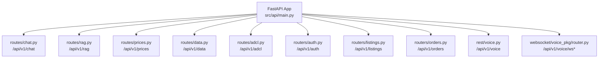

# CropFresh AI - API Endpoints Reference

> **Last Updated:** 2026-03-17
> **Base URL:** `http://localhost:8000` (dev) / `https://api.cropfresh.in` (prod)
> **Auth:** `X-API-Key` for API routes outside development

---

## API Router Architecture



---

## 1. Chat API (`/api/v1/chat`)

**Source:** `src/api/routes/chat.py`

| Endpoint | Method | Description |
|----------|--------|-------------|
| `/api/v1/chat` | POST | Multi-turn conversation with agent routing |
| `/api/v1/chat/stream` | POST | SSE streaming responses |
| `/api/v1/chat/session` | POST | Create a new chat session |
| `/api/v1/chat/session/{session_id}` | GET | Fetch session metadata |
| `/api/v1/chat/agents` | GET | List registered agents |
| `/api/v1/chat/tools` | GET | List available tools |

### POST `/api/v1/chat`

**Request**

```json
{
  "message": "What is the tomato price in Mysore?",
  "session_id": "uuid-string",
  "context": {"channel": "web"}
}
```

**Response**

```json
{
  "message": "Tomato price in Mysore mandi is Rs25/kg.",
  "session_id": "uuid-string",
  "agent_used": "commerce_agent",
  "confidence": 0.92,
  "sources": ["agmarknet"],
  "tools_used": ["multi_source_rates"],
  "steps": [],
  "suggested_actions": ["Check weekly trends"]
}
```

---

## 2. RAG API (`/api/v1/rag`)

**Source:** `src/api/routes/rag.py`

| Endpoint | Method | Description |
|----------|--------|-------------|
| `/api/v1/rag/query` | POST | Query the RAG pipeline |
| `/api/v1/rag/search` | GET | Retrieval-only search |
| `/api/v1/rag/ingest` | POST | Ingest documents |
| `/api/v1/rag/stats` | GET | Collection statistics |
| `/api/v1/rag/route` | POST | Route-debug helper |
| `/api/v1/rag/normalize` | POST | Query-normalization helper |

---

## 3. Prices API (`/api/v1/prices`)

**Source:** `src/api/routes/prices.py`

| Endpoint | Method | Description |
|----------|--------|-------------|
| `/api/v1/prices/latest` | GET | Legacy aggregate price snapshot |
| `/api/v1/prices/history` | GET | Legacy history endpoint |
| `/api/v1/prices/summary` | GET | Legacy summary endpoint |
| `/api/v1/prices/query` | POST | Official-first multi-source Karnataka rate query |
| `/api/v1/prices/source-health` | GET | Connector health and pending-source metadata |

### POST `/api/v1/prices/query`

**Request**

```json
{
  "rate_kinds": ["mandi_wholesale"],
  "commodity": "tomato",
  "state": "Karnataka",
  "district": null,
  "market": "Kolar",
  "date": "2026-03-17",
  "include_reference": true,
  "force_live": false,
  "comparison_depth": "all_sources"
}
```

**Response fields**

- `query_target`
- `canonical_rates`
- `comparison_quotes`
- `source_health`
- `warnings`
- `pending_sources`
- `fetched_at`

---

## 4. Data Utilities (`/api/v1/data`)

**Source:** `src/api/routes/data.py`

| Endpoint | Method | Description |
|----------|--------|-------------|
| `/api/v1/data/scrape` | POST | Generic scrape helper |
| `/api/v1/data/sources` | GET | List configured data sources |
| `/api/v1/data/prices` | GET | Data-service price lookup |
| `/api/v1/data/weather` | GET | Weather lookup |
| `/api/v1/data/aikosha/datasets` | GET | AI Kosha dataset list |
| `/api/v1/data/aikosha/dataset/{dataset_id}` | GET | AI Kosha dataset detail |
| `/api/v1/data/aikosha/categories` | GET | AI Kosha category list |

---

## 5. ADCL API (`/api/v1/adcl`)

**Source:** `src/api/routes/adcl.py`

| Endpoint | Method | Description |
|----------|--------|-------------|
| `/api/v1/adcl/weekly` | GET | District-scoped weekly crop-demand report |

### GET `/api/v1/adcl/weekly`

| Query Param | Required | Description |
|-------------|----------|-------------|
| `district` | Yes | District to score, for example `Kolar` |
| `force_live` | No | Rebuild from live inputs instead of cache |
| `farmer_id` | No | Future farmer-aware overlay hook |
| `language` | No | Summary language hint |

**Response highlights**

- `week_start`
- `district`
- `generated_at`
- `freshness`
- `source_health`
- `metadata`
- `crops[]` with `commodity`, `green_label`, `recommendation`, `buyer_count`, `total_demand_kg`, and evidence metadata

---

## 6. Auth API (`/api/v1/auth`)

**Source:** `src/api/routers/auth.py`

| Endpoint | Method | Description |
|----------|--------|-------------|
| `/api/v1/auth/register` | POST | Register phone number and send OTP |
| `/api/v1/auth/verify-otp` | POST | Verify OTP and return JWT |
| `/api/v1/auth/me` | GET | Decode JWT and return current user info |
| `/api/v1/auth/profile/{user_id}` | GET | Fetch farmer or buyer profile |
| `/api/v1/auth/profile/{user_id}` | PATCH | Update farmer or buyer profile |
| `/api/v1/auth/buyer-profile/{user_id}` | PATCH | Update buyer-specific profile fields |

---

## 7. Listings API (`/api/v1/listings`)

**Source:** `src/api/routers/listings.py`

| Endpoint | Method | Description |
|----------|--------|-------------|
| `/api/v1/listings` | POST | Create a produce listing |
| `/api/v1/listings` | GET | Search listings with filters |
| `/api/v1/listings/farmer/{farmer_id}` | GET | Get a farmer's listings |
| `/api/v1/listings/{listing_id}` | GET | Fetch a listing by ID |
| `/api/v1/listings/{listing_id}` | PATCH | Update a listing |
| `/api/v1/listings/{listing_id}` | DELETE | Soft-cancel a listing |
| `/api/v1/listings/{listing_id}/grade` | POST | Attach a quality grade |

---

## 8. Orders API (`/api/v1/orders`)

**Source:** `src/api/routers/orders.py`

| Endpoint | Method | Description |
|----------|--------|-------------|
| `/api/v1/orders` | POST | Create an order |
| `/api/v1/orders` | GET | List orders by farmer or buyer |
| `/api/v1/orders/{order_id}` | GET | Fetch an order by ID |
| `/api/v1/orders/{order_id}/status` | PATCH | Advance order status |
| `/api/v1/orders/{order_id}/dispute` | POST | Raise a dispute |
| `/api/v1/orders/{order_id}/settle` | POST | Settle the order and release escrow |
| `/api/v1/orders/{order_id}/aisp` | GET | Get AISP price breakdown |

---

## 9. Voice REST API (`/api/v1/voice`)

**Source:** `src/api/rest/voice.py`

| Endpoint | Method | Description |
|----------|--------|-------------|
| `/api/v1/voice/process` | POST | Full voice pipeline: audio -> text -> agent -> audio |
| `/api/v1/voice/transcribe` | POST | Audio -> text only |
| `/api/v1/voice/synthesize` | POST | Text -> audio only |
| `/api/v1/voice/languages` | GET | Supported STT and TTS languages |
| `/api/v1/voice/session/{session_id}` | DELETE | Clear a voice session |
| `/api/v1/voice/health` | GET | Voice runtime health |

### POST `/api/v1/voice/process`

**Request:** `multipart/form-data`

| Field | Type | Required | Description |
|-------|------|----------|-------------|
| `audio` | file | Yes | Audio file (`WAV`, `MP3`, `OGG`) |
| `user_id` | string | Yes | User identifier |
| `session_id` | string | No | Session ID for multi-turn context |
| `language` | string | No | Language code or `auto` |

**Response**

```json
{
  "transcription": "tomato price",
  "language": "en",
  "intent": "CHECK_PRICE",
  "entities": {"commodity": "Tomato"},
  "response_text": "Tomato price in Mysore mandi is Rs25/kg.",
  "response_audio_base64": "...",
  "session_id": "uuid-string",
  "confidence": 0.94
}
```

### GET `/api/v1/voice/health`

Current response fields:

- `status`
- `stt_providers`
- `tts_provider`
- `languages`
- `version`

Sprint 07 expands this endpoint with provider readiness and warm-status details.

---

## 10. Voice WebSocket (`/api/v1/voice/ws*`)

**Source:** `src/api/websocket/voice_pkg/router.py`

| Endpoint | Method | Description |
|----------|--------|-------------|
| `/api/v1/voice/ws` | WebSocket | Compatibility voice streaming path |
| `/api/v1/voice/ws/duplex` | WebSocket | Canonical realtime duplex path |
| `/api/v1/voice/ws/sessions` | GET | Active websocket session count |

The documented production contract is `/api/v1/voice/ws/duplex`.

Current transport notes:

- JSON text frames only
- audio carried in `audio_base64`
- incremental server audio returned as base64 chunks

See `docs/api/websocket-voice.md` for the full protocol.

---

## 11. Health and Observability

**Source:** `src/api/main.py`

| Endpoint | Method | Description |
|----------|--------|-------------|
| `/health` | GET | Liveness probe |
| `/health/ready` | GET | Readiness probe with service checks |
| `/metrics` | GET | Prometheus scrape endpoint |

---

## Error Responses

Most routes return FastAPI-style error payloads:

```json
{
  "detail": "Human-readable error message"
}
```

Common status codes:

| Status Code | Meaning |
|-------------|---------|
| 400 | Bad request |
| 401 | Unauthorized |
| 403 | Forbidden |
| 404 | Not found |
| 422 | Validation failure |
| 500 | Internal server error |
| 503 | Service unavailable |
