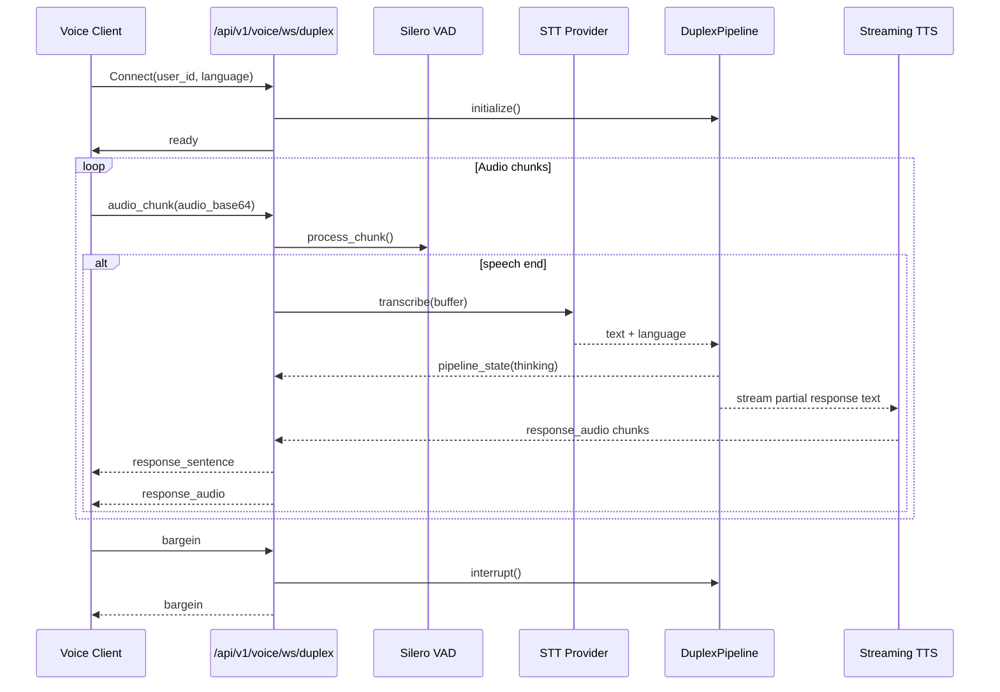

# CropFresh AI - WebSocket Voice Protocol

> **Last Updated:** 2026-03-17
> **Canonical Source:** `src/api/websocket/voice_pkg/router.py`
> **Canonical Realtime Route:** `/api/v1/voice/ws/duplex`

---

## Current Status

- `/api/v1/voice/ws/duplex` is the canonical realtime voice interface.
- `/api/v1/voice/ws` remains available as a compatibility path for the older session-oriented flow.
- The current transport uses JSON text frames with base64 audio payloads.
- Binary audio transport is a Sprint 07 planned upgrade, not the current contract.
- Current end-to-end voice latency is still roughly `3-4s` in the existing stack.

---

## Endpoints

### 1. Compatibility Path

```text
ws://localhost:8000/api/v1/voice/ws?user_id=farmer_123&language=hi&session_id=uuid
```

### 2. Canonical Duplex Path

```text
ws://localhost:8000/api/v1/voice/ws/duplex?user_id=farmer_123&language=hi&session_id=uuid
```

### Query Parameters

| Parameter | Type | Required | Default | Notes |
|-----------|------|----------|---------|-------|
| `user_id` | string | No | `anonymous` | Passed as a websocket query parameter |
| `language` | string | No | `hi` | Initial language hint; duplex can switch later |
| `session_id` | string | No | auto-generated | The duplex route currently generates a fresh session ID server-side |

---

## Transport Rules

- Client and server exchange JSON text frames only.
- Audio is currently sent as base64 in the `audio_base64` field.
- Server audio responses are chunked and returned as base64 plus metadata.
- Duplex streaming currently emits text and audio incrementally, but it is not yet a raw binary PCM protocol.

---

## Compatibility Route: `/api/v1/voice/ws`

This route wraps the session-based voice flow in `src/api/websocket/voice_pkg/session.py`.

### Client -> Server Messages

| Type | Required Fields | Description |
|------|-----------------|-------------|
| `audio_chunk` | `audio_base64` | Base64-encoded audio chunk |
| `audio_end` | none | Flush the buffered utterance |
| `close` | none | Close the session |

### Server -> Client Messages

| Type | Fields | Description |
|------|--------|-------------|
| `ready` | `session_id` | Session accepted and initialized |
| `vad_start` | `timestamp_ms` | Speech start detected |
| `vad_speech` | `probability` | Ongoing speech activity |
| `vad_end` | `timestamp_ms` | Speech end detected |
| `language_detected` | `language`, `confidence` | STT language detection result |
| `transcript_final` | `text`, `language`, `confidence`, `provider` | Final transcription |
| `response_text` | `text`, `intent`, `entities` | Agent text response |
| `response_audio` | `audio_base64`, `format`, `sample_rate`, `chunk_index`, `is_last` | Chunked TTS audio |
| `response_end` | `duration_seconds` | End of a response |
| `bargein` | none | Response interrupted by new speech |
| `error` | `error` | Session or pipeline error |

---

## Canonical Route: `/api/v1/voice/ws/duplex`

This route wraps the streaming duplex pipeline in `src/api/websocket/voice_pkg/router.py` and `src/api/websocket/voice_pkg/duplex.py`.

### Client -> Server Messages

| Type | Required Fields | Description |
|------|-----------------|-------------|
| `audio_chunk` | `audio_base64` | Base64-encoded audio chunk |
| `audio_end` | none | Flush the buffered utterance |
| `bargein` | none | Force an interruption of current playback |
| `language_hint` | `language` | Update the preferred response language |
| `close` | none | Close the websocket |

### Server -> Client Messages

| Type | Fields | Description |
|------|--------|-------------|
| `ready` | `session_id`, `mode`, `features` | Duplex pipeline ready |
| `pipeline_state` | `state`, plus event metadata | Pipeline transitions such as listening, thinking, speaking |
| `language_detected` | `language`, optional `locked` | STT or language-switch signal |
| `response_sentence` | `text` | Text emitted while response audio is still streaming |
| `response_audio` | `audio_base64`, `format`, `sample_rate`, `chunk_index`, `is_last` | Chunked audio from the streaming TTS path |
| `response_end` | `chunks_sent`, `full_text` | End of a duplex response |
| `bargein` | none | Current playback interrupted |
| `error` | `error` | Duplex pipeline error |

### Example Duplex Messages

```json
{"type":"audio_chunk","audio_base64":"..."}
{"type":"audio_end"}
{"type":"language_hint","language":"kn"}
```

```json
{"type":"ready","session_id":"...","mode":"duplex","features":{"vad":true,"streaming_llm":true,"streaming_tts":true,"bargein":true}}
{"type":"pipeline_state","state":"thinking","language":"kn"}
{"type":"response_audio","audio_base64":"...","format":"wav","sample_rate":24000,"chunk_index":0,"is_last":false}
```

---

## Duplex Processing Flow



---

## Operational Notes

- The duplex route currently forces `groq` for LLM and STT plus `edge` for TTS at initialization time.
- The compatibility route still uses `MultiProviderSTT`, `EdgeTTSProvider`, and `VoiceAgent`.
- The duplex route sends `pipeline_state` events, but full latency timing fields are still a Sprint 07 follow-up.
- `GET /api/v1/voice/ws/sessions` returns the current active websocket session count.

---

## Planned Sprint 07 Upgrades

- Move the canonical transport to `JSON control + binary audio`.
- Expose stage-level timing in websocket events and the live test UI.
- Reduce sentence buffering so first audio arrives earlier.
- Keep `/api/v1/voice/ws` as a compatibility path for one sprint while clients migrate.
