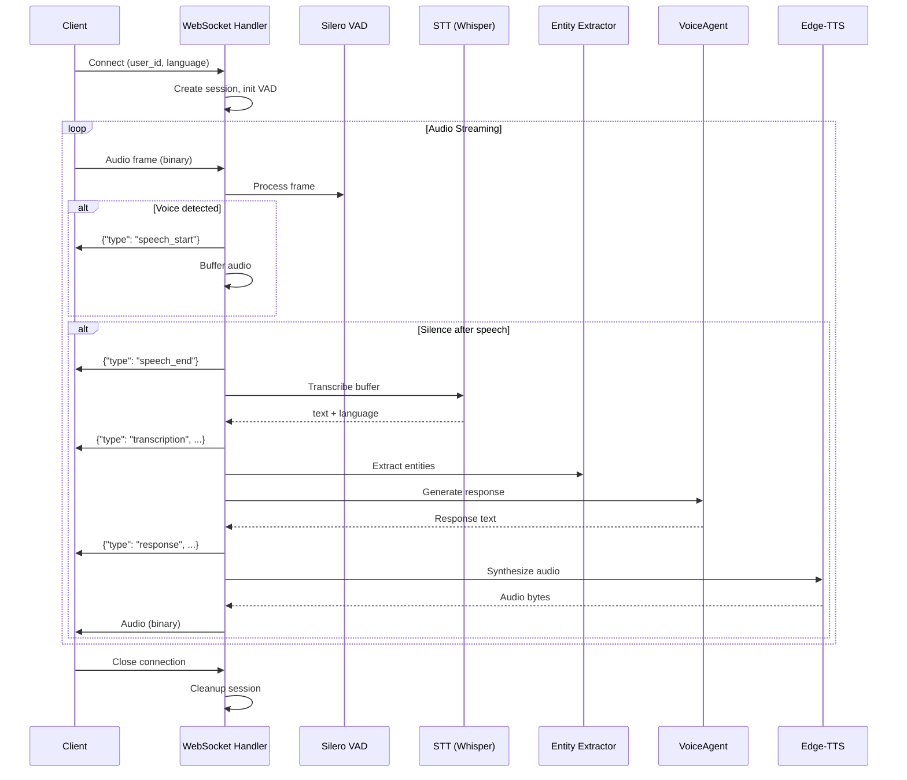

# CropFresh AI — WebSocket Voice Protocol

> **Endpoint:** `ws://localhost:8000/ws/voice/{user_id}`
> **Source:** `src/api/websocket/voice_ws.py` (25,075 bytes)

---

## Connection

```
ws://localhost:8000/ws/voice/{user_id}?language=kn&session_id=uuid
```

| Parameter | Type | Required | Default |
|-----------|------|----------|---------|
| `user_id` | path | ✅ | — |
| `language` | query | ❌ | `kn` |
| `session_id` | query | ❌ | Auto-created |

---

## Message Protocol

### Client → Server

**Binary frames:** Raw audio bytes (16kHz, 16-bit PCM or WebM)

**JSON control messages:**
```json
{"type": "config", "language": "hi", "vad_threshold": 0.5}
{"type": "end_of_speech"}
{"type": "ping"}
```

### Server → Client

**Binary frames:** Synthesized audio response (WAV)

**JSON status messages:**
```json
{"type": "speech_start"}
{"type": "speech_end"}
{"type": "transcription", "text": "ಟೊಮ್ಯಾಟೊ ಬೆಲೆ", "language": "kn", "confidence": 0.95}
{"type": "response", "text": "ಟೊಮ್ಯಾಟೊ ₹25/kg", "agent": "commerce_agent", "intent": "CHECK_PRICE"}
{"type": "error", "message": "STT failed"}
{"type": "pong"}
```

---

## Processing Pipeline



---

## Session Rehydration (NFR6)

If the client disconnects and reconnects within 5 minutes, the conversation context is restored:

```
1. Client reconnects with same session_id
2. Server calls StateManager.rehydrate_voice_session()
3. ≤ 1.0s SLA for rehydration (via asyncio.wait_for)
4. If session stale > 5 min → SessionExpiredError → new session
```

---

## Configuration

| Env Variable | Default | Description |
|-------------|---------|-------------|
| `VAD_THRESHOLD` | 0.5 | Voice activity detection threshold |
| `WHISPER_MODEL_SIZE` | `base` | STT model size |
| `DEFAULT_LANGUAGE` | `kn` | Default voice language |
| `MAX_AUDIO_BUFFER_SEC` | 30 | Max recording before forced transcription |
