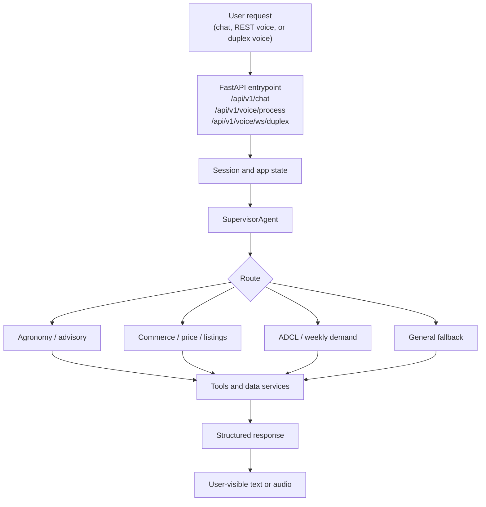
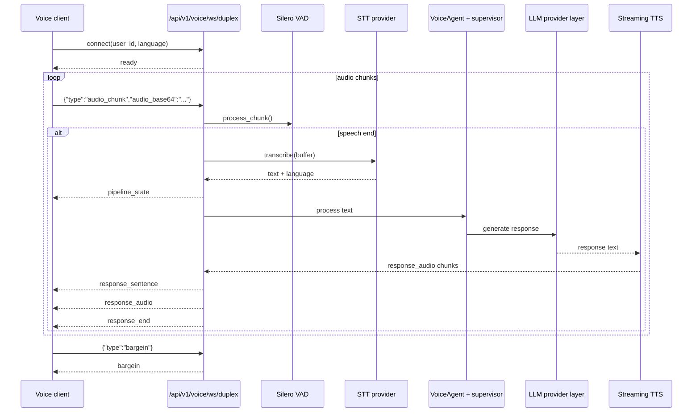
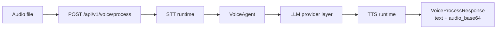
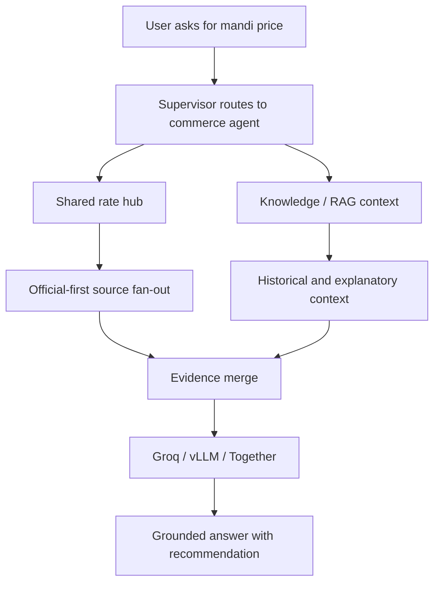
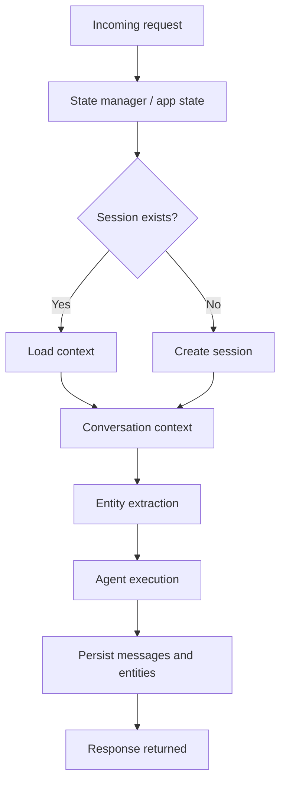
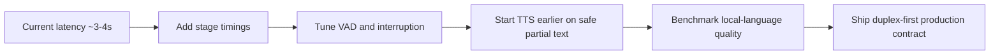

# CropFresh AI - Data Flow Diagrams

> **Last Updated:** 2026-03-17
> Diagrams reflect the intended current runtime story, with the duplex websocket as the canonical voice path.

---

## 1. Agent Routing Flow

Key routing notes:

- Chat and voice both end up in the same supervisor and domain-agent ecosystem.
- Voice-specific extraction happens before the supervisor sees the resolved text.
- Redis-backed session state supports multi-turn continuity.

---

## 2. Duplex Voice Flow

Current transport notes:

- JSON text frames only
- base64 audio payloads in both directions
- stage-level latency metadata still needs Sprint 07 instrumentation

---

## 3. One-Shot Voice REST Flow

This path is useful for controlled testing, server-side integrations, and regression checks against the websocket flow.

---

## 4. Price Discovery Flow

Provider policy note: Bedrock should no longer be described as the intended active provider in this flow.

---

## 5. Session and Memory Flow

The same session concept is shared across chat, REST voice, and websocket voice flows, even though the transport contracts differ.

---

## 6. Voice Improvement Focus for Sprint 07

Target framing:

- 20ms is an audio-frame budget, not the full response SLA
- sub-second first audio is the practical near-term goal
- local-language naturalness is as important as raw latency

---

## Related Docs

| Document | Path |
|----------|------|
| System architecture | `docs/architecture/system-architecture.md` |
| Voice pipeline | `docs/features/voice-pipeline.md` |
| Websocket protocol | `docs/api/websocket-voice.md` |
