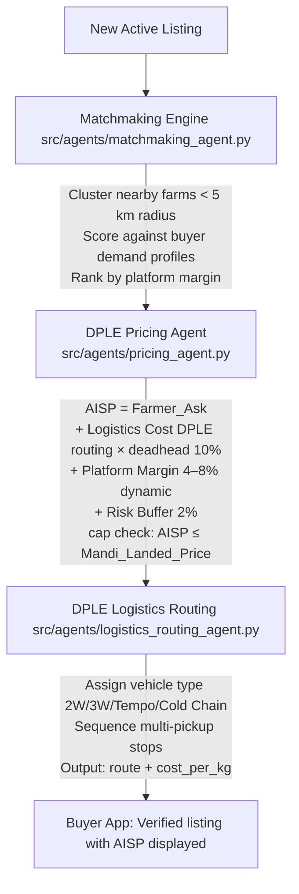
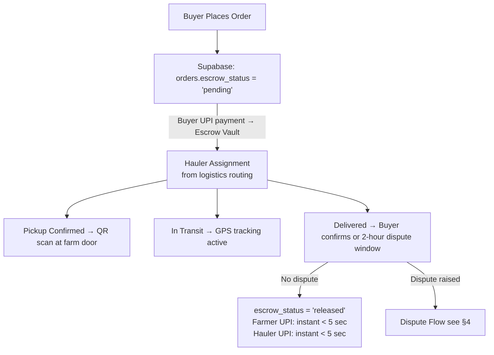
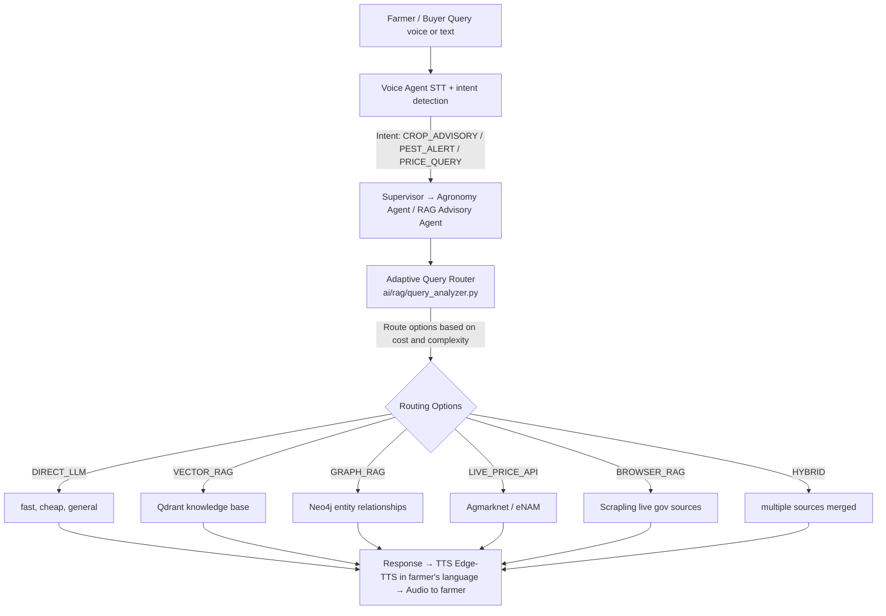
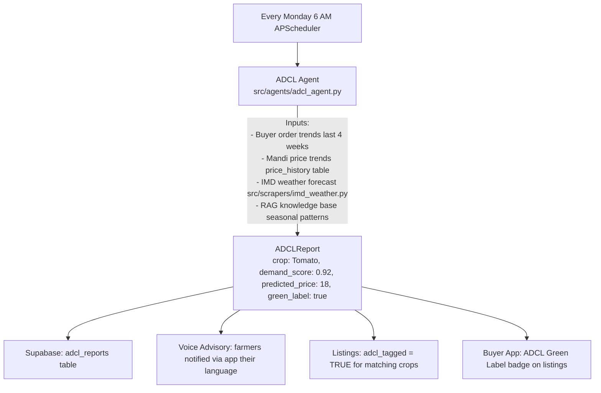
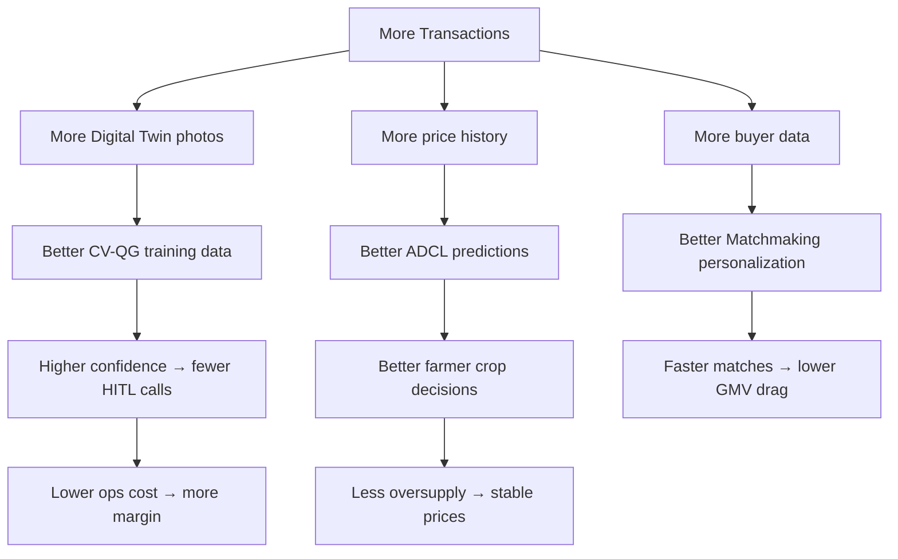

# Agent Data Flow — CropFresh AI

> **Last Updated:** 2026-02-28
> **Aligns with:** Business Model PDF Sections 5–11

---

## 1. Farmer Listing Flow

```
Farmer (Voice/App)
       │  Audio / Text
       ▼
VoiceAgent (src/agents/voice_agent.py)
       │  Intent: CREATE_LISTING
       │  Entities: {crop, quantity, price, language}
       ▼
Supervisor Agent  (route → QualityAssessmentAgent)
       │
       ▼
QualityAssessmentAgent (src/agents/quality_assessment/agent.py)
       │  Triggers CV-QG via ai/vision/quality_grader.py
       │
       ├─ Confidence ≥ 95% ──→ Grade = A/B/C  ──→  Auto Digital Twin
       │
       └─ Confidence < 95% ──→ HITL_required = True
                                      │
                                      ▼
                             Agent App Notification
                                      │
                             Agent Photos + Override
                                      │
                             Digital Twin Created
                                      │
                                      ▼
                          listing.status = 'active'
                          listing.batch_qr_code generated
                          Supabase: listings table written
```

---

```mermaid
graph TD
    A[Farmer Voice/App] -->|Audio / Text| B[VoiceAgent <br/>src/agents/voice_agent.py]
    B -->|Intent: CREATE_LISTING<br>Entities: {crop, quantity, price, language}| C[Supervisor Agent]
    C -->|route| D[QualityAssessmentAgent <br/>src/agents/quality_assessment/agent.py]
    D -->|Triggers CV-QG via ai/vision/quality_grader.py| E{Confidence &ge; 95%?}
    E -->|Yes| F[Grade = A/B/C <br/> Auto Digital Twin]
    E -->|No| G[HITL_required = True]
    G --> H[Agent App Notification]
    H --> I[Agent Photos + Override]
    I --> J[Digital Twin Created]
    F --> K[listing.status = 'active'<br/>listing.batch_qr_code generated<br/>Supabase: listings table written]
    J --> K
```

---

## 2. AISP Pricing + Matchmaking Flow

```
New Active Listing
       │
       ▼
Matchmaking Engine (src/agents/matchmaking_agent.py)
       │  Cluster nearby farms (< 5 km radius)
       │  Score against buyer demand profiles
       │  Rank by platform margin
       │
       ▼
DPLE Pricing Agent (src/agents/pricing_agent.py)
       │
       │  AISP = Farmer_Ask
       │        + Logistics Cost (DPLE routing × deadhead 10%)
       │        + Platform Margin (4–8% dynamic)
       │        + Risk Buffer (2%)
       │        [cap check: AISP ≤ Mandi_Landed_Price]
       │
       ▼
DPLE Logistics Routing (src/agents/logistics_routing_agent.py)
       │  Assign vehicle type (2W/3W/Tempo/Cold Chain)
       │  Sequence multi-pickup stops
       │  Output: route + cost_per_kg
       │
       ▼
Buyer App: Verified listing with AISP displayed
```

---



---

## 3. Order to Settlement Flow

```
Buyer Places Order
       │
       ▼
Supabase: orders.escrow_status = 'pending'
       │
       │  Buyer UPI payment → Escrow Vault
       │
       ▼
Hauler Assignment (from logistics routing)
       │
       ├─ Pickup Confirmed → QR scan at farm door
       │
       ├─ In Transit → GPS tracking active
       │
       └─ Delivered → Buyer confirms (or 2-hour dispute window)
              │
              ├─ No dispute ──→ escrow_status = 'released'
              │                  Farmer UPI: instant (< 5 sec)
              │                  Hauler UPI: instant (< 5 sec)
              │
              └─ Dispute raised ──→ Dispute Flow (see §4)
```

---



---

## 4. Dispute Resolution Flow

```
Buyer Raises Dispute
       │  arrival_photos[], reason
       ▼
Digital Twin Diff Engine (src/agents/digital_twin/engine.py)
       │
       │  Compare: departure_twin.photos vs arrival_photos
       │  Detect: color changes, shape deformations, qty loss
       │
       ▼
DifferenceReport
  {
    liability: "farmer" | "hauler" | "buyer" | "shared",
    claim_percent: 0–100%,
    evidence: [annotated images]
  }
       │
       ├─ Liability = Hauler ──→ Deduct from hauler wallet
       ├─ Liability = Farmer  ──→ Deduct from farmer payout
       ├─ Liability = Buyer   ──→ Full release to farmer + hauler
       └─ < ₹500 claim        ──→ Risk buffer pool covers it
              │
              ▼
       PostgreSQL: disputes.status = 'resolved'
       orders.escrow_status = 'released'
```

---



```mermaid
graph TD
    A[Buyer Raises Dispute] -->|arrival_photos, reason| B[Digital Twin Diff Engine <br/>src/agents/digital_twin/engine.py]
    B -->|Compare: departure_twin.photos vs arrival_photos<br/>Detect: color changes, shape deformations, qty loss| C["DifferenceReport<br/>liability: farmer | hauler | buyer | shared<br/>claim_percent: 0–100%<br/>evidence: annotated images"]
    C -->|Liability = Hauler| D[Deduct from hauler wallet]
    C -->|Liability = Farmer| E[Deduct from farmer payout]
    C -->|Liability = Buyer| F[Full release to farmer + hauler]
    C -->|< &#8377;500 claim| G[Risk buffer pool covers it]
    D --> H[PostgreSQL: disputes.status = 'resolved'<br/>orders.escrow_status = 'released']
    E --> H
    F --> H
    G --> H
```

## 5. RAG Advisory Flow

```
Farmer / Buyer Query (voice or text)
       │
       ▼
Voice Agent (STT + intent detection)
       │  Intent: CROP_ADVISORY / PEST_ALERT / PRICE_QUERY
       ▼
Supervisor → Agronomy Agent / RAG Advisory Agent
       │
       ▼
Adaptive Query Router (ai/rag/query_analyzer.py)
       │
       │  Route options based on cost and complexity:
       │  ├─ DIRECT_LLM          (fast, cheap, general)
       │  ├─ VECTOR_RAG           (Qdrant knowledge base)
       │  ├─ GRAPH_RAG            (Neo4j entity relationships)
       │  ├─ LIVE_PRICE_API       (Agmarknet / eNAM)
       │  ├─ BROWSER_RAG          (Scrapling live gov sources)
       │  └─ HYBRID               (multiple sources merged)
       │
       ▼
Response → TTS (Edge-TTS in farmer's language) → Audio to farmer
```

---



## 6. ADCL Weekly Crop Demand List

```
Every Monday 6 AM (APScheduler)
       │
       ▼
ADCL Agent (src/agents/adcl_agent.py)
       │  Inputs:
       │  ├─ Buyer order trends (last 4 weeks)
       │  ├─ Mandi price trends (price_history table)
       │  ├─ IMD weather forecast (src/scrapers/imd_weather.py)
       │  └─ RAG knowledge base (seasonal patterns)
       │
       ▼
ADCLReport:
  [{crop: "Tomato", demand_score: 0.92, predicted_price: 18, green_label: true},
   {crop: "Beans",  demand_score: 0.87, ...},
   ...]
       │
       ▼
Supabase: adcl_reports table
Voice Advisory: farmers notified via app (their language)
Listings: adcl_tagged = TRUE for matching crops
Buyer App: "ADCL Green Label" badge on listings
```

---



---

## 7. Data Flywheel

```
More Transactions
       │
       ├─→ More Digital Twin photos
       │          └─→ Better CV-QG training data
       │                     └─→ Higher confidence → fewer HITL calls
       │                                └─→ Lower ops cost → more margin
       │
       ├─→ More price history
       │          └─→ Better ADCL predictions
       │                     └─→ Better farmer crop decisions
       │                                └─→ Less oversupply → stable prices
       │
       └─→ More buyer data
                  └─→ Better Matchmaking personalization
                             └─→ Faster matches → lower GMV drag
```


