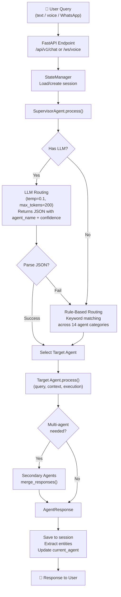
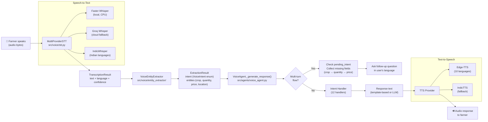
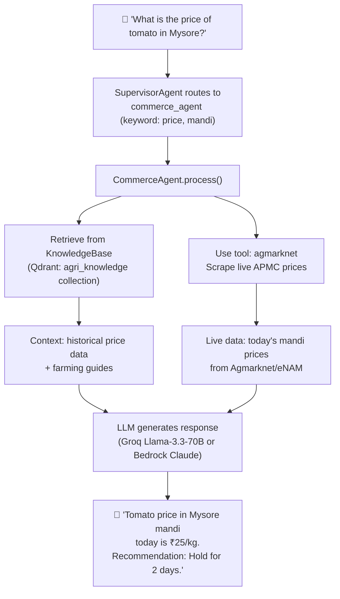
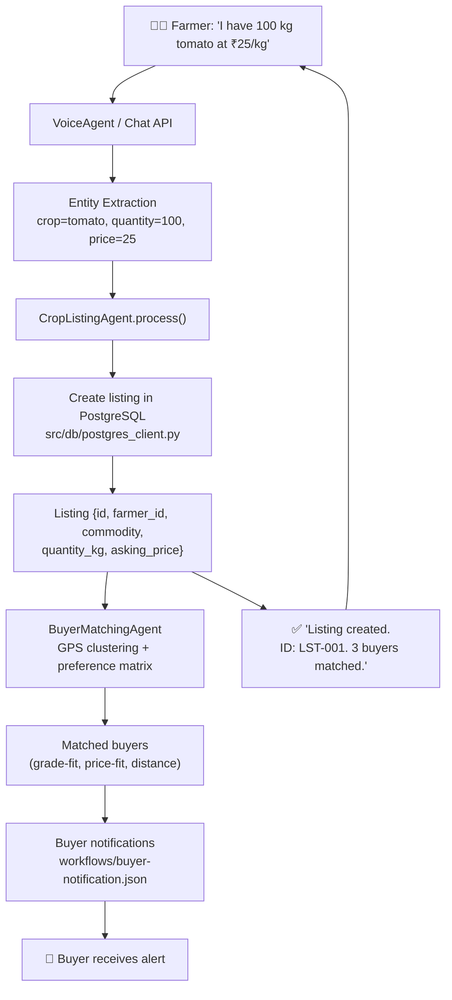
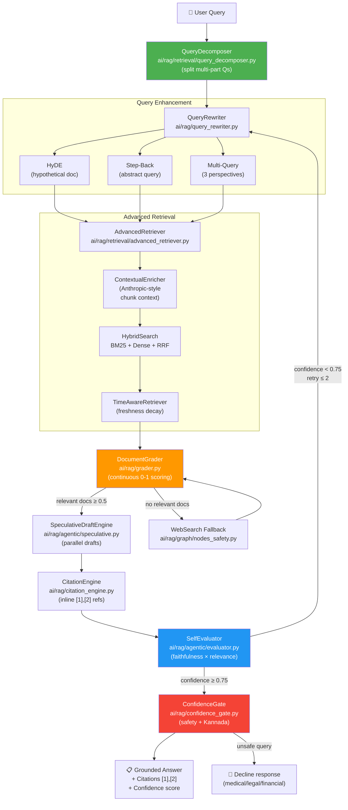
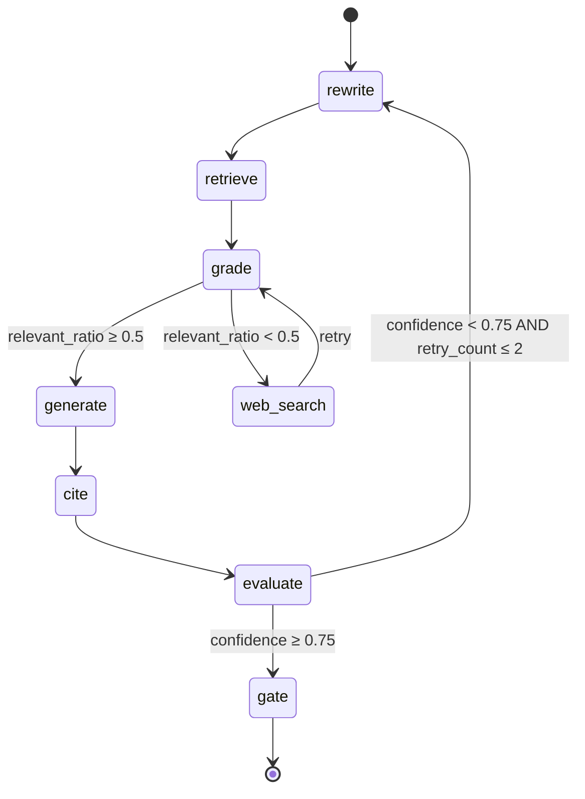
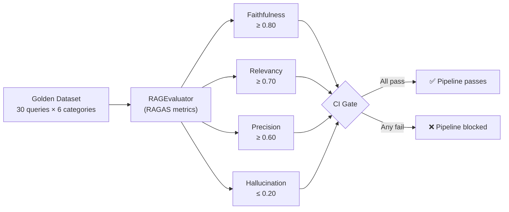
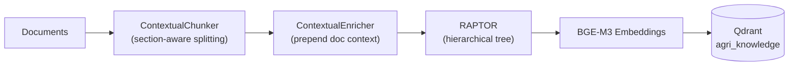
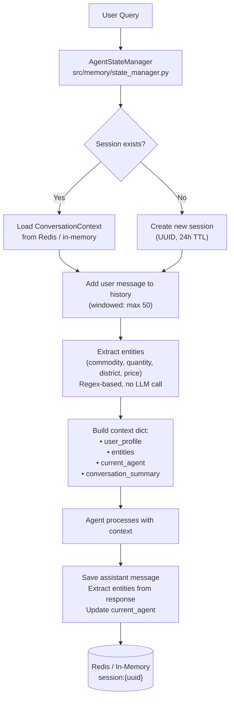
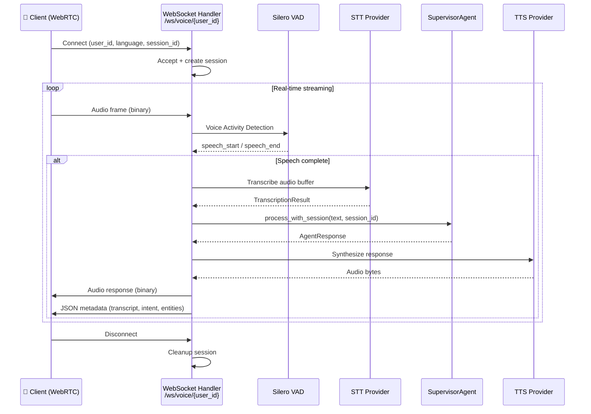

# CropFresh AI — Data Flow Diagrams

> **Last Updated:** 2026-03-14
> All diagrams reflect the **actual codebase** as of this date.

---

## 1. Agent Routing Flow

Every user query (text or voice) flows through the `SupervisorAgent` which decides which specialized agent handles it.

### Routing Decision Table

| Agent | Primary Keywords | Confidence Threshold |
|-------|-----------------|---------------------|
| `agronomy_agent` | grow, plant, pest, disease, soil, seed, irrigation | 0.3–0.9 (score-based) |
| `commerce_agent` | price, sell, buy, mandi, market, rate, profit | 0.3–0.9 |
| `platform_agent` | register, login, app, account, order, payment | 0.3–0.9 |
| `web_scraping_agent` | live, current, today, real-time, fetch, scrape | 0.3–0.9 |
| `browser_agent` | login to, submit, navigate, download, dashboard | 0.3–0.9 |
| `research_agent` | research, investigate, comprehensive, compare | 0.3–0.9 |
| `buyer_matching_agent` | find buyer, match buyer, sell my produce | 0.85 (exact match) |
| `quality_assessment_agent` | quality check, grade, defect, shelf life | 0.84 (exact match) |
| `adcl_agent` | recommend, sow, what to grow, demand | 0.83 (exact match) |
| `crop_listing_agent` | list my crop, create listing, my listings | 0.83 (exact match) |
| `logistics_agent` | delivery, transport, route, vehicle, shipping | 0.82 (exact match) |
| `price_prediction_agent` | predict, forecast, trend, future price | 0.3–0.9 |
| `knowledge_agent` | explain, tell me about, information, what is | 0.3–0.9 |
| `general_agent` | hello, hi, thanks, help, who are you | 0.3–0.9 (fallback) |

---

## 2. Voice Pipeline Flow

The voice pipeline supports **10 Indian languages** and handles both STT and TTS with multi-turn conversation flows.

### Supported Languages

| Code | Language | STT Provider | TTS Voice |
|------|----------|-------------|-----------|
| `kn` | Kannada | IndicWhisper | Edge-TTS `kn-IN-SapnaNeural` |
| `hi` | Hindi | Whisper/Groq | Edge-TTS `hi-IN-SwaraNeural` |
| `en` | English | Whisper/Groq | Edge-TTS `en-IN-NeerjaNeural` |
| `ta` | Tamil | IndicWhisper | Edge-TTS `ta-IN-PallaviNeural` |
| `te` | Telugu | IndicWhisper | Edge-TTS `te-IN-ShrutiNeural` |
| `mr` | Marathi | IndicWhisper | Edge-TTS `mr-IN-AarohiNeural` |
| `bn` | Bengali | IndicWhisper | Edge-TTS `bn-IN-TanishaaNeural` |
| `gu` | Gujarati | IndicWhisper | Edge-TTS `gu-IN-DhwaniNeural` |
| `pa` | Punjabi | IndicWhisper | Edge-TTS `pa-IN-VaaniNeural` |
| `ml` | Malayalam | IndicWhisper | Edge-TTS `ml-IN-SobhanaNeural` |

### Voice Intents

| Intent | Required Fields | Multi-Turn |
|--------|----------------|-----------|
| `CREATE_LISTING` | crop, quantity, asking_price | ✅ Yes |
| `CHECK_PRICE` | crop | No |
| `TRACK_ORDER` | order_id (optional) | No |
| `MY_LISTINGS` | — | No |
| `FIND_BUYER` | commodity, quantity_kg | ✅ Yes |
| `REGISTER` | name, phone, district | ✅ Yes |
| `CHECK_WEATHER` | location | No |
| `GET_ADVISORY` | crop | No |
| `QUALITY_CHECK` | commodity | No |
| `WEEKLY_DEMAND` | location | No |
| `DISPUTE_STATUS` | dispute_id | No |
| `GREETING` | — | No |
| `HELP` | — | No |

---

## 3. Price Discovery Flow

---

## 4. Crop Listing Flow

---

## 5. Advanced Agentic RAG Pipeline (ADR-010)

The RAG system uses a **LangGraph state machine** to orchestrate a self-correcting, anti-hallucination pipeline with 8 nodes and conditional routing.

### 5.1 High-Level Flow

### 5.2 LangGraph State Machine Nodes

| Node | File | Purpose |
|------|------|---------|
| **rewrite** | `ai/rag/graph/nodes.py` | HyDE / step-back / multi-query expansion |
| **retrieve** | `ai/rag/graph/nodes.py` | Qdrant hybrid search with deduplication |
| **grade** | `ai/rag/graph/nodes.py` | Continuous 0–1 scoring + time-decay penalty |
| **generate** | `ai/rag/graph/nodes.py` | Speculative parallel drafts + best selection |
| **cite** | `ai/rag/graph/nodes.py` | Inline citation insertion |
| **evaluate** | `ai/rag/graph/nodes_safety.py` | RAGAS-style faithfulness × relevance gate |
| **gate** | `ai/rag/graph/nodes_safety.py` | Safety classifier (medical/legal/financial) |
| **web_search** | `ai/rag/graph/nodes_safety.py` | Fallback when grading finds no relevant docs |

### 5.3 Conditional Routing Logic

### 5.4 Anti-Hallucination Techniques

| Technique | Module | Impact |
|-----------|--------|--------|
| Contextual Enrichment | `retrieval/contextual_enricher.py` | Retrieval failure ↓ 15% → 5% |
| Query Decomposition | `retrieval/query_decomposer.py` | Multi-part queries handled correctly |
| Time-Aware Scoring | `retrieval/time_aware.py` | Stale market data penalized (24h decay) |
| Document Grading | `grader.py` | Continuous 0–1 scoring filters weak docs |
| Self-Evaluation | `evaluator.py` | Low-confidence answers retried (max 2×) |
| Citation Engine | `citation_engine.py` | Every claim traced to source doc |
| Confidence Gate | `confidence_gate.py` | Unsafe queries declined in user's language |

### 5.5 Evaluation & CI Guardrail

### 5.6 Indexing Pipeline (Offline)

---

## 6. Session & Memory Flow

### Entity Extraction Patterns

| Entity | Regex Pattern | Example Match |
|--------|--------------|---------------|
| `commodity` | tomato, potato, onion, carrot, okra... (+ Hindi/Kannada) | "tamatar" → "Tomato" |
| `quantity_kg` | `\d+\.?\d* (kg|kilo)` | "100 kg" → 100.0 |
| `quantity_quintal` | `\d+\.?\d* (quintal|q)` | "2 quintal" → 200 kg |
| `district` | Kolar, Mysuru, Belagavi, Bangalore... | "mysore" → "Mysore" |
| `price_per_kg` | `₹\d+\.?\d*/kg` | "₹25/kg" → 25.0 |

---

## 7. WebSocket Voice Streaming Flow

---

## Related Documentation

| Document | Path |
|----------|------|
| System Architecture | [`docs/architecture/system-architecture.md`](system-architecture.md) |
| Agent Registry | [`docs/agents/REGISTRY.md`](../agents/REGISTRY.md) |
| Voice Pipeline | [`docs/features/voice-pipeline.md`](../features/voice-pipeline.md) |
| RAG Pipeline | [`docs/features/rag-pipeline.md`](../features/rag-pipeline.md) |
