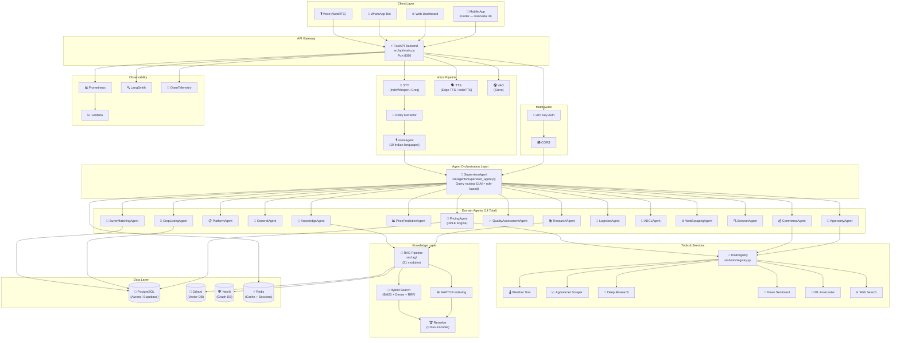
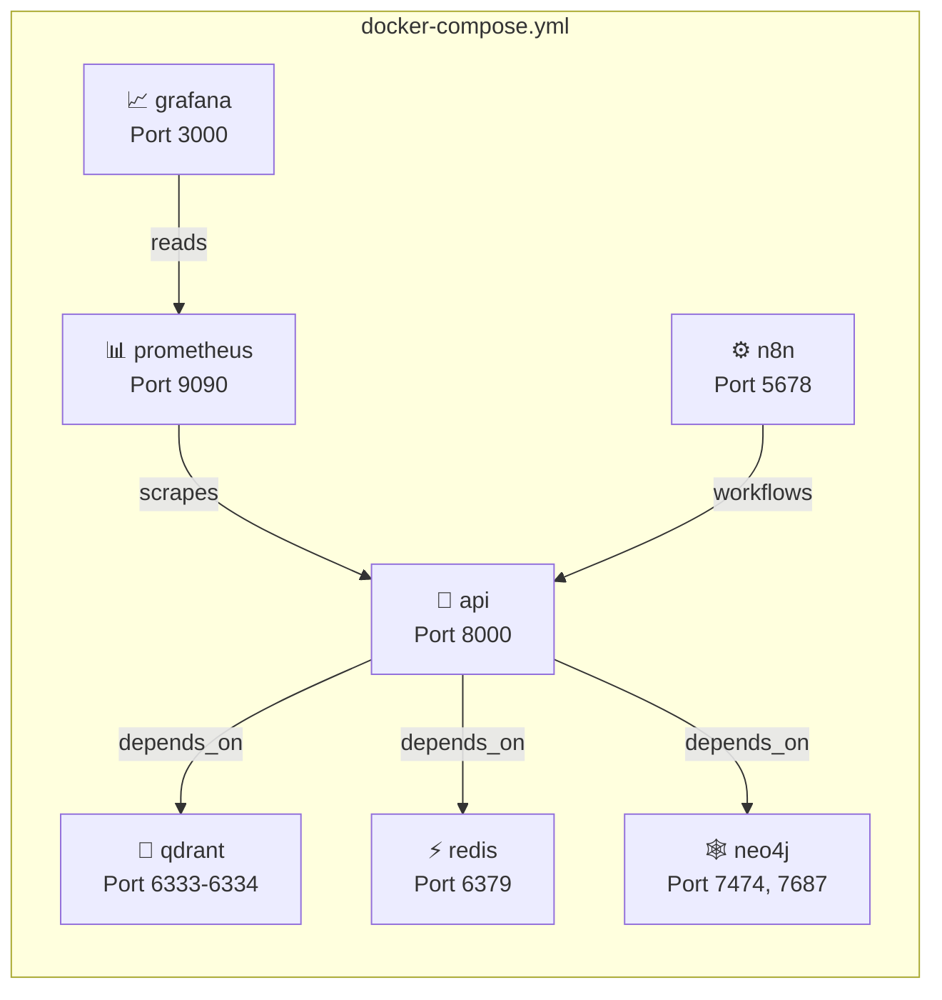
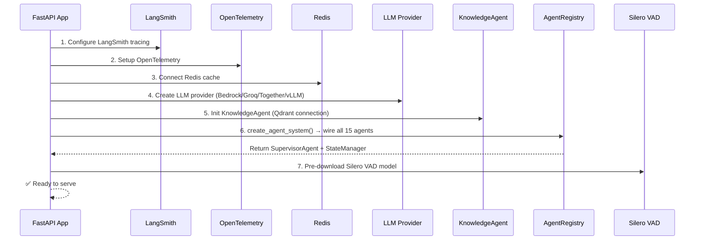

# CropFresh AI — System Architecture

> **Last Updated:** 2026-03-11
> **Version:** 2.1.0
> **Status:** Active Development (Phase 1 — Foundation & Data Pipeline)

---

## Overview

CropFresh AI is India's intelligent agricultural marketplace AI service. It connects Karnataka farmers with buyers using a **multi-agent AI system**, **voice-first Kannada interaction**, and **real-time market intelligence**.

The platform is built as a **FastAPI backend** with a **Supervisor-routed multi-agent architecture** where 14 specialized domain agents handle everything from price queries to crop listings, quality assessment, and voice interactions in 10+ Indian languages.

---

## High-Level Architecture

---

## Component Inventory

### `src/` Directory Structure

| Directory | Purpose | Key Files | Lines |
|-----------|---------|-----------|-------|
| `src/agents/` | 14 domain agents + supervisor | `supervisor_agent.py`, `base_agent.py`, `agent_registry.py` | ~2,500+ |
| `src/api/` | FastAPI app, 9 routers, middleware | `main.py`, `config.py`, `routes/`, `routers/` | ~1,500+ |
| `src/voice/` | STT, TTS, VAD, WebRTC, entity extraction | `stt.py`, `tts.py`, `vad.py`, `voice_agent.py` | ~2,000+ |
| `src/rag/` | 21-module RAG pipeline | `raptor.py`, `hybrid_search.py`, `reranker.py` | ~3,000+ |
| `src/tools/` | 16 agent tools | `registry.py`, `agmarknet.py`, `weather.py` | ~2,000+ |
| `src/scrapers/` | 13 web scrapers | `base_scraper.py`, `agmarknet.py`, `enam_client.py` | ~1,800+ |
| `src/db/` | Database clients | `postgres_client.py`, `neo4j_client.py`, `supabase_client.py` | ~700+ |
| `src/memory/` | Session + state management | `state_manager.py` (729 lines) | 729 |
| `src/orchestrator/` | LLM provider abstraction | `llm_provider.py` | ~500+ |
| `src/evaluation/` | RAG evaluation (RAGAS) | `eval_runner.py`, `ragas_evaluator.py` | ~400+ |
| `src/resilience/` | Circuit breaker, health monitor | `circuit_breaker.py`, `health_monitor.py` | ~600+ |
| `src/autonomous/` | Goal-driven autonomous agent | `goal_agent.py`, `pear_loop.py` | ~400+ |
| `src/production/` | Production infra (rate limiter, cache) | `rate_limiter.py`, `cache.py`, `config.py` | ~350+ |
| `src/mcp/` | MCP browser server | `browser_server.py` | ~250+ |
| `src/workflows/` | JSON workflow definitions | 5 workflow JSON files | — |
| `src/config/` | App settings (Pydantic) | `settings.py` | ~250+ |
| `src/pipelines/` | Data pipeline stubs | Stub files | — |
| `src/models/` | Pydantic data models | `__init__.py` only | — |

### Agent Groups (from `agent_registry.py`)

| Group | Agents | Notes |
|-------|--------|-------|
| **Core** | AgronomyAgent, CommerceAgent, PlatformAgent, GeneralAgent | All inherit `BaseAgent` |
| **Pricing** | PricingAgent, PricePredictionAgent | PricingAgent does NOT inherit BaseAgent |
| **Marketplace** | BuyerMatchingAgent, QualityAssessmentAgent, CropListingAgent | Located in subdirectories |
| **Web** | WebScrapingAgent, BrowserAgent, ResearchAgent | WebScrapingAgent/BrowserAgent don't inherit BaseAgent |
| **Wrapper** | ADCLWrapperAgent, LogisticsWrapperAgent | Wrap standalone engines |
| **Knowledge** | KnowledgeAgent | Qdrant-backed RAG, doesn't inherit BaseAgent |

---

## Technology Stack

| Layer | Technology | Configuration |
|-------|-----------|---------------|
| **Backend** | FastAPI 0.115+ / Python 3.11+ | `src/api/main.py` |
| **LLM** | Amazon Bedrock (Claude) / Groq (Llama-3.3-70B) / Together / vLLM | `src/api/config.py` → `llm_provider` |
| **Vector DB** | Qdrant Cloud (or pgvector) | `QDRANT_HOST`, `QDRANT_PORT`, `QDRANT_API_KEY` |
| **Graph DB** | Neo4j 5 Community | `NEO4J_URI`, `NEO4J_USER`, `NEO4J_PASSWORD` |
| **Primary DB** | PostgreSQL (Aurora / Supabase) | `PG_HOST`, `PG_DATABASE`, `PG_USER` |
| **Cache** | Redis 7 Alpine | `REDIS_URL` |
| **Embeddings** | BAAI/bge-m3 (MiniLM fallback) | `EMBEDDING_MODEL`, `EMBEDDING_DEVICE` |
| **STT** | IndicWhisper / Groq Whisper | `WHISPER_MODEL_SIZE` |
| **TTS** | Edge-TTS / IndicTTS | Default: Edge-TTS |
| **VAD** | Silero VAD | Pre-downloaded at startup |
| **Vision** | YOLOv11m (planned) | `YOLO_MODEL_PATH` |
| **Scraping** | Scrapling + Playwright + Camoufox | `src/scrapers/base_scraper.py` |
| **Monitoring** | Prometheus + Grafana | `infra/monitoring/` |
| **Tracing** | LangSmith + OpenTelemetry | `LANGSMITH_API_KEY`, `OTEL_ENDPOINT` |
| **Workflows** | n8n | Port 5678 |
| **Package Mgr** | uv | `pyproject.toml`, `uv.lock` |

---

## Docker Compose Services

| Service | Image | Volume | Health Check |
|---------|-------|--------|-------------|
| `api` | Custom Dockerfile | `src/`, `ai/` | `wget /health` |
| `redis` | `redis:7-alpine` | `redis_data` | `redis-cli ping` |
| `qdrant` | `qdrant/qdrant:latest` | `qdrant_data` | `wget /healthz` |
| `neo4j` | `neo4j:5-community` | `neo4j_data`, `neo4j_logs` | `wget :7474` |
| `prometheus` | `prom/prometheus:latest` | `prometheus_data` | — |
| `grafana` | `grafana/grafana:latest` | `grafana_data` | — |
| `n8n` | `n8nio/n8n:latest` | `n8n_data` | — |

---

## Startup Sequence

The application initializes in this order (see `src/api/main.py` → `lifespan()`):

---

## Non-Functional Requirements

| Requirement | Target | Current Status |
|-------------|--------|---------------|
| Voice response latency | < 3s (< 2s goal) | ~3-4s (optimizing) |
| API response latency | < 500ms P95 | Met for cached queries |
| Agent routing accuracy | > 90% | ~85% (improving) |
| Multi-language support | Kannada, Hindi, English + 7 more | 10 languages active |
| API cost per query | < ₹0.50 | ~₹0.44 (adaptive router reduces to ~₹0.21) |
| Uptime (Phase 6+) | > 99.5% | N/A (pre-production) |
| Data privacy | No farmer data used for LLM training | ✅ Enforced |

---

## Security Architecture

1. **API Key Authentication** — `X-API-Key` header via `APIKeyMiddleware` (skipped in development)
2. **Environment-driven CORS** — `ALLOWED_ORIGINS` env var (never `*` in production)
3. **Firebase Auth** — JWT Bearer tokens for user-facing endpoints
4. **Supabase RLS** — Row Level Security on database tables
5. **No Swagger in Production** — `/docs` and `/redoc` hidden when `ENVIRONMENT=production`
6. **Secret Management** — All credentials via env vars, never hardcoded

---

## Related Documentation

| Document | Path |
|----------|------|
| Data Flow Diagrams | [`docs/architecture/data-flow.md`](data-flow.md) |
| Module Dependency Map | [`docs/diagrams/module-map.md`](../diagrams/module-map.md) |
| Agent Registry | [`docs/agents/REGISTRY.md`](../agents/REGISTRY.md) |
| API Reference | [`docs/api/endpoints-reference.md`](../api/endpoints-reference.md) |
| Environment Variables | [`docs/guides/environment-variables.md`](../guides/environment-variables.md) |
