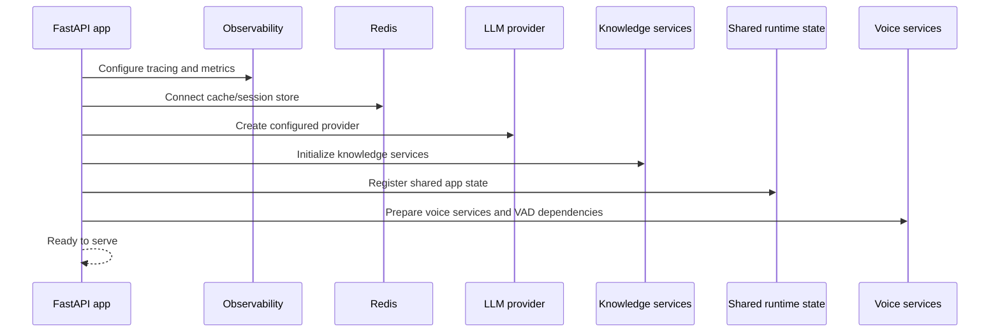

# CropFresh AI - System Architecture

> **Last Updated:** 2026-03-17
> **Status:** Active development

---

## Overview

CropFresh AI is a FastAPI backend for an agricultural marketplace assistant that combines:

- multi-agent orchestration for commerce, agronomy, logistics, ADCL, and knowledge flows
- realtime and one-shot voice interfaces
- shared rate-hub and marketplace data services
- AWS-hosted infrastructure for the production deployment path

The current production voice direction is the duplex websocket path, not a Pipecat-first stack.

---

## High-Level Architecture

```mermaid
graph TD
    subgraph Clients
        C1["Web app"]
        C2["Static voice test pages"]
        C3["Mobile / WhatsApp (planned)"]
    end

    subgraph API
        API["FastAPI<br/>src/api/main.py"]
        REST["REST routes"]
        WS["Voice websocket routes"]
    end

    subgraph Orchestration
        SUP["SupervisorAgent"]
        VOICE["VoiceAgent"]
        TOOLS["Tool registry and shared services"]
    end

    subgraph DataAndModels
        LLM["LLM provider layer<br/>Groq / vLLM / Together"]
        STT["Hybrid STT"]
        TTS["Edge TTS / local Indic TTS"]
        DB["PostgreSQL / Aurora"]
        QDRANT["Qdrant / pgvector transition"]
        NEO4J["Neo4j"]
        REDIS["Redis"]
    end

    subgraph Observability
        OBS["LangSmith / OpenTelemetry / Prometheus"]
    end

    C1 --> API
    C2 --> API
    C3 --> API
    API --> REST
    API --> WS
    REST --> SUP
    REST --> VOICE
    WS --> VOICE
    VOICE --> STT
    VOICE --> TTS
    VOICE --> SUP
    SUP --> LLM
    SUP --> TOOLS
    TOOLS --> DB
    TOOLS --> QDRANT
    TOOLS --> NEO4J
    SUP --> REDIS
    API --> OBS
```

---

## Runtime Layers

| Layer | Primary Components | Notes |
|-------|--------------------|-------|
| Client access | Web UI, static voice pages, future mobile surfaces | Static pages are mounted from `/static` |
| API layer | `src/api/main.py`, routers, middleware | REST plus websocket entrypoints |
| Agent layer | `SupervisorAgent`, domain agents, `VoiceAgent` | Multi-agent routing plus voice-specific handling |
| Voice layer | `src/api/websocket/voice_pkg/`, `src/voice/` | Duplex websocket is canonical; Pipecat is experimental |
| Model layer | Groq, vLLM, Together, STT, TTS | Bedrock remains a legacy code path scheduled for removal |
| Data layer | PostgreSQL/Aurora, Redis, Qdrant, Neo4j | Shared across chat, listings, orders, ADCL, and voice |
| Observability | LangSmith, OpenTelemetry, Prometheus | Stage-level voice timing still needs Sprint 07 work |

---

## Voice Architecture

### Production-facing paths

| Interface | Role | Status |
|-----------|------|--------|
| `/api/v1/voice/process` | One-shot voice in -> voice out | Active |
| `/api/v1/voice/ws` | Compatibility voice websocket | Active |
| `/api/v1/voice/ws/duplex` | Canonical realtime duplex websocket | Active |
| Pipecat slices | Experimental alternate path | Not production-default |

### Voice runtime flow

1. Client sends audio to the duplex websocket or REST route.
2. VAD and STT convert speech into text and language signals.
3. `VoiceAgent` and the supervisor layer resolve intent and business logic.
4. The LLM provider layer generates response text.
5. TTS streams audio back to the client.

Current reality: the duplex route still uses JSON plus base64 audio and full-turn latency is roughly `3-4s`.

---

## Technology Stack

| Layer | Technology | Configuration |
|-------|------------|---------------|
| Backend | FastAPI 0.115+ / Python 3.11+ | `src/api/main.py` |
| LLM provider layer | Groq / vLLM / Together | `src/api/config.py` -> `llm_provider` |
| Legacy LLM path | Bedrock | Legacy code path scheduled for removal in Sprint 07 |
| Voice STT | Faster Whisper / Groq Whisper / Indic models | `src/voice/` |
| Voice TTS | Edge TTS / local Indic TTS | `src/voice/` |
| VAD | Silero VAD | Used in websocket voice flows |
| Primary DB | PostgreSQL / Aurora | `PG_*` settings |
| Cache | Redis | `REDIS_URL` |
| Vector search | Qdrant with pgvector transition work | `QDRANT_*` settings |
| Graph DB | Neo4j | `NEO4J_*` settings |
| Observability | LangSmith / OpenTelemetry / Prometheus | `LANGSMITH_*`, `OTEL_ENDPOINT` |
| Deployment | AWS App Runner, RDS, EC2 GPU, Secrets Manager | AWS infrastructure remains in use after Bedrock removal |

---

## Startup Sequence



The desired provider direction is `groq`, `vllm`, or `together`. Bedrock should no longer be treated as the intended active runtime dependency.

---

## Non-Functional Snapshot

| Requirement | Target | Current |
|-------------|--------|---------|
| Voice first-audio latency | <1.2s P95 | Not fully instrumented yet |
| Voice full response latency | <2.0s P95 | ~3-4s |
| API response latency | <500ms P95 | Met for cached slices |
| Agent routing accuracy | >90% | ~85% |
| Data privacy | No farmer data used for LLM training | Required policy |

---

## Related Docs

| Document | Path |
|----------|------|
| Data flow | `docs/architecture/data-flow.md` |
| Voice pipeline | `docs/features/voice-pipeline.md` |
| Websocket voice protocol | `docs/api/websocket-voice.md` |
| Environment variables | `docs/guides/environment-variables.md` |
