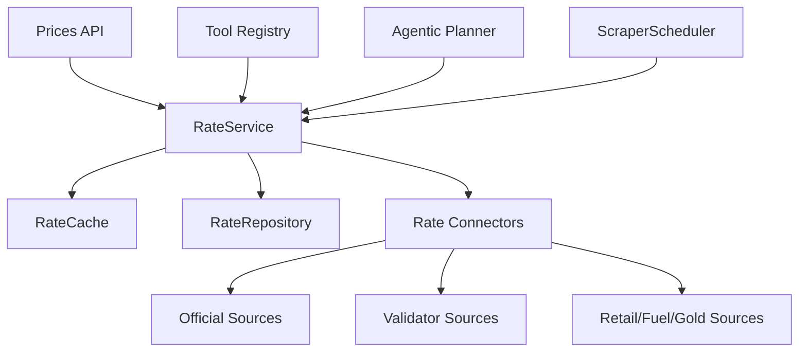

# ADR-011 — Multi-Source Rate Hub

> **Date:** 2026-03-17
> **Status:** Accepted
> **Decision Maker:** CropFresh AI

---

## Context

CropFresh needed one shared way to fetch Karnataka rate data from multiple public sources instead of scattering price lookups across standalone scrapers, agent tools, and API routes. The new capability had to support mandi wholesale rates, support prices, fuel, and gold while preserving existing mandi consumers and keeping source-level evidence visible.

---

## Decision Drivers

- Need one canonical rate service reused by API, tools, planner, graph runtime, and scheduler
- Need official-first conflict handling with transparent evidence and warnings
- Need modular files under the project’s 200-line working limit
- Need to preserve older mandi features during migration

---

## Considered Options

### Option A: Keep separate source-specific services
**Pros:** Low migration effort for each existing caller.
**Cons:** Duplicate fetch logic, inconsistent precedence, inconsistent caching, and no single evidence contract.

### Option B: Introduce a generic multi-source rate hub
**Pros:** One query model, one response contract, shared precedence rules, shared scheduler integration, and easier expansion to new rate categories.
**Cons:** Requires connector abstraction, a new schema, and migration wiring across multiple call sites.

---

## Decision

We chose **Option B: a generic multi-source rate hub**. The hub lives in `src/rates/`, fans out to public connectors in parallel, applies official-first precedence by `RateKind`, persists normalized records, and returns both canonical rates and side-by-side comparison evidence.

---

## Architecture Diagram

---

## Consequences

### Positive
- One rate query path now powers API, tools, planner fallback, and scheduled refreshes
- Conflict handling and warning generation are consistent across categories
- Pending-access sources can be tracked without being executed automatically
- Mandi records still dual-write into the old normalized price store for compatibility

### Negative
- The connector set increases maintenance overhead when upstream HTML changes
- Scheduler refreshes currently rely on a small set of default Karnataka targets for commodity-bound queries

### Risks
- Public sites may drift or rate-limit scraping more aggressively — mitigation: fixture tests, bounded concurrency, retries, and circuit breaking
- Strict mypy compliance is not yet complete in surrounding legacy modules — mitigation: keep the new slice well-tested and tighten annotations incrementally

---

## Follow-Up Actions

- [ ] Add live smoke tests for a small official-source subset when unrestricted network verification is available
- [ ] Externalize scheduler refresh targets instead of hard-coding the initial Karnataka tuples
- [ ] Continue strict typing cleanup around connector wrappers and the shared tool registry

---

## Related

- `docs/features/scraping-system.md`
- `docs/api/endpoints-reference.md`
- `docs/decisions/ADR-010-browser-scraping-rag.md`
