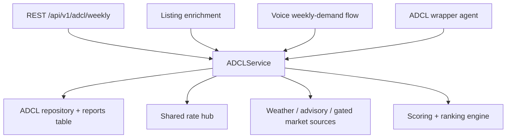

# ADR-012 - ADCL District-First Service Contract

> **Date:** 2026-03-17
> **Status:** Accepted
> **Decision Maker:** CropFresh AI

---

## Context

ADCL currently has multiple partially overlapping integration paths. The wrapper, listings flow, voice flow, and internal engine do not share one stable contract, which makes field naming drift, dependency mismatches, and mock-heavy behavior more likely. Before production work starts, ADCL needs one district-first service surface that the rest of the app can depend on.

---

## Decision Drivers

- Need one ADCL integration contract reused across REST, wrapper, listings, and voice
- Need a district-first rollout that works before deeper farmer-level personalization exists
- Need a canonical payload with evidence, freshness, and source-health metadata
- Need migration safety for existing callers through thin compatibility shims
- Need a modular service boundary that can be tested without invoking every caller separately

---

## Considered Options

### Option A: Keep caller-specific adapters and normalize at the edges
**Pros:** Lowest short-term refactor effort for each existing caller.
**Cons:** Contracts continue to drift, compatibility bugs remain likely, and tests must duplicate behavior across multiple adapters.

### Option B: Introduce one canonical `ADCLService`
**Pros:** One source of truth for report generation, one payload contract, easier testing, and cleaner reuse across REST, listings, voice, and wrappers.
**Cons:** Requires coordinated migration across multiple call sites and temporary compatibility shims.

---

## Decision

We chose **Option B: introduce one canonical `ADCLService`**.

The service contract for Sprint 06 is:

- `generate_weekly_report(district, force_live=False, farmer_id=None, language=None)`
- `get_weekly_demand(district, force_live=False)`
- `is_recommended_crop(commodity, district, week_start=None)`

The canonical crop/report payload includes:

- `commodity`
- `green_label`
- `recommendation`
- `demand_trend`
- `price_trend`
- `seasonal_fit`
- `sow_season_fit`
- `buyer_count`
- `total_demand_kg`
- `predicted_price_per_kg`
- `evidence`
- `freshness`
- `source_health`

Older wrapper or caller-specific field names may remain only as temporary compatibility shims during Sprint 06.

---

## Architecture Diagram

---

## Consequences

### Positive
- One service contract becomes the only supported ADCL integration path.
- REST, voice, listings, and wrappers can return the same user-facing fields and evidence structure.
- Unit and integration tests can focus on one behavior surface instead of four slightly different ones.
- District-first rollout is unblocked without waiting for richer farmer-profile schema work.

### Negative
- Existing ADCL callers need coordinated migration during Sprint 06.
- Temporary compatibility shims add short-lived maintenance overhead until all callers are updated.

### Risks
- Some callers may depend on older field names longer than expected; mitigation: keep thin shims only for the sprint and test each adapter explicitly.
- Service boundaries may expose missing repository methods or startup dependency gaps; mitigation: include app-wiring work in the same sprint.

---

## Follow-Up Actions

- [ ] Implement the canonical `ADCLService` and move all ADCL callers onto it.
- [ ] Add adapter tests for wrapper, listings, and voice compatibility.
- [ ] Remove temporary shims once all callers use the canonical payload directly.

---

## Related

- `tracking/sprints/sprint-06-adcl-productionization.md`
- `docs/decisions/ADR-013-adcl-source-precedence-and-evidence.md`
- `tracking/PROJECT_STATUS.md`
