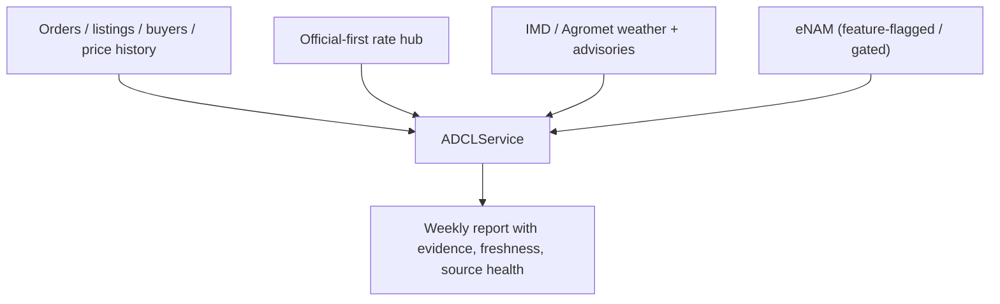

# ADR-013 - ADCL Source Precedence and Evidence Policy

> **Date:** 2026-03-17
> **Status:** Accepted
> **Decision Maker:** CropFresh AI

---

## Context

ADCL must become a live, production-grade ranking service. The current path still risks mock fallbacks, implicit source mixing, and weak evidence visibility. For production use, CropFresh needs a clear rule for how internal marketplace data, official external sources, and gated sources contribute to a recommendation, and how that evidence is exposed to the app.

---

## Decision Drivers

- Need marketplace demand to remain the primary truth for what buyers are actually requesting
- Need official external data for price, arrivals, weather, and advisory context
- Need clear handling for gated sources such as eNAM when credentials are unavailable
- Need explicit freshness and source-health metadata in every ADCL report
- Need to disallow mock data in production execution paths

---

## Considered Options

### Option A: External-first blended ranking
**Pros:** Can use rich public data even when internal demand is sparse.
**Cons:** Risks recommending crops that do not match actual platform demand and makes production trust harder to explain.

### Option B: Marketplace-demand-first ranking with official context and explicit evidence
**Pros:** Keeps recommendations tied to real buyer behavior while still using official sources for price, weather, and arrival context.
**Cons:** Districts with sparse internal demand need careful degradation behavior and transparent confidence.

### Option C: Permissive runtime with mock fallbacks when live sources fail
**Pros:** Simplifies demos and avoids hard failures in development.
**Cons:** Unsafe for production, hides freshness problems, and can mislead app surfaces with fabricated demand.

---

## Decision

We chose **Option B** and explicitly rejected **Option C** for production paths.

The ADCL precedence policy is:

1. Internal marketplace demand is the primary ranking signal.
2. Official external data augments ranking and explanation:
   - Shared official-first rate hub for price context
   - IMD / Agromet weather and advisories
   - Other official or approved public datasets as needed
3. Gated sources such as eNAM are optional enrichments behind credentials or a feature flag.
4. Every report must expose:
   - evidence
   - freshness
   - source_health
5. Mock orders and mock live-source clients are test-only and must not run in production ADCL paths.

---

## Architecture Diagram

---

## Consequences

### Positive
- Recommendations stay grounded in actual marketplace demand instead of abstract public signals alone.
- Source freshness and outages become visible instead of being hidden behind silent fallbacks.
- External connectors can fail independently without forcing the whole report to disappear.
- The policy is explainable to users, operators, and future contributors.

### Negative
- Sparse internal demand in some districts may reduce confidence or recommendation breadth.
- The service must carry more metadata per recommendation to keep evidence transparent.

### Risks
- Official source formats may change or degrade; mitigation: connector tests, health checks, and explicit freshness fields.
- Gated sources may be unavailable during implementation; mitigation: keep them optional and surface their status clearly instead of faking data.

---

## Follow-Up Actions

- [ ] Implement source-health and freshness tracking in the ADCL payload and persistence layer.
- [ ] Disable mock fallbacks in production ADCL paths.
- [ ] Add graceful degradation tests for source failures and sparse district data.

---

## Related

- `tracking/sprints/sprint-06-adcl-productionization.md`
- `docs/decisions/ADR-012-adcl-district-first-service-contract.md`
- `docs/decisions/ADR-011-multi-source-rate-hub.md`
