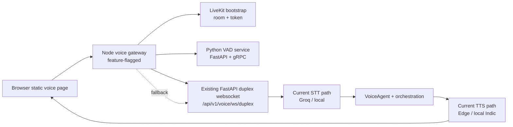

# ADR-015 - LiveKit Bridge Hybrid Cutover

> **Date:** 2026-03-18
> **Status:** Accepted
> **Decision Maker:** CropFresh AI

---

## Context

CropFresh's truthful current realtime voice path is still the FastAPI duplex websocket contract centered on `/api/v1/voice/ws/duplex`. The next architecture target adds a Node.js/TypeScript gateway, LiveKit media bootstrap, and a standalone Python VAD service, but those services do not exist in the repo yet.

If we rewrite the repo docs as though LiveKit is already active, the next implementation session will start from a false premise. If we defer the new architecture entirely, the next session will need to reopen the same system-boundary decisions and lose momentum again.

Sprint 08 needs one explicit decision: do we replace the current websocket runtime immediately, or do we introduce the new architecture in bridge mode while preserving today's working contract?

---

## Decision Drivers

- Need next-session docs that stay truthful about the current runtime
- Need a low-risk path to introduce Node/LiveKit services without breaking current static clients
- Need to preserve `/api/v1/voice/ws/duplex` as the existing fallback and downstream processing engine during Phase 1
- Need to reuse the current Groq plus Edge/local Indic provider path first, instead of coupling the bridge sprint to a provider migration
- Need to avoid reopening architecture direction at the start of the next implementation session

---

## Considered Options

### Option A: Direct cutover to LiveKit as the new canonical runtime

**Pros:** Clean end-state story and fewer transitional layers on paper.  
**Cons:** Incorrect for current repo truth, higher migration risk, and too many moving parts for the next implementation slice.

### Option B: Hybrid bridge mode with LiveKit gateway plus existing duplex websocket downstream

**Pros:** Keeps current docs honest, preserves the working websocket contract, and lets Sprint 08 land service scaffolding and fallback behavior safely.  
**Cons:** Adds transitional complexity and means first-iteration latency is still partly bounded by the current downstream stack.

### Option C: Defer LiveKit entirely and keep improving only the existing duplex websocket

**Pros:** Lowest short-term implementation risk.  
**Cons:** Reopens the same architecture planning next session and delays the new service boundaries the team already wants to establish.

---

## Decision

We chose **Option B: Hybrid bridge mode**.

Sprint 08 will introduce a feature-flagged LiveKit bridge around the current voice runtime instead of replacing `/api/v1/voice/ws/duplex` immediately.

That means:

1. `/api/v1/voice/ws/duplex` remains the truthful current production-facing contract in repo docs.
2. A new Node.js/TypeScript voice gateway can bootstrap LiveKit sessions and fall back to the existing websocket path.
3. A new Python VAD service can expose acoustic segmentation over FastAPI plus gRPC without forcing a same-sprint STT/TTS/orchestration split.
4. The existing FastAPI duplex runtime remains the downstream speech engine for Phase 1.
5. Provider migration to Deepgram/Cartesia is deferred; Sprint 08 keeps the current Groq plus Edge/local Indic path.

We are **not** replacing `/api/v1/voice/ws/duplex` yet because:

- current static voice pages and focused tests already depend on it
- current repo docs describe it as the live path today
- the new gateway and VAD service do not exist yet
- fallback, bridge metrics, and client bootstrap need to land before any honest cutover claim can be made

---

## Architecture Diagram

---

## Consequences

### Positive

- The next implementation session can start from one locked architecture choice instead of reopening migration strategy.
- Current repo docs stay honest about what is live today.
- Static clients keep a stable fallback while the new gateway and VAD service are introduced.
- Sprint 08 can focus on service boundaries, contracts, and fallback behavior instead of combining that work with a provider swap.

### Negative

- Sprint 08 adds transitional architecture rather than a clean final-state cutover.
- First-iteration bridge performance will still depend on the current downstream duplex stack.

### Risks

- The bridge can introduce double buffering or duplicated state transitions if contracts are loose.
- LiveKit bootstrap and websocket fallback can drift if the browser bootstrap contract is not locked early.
- A future cutover still needs a separate decision once the bridge path is proven.

---

## Follow-Up Actions

- [x] Create `tracking/sprints/sprint-08-livekit-voice-bridge-foundation.md` as the implementation-facing sprint source of truth.
- [x] Create the planned bridge architecture doc with the bootstrap contract and VAD gRPC contract.
- [x] Document the follow-on Sprint 09-12 voice-program boundaries in dedicated sprint files so future work stays out of Sprint 08.
- [ ] Keep current websocket/runtime docs truthful until actual bridge implementation lands.
- [ ] Revisit full cutover only after Sprint 08 validates gateway, fallback, and VAD boundaries.

---

## Related

- `tracking/sprints/sprint-08-livekit-voice-bridge-foundation.md`
- `tracking/sprints/sprint-09-semantic-vad-continuity-and-session-recovery.md`
- `tracking/sprints/sprint-10-voice-orchestration-state-and-tools.md`
- `tracking/sprints/sprint-11-voice-load-hardening-and-observability.md`
- `tracking/sprints/sprint-12-livekit-scale-security-and-deployment.md`
- `docs/features/livekit-voice-bridge.md`
- `tracking/PROJECT_STATUS.md`
- `docs/api/websocket-voice.md`
- `docs/features/voice-pipeline.md`
