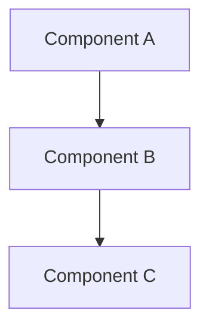

# ADR-NNN — [Decision Title]

> **Date:** YYYY-MM-DD
> **Status:** Proposed | Accepted | Rejected | Deprecated | Superseded
> **Decision Maker:** [Your name]

---

## Context

What is the issue or problem that requires a decision?
Provide background information and constraints.

---

## Decision Drivers

- [Driver 1 — e.g., must support 10+ Indian languages]
- [Driver 2 — e.g., latency budget < 500ms]
- [Driver 3 — e.g., cost < ₹0.50/query]

---

## Considered Options

### Option A: [Name]
**Pros:** ...
**Cons:** ...

### Option B: [Name]
**Pros:** ...
**Cons:** ...

---

## Decision

We chose **[Option X]** because [reasoning].

---

## Architecture Diagram

---

## Consequences

### Positive
- [Benefit 1]

### Negative
- [Tradeoff 1]

### Risks
- [Risk 1 — mitigation: ...]

---

## Follow-Up Actions

- [ ] [Action 1]
- [ ] [Action 2]

---

## Related

- [Previous ADR if superseding]
- [Related architecture doc]
