# CropFresh AI — Module Dependency Map

> **Last Updated:** 2026-03-11

This document shows how every `src/` subdirectory depends on others. Use this to understand the codebase before making changes.

---

## Module Dependency Graph

```mermaid
graph TD
    subgraph "Entry Point"
        MAIN["src/api/main.py<br/>FastAPI Application"]
    end

    subgraph "API Layer"
        ROUTES["src/api/routes/<br/>chat, rag, prices, data"]
        ROUTERS["src/api/routers/<br/>auth, listings, orders, voice"]
        REST["src/api/rest/<br/>voice REST API"]
        WS["src/api/websocket/<br/>voice WebSocket"]
        MW["src/api/middleware/<br/>auth (API key)"]
        CONF["src/api/config.py<br/>Settings (Pydantic)"]
    end

    subgraph "Agent Layer"
        SUP["src/agents/supervisor_agent.py"]
        BASE["src/agents/base_agent.py"]
        REG["src/agents/agent_registry.py"]
        AGENTS["src/agents/<br/>14 domain agents"]
        PROMPT["src/agents/prompt_context.py"]
    end

    subgraph "Voice Layer"
        VA["src/agents/voice_agent.py"]
        STT["src/voice/stt.py"]
        TTS_M["src/voice/tts.py"]
        VAD["src/voice/vad.py"]
        EE["src/voice/entity_extractor/"]
        DUPLEX["src/voice/duplex_pipeline.py"]
        WEBRTC["src/voice/webrtc_transport.py"]
    end

    subgraph "RAG Layer"
        KB["src/rag/knowledge_base.py"]
        RAP["src/rag/raptor.py"]
        QP["src/rag/query_processor.py"]
        HS["src/rag/hybrid_search.py"]
        RR["src/rag/reranker.py"]
        GR["src/rag/graph_retriever.py"]
        EMB["src/rag/embeddings.py"]
    end

    subgraph "Tools Layer"
        TREG["src/tools/registry.py"]
        TOOLS["src/tools/<br/>agmarknet, weather,<br/>deep_research, web_search,<br/>ml_forecaster, news_sentiment"]
    end

    subgraph "Scrapers Layer"
        BSCRP["src/scrapers/base_scraper.py"]
        SCRP["src/scrapers/<br/>agmarknet, enam_client,<br/>imd_weather, state_portals"]
        SCHED["src/scrapers/scraper_scheduler.py"]
    end

    subgraph "Data Layer"
        PG["src/db/postgres_client.py"]
        N4J["src/db/neo4j_client.py"]
        SUP_DB["src/db/supabase_client.py"]
    end

    subgraph "Infrastructure"
        MEM["src/memory/state_manager.py"]
        LLM_P["src/orchestrator/llm_provider.py"]
        RES["src/resilience/<br/>circuit_breaker, health_monitor"]
        PROD["src/production/<br/>cache, rate_limiter, observability"]
        AUTO["src/autonomous/<br/>goal_agent, pear_loop"]
        EVAL["src/evaluation/<br/>ragas_evaluator, eval_runner"]
    end

    %% Entry point dependencies
    MAIN --> CONF
    MAIN --> MW
    MAIN --> REG
    MAIN --> ROUTES & ROUTERS & REST & WS

    %% API to Agent
    ROUTES --> SUP
    ROUTERS --> SUP
    WS --> VA & DUPLEX

    %% Agent Registry wiring
    REG --> SUP
    REG --> AGENTS
    REG --> TREG
    REG --> MEM

    %% Agent dependencies
    AGENTS --> BASE
    SUP --> BASE
    BASE --> MEM
    BASE --> TREG
    BASE --> LLM_P
    SUP --> PROMPT

    %% Voice
    VA --> STT & TTS_M & EE
    DUPLEX --> STT & TTS_M & VAD & WEBRTC
    WS --> DUPLEX

    %% RAG
    AGENTS -->|"KnowledgeAgent"| KB
    KB --> EMB
    QP --> HS --> RR
    HS --> EMB
    GR --> N4J
    RAP --> EMB

    %% Tools
    AGENTS -->|"via ToolRegistry"| TREG
    TREG --> TOOLS
    TOOLS --> SCRP
    SCRP --> BSCRP

    %% Data
    AGENTS --> PG
    AGENTS --> SUP_DB
    KB --> N4J

    %% Infrastructure
    AGENTS --> LLM_P
    MEM --> PG
    PROD --> MEM
```

---

## Directory Quick Reference

| Directory | Files | Primary Dependency | Depended On By |
|-----------|-------|-------------------|----------------|
| `src/api/` | 20+ | `src/agents/`, `src/voice/` | Entry point |
| `src/agents/` | 29 | `src/memory/`, `src/tools/`, `src/orchestrator/` | `src/api/` |
| `src/voice/` | 14 | `src/agents/voice_agent.py` | `src/api/websocket/` |
| `src/rag/` | 23 | `src/db/`, `src/rag/embeddings.py` | `src/agents/knowledge_agent.py` |
| `src/tools/` | 17 | `src/scrapers/` | `src/agents/` (via ToolRegistry) |
| `src/scrapers/` | 16 | External APIs, Scrapling | `src/tools/` |
| `src/db/` | 6 | PostgreSQL, Neo4j, Supabase | `src/agents/`, `src/rag/` |
| `src/memory/` | 2 | Redis | `src/agents/`, `src/api/` |
| `src/orchestrator/` | 2 | LLM APIs (Groq/vLLM/Together; Bedrock legacy removal planned) | `src/agents/` |
| `src/evaluation/` | 8 | RAGAS, `src/rag/` | Scripts |
| `src/resilience/` | 7 | — | `src/agents/` |
| `src/production/` | 5 | Redis | `src/api/` |
| `src/autonomous/` | 5 | `src/agents/` | — |
| `src/mcp/` | 2 | Playwright | — |
| `src/config/` | 2 | — | `src/api/` |
