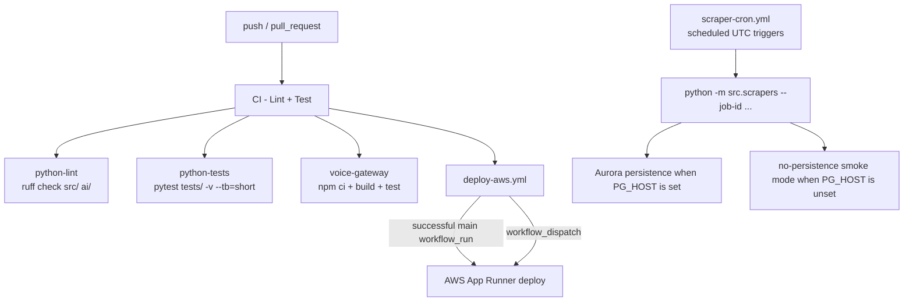

# CropFresh AI - CI/CD Pipeline

> **Source:** `.github/workflows/`
> **Purpose:** Repo truth for CI checks, scheduled scraper runs, and AWS deployment gating

---

## Overview

CropFresh now treats GitHub Actions as the source of truth for Python quality, voice-gateway quality, scheduled scraper execution, and AWS deployment gating.

---

## Active Workflows

| Workflow | File | Current role |
|----------|------|--------------|
| Main CI | `.github/workflows/ci.yml` | Runs Python lint, Python tests, and voice-gateway build/test |
| Agent evals | `.github/workflows/eval-agents.yml` | Runs `uv run python ai/evals/run_evals.py` on agent/eval PRs |
| Scheduled scraping | `.github/workflows/scraper-cron.yml` | Runs one-shot scraper/rate job IDs on UTC cron schedules |
| AWS deploy | `.github/workflows/deploy-aws.yml` | Deploys only after successful CI on `main`, or via manual dispatch |

Deprecated Cloud Run workflows were removed on 2026-03-24 and should be treated as retired.

---

## CI Contract

- Python lint uses `uv sync --group dev` then `uv run ruff check src/ ai/`.
- Python tests use `uv sync --group dev` then `uv run pytest tests/ -v --tb=short`.
- Voice gateway CI runs `npm ci`, `npm run build`, and `npm test` in `services/voice-gateway`.
- Realtime websocket smoke tests are intentionally opt-in and are skipped in default CI because they require a manually running live server.

### Opt-In Realtime E2E

- Set `VOICE_REALTIME_E2E=1` to enable the localhost websocket smoke suites.
- Override `VOICE_REALTIME_E2E_URL` when the live websocket target is not `ws://127.0.0.1:8000/api/v1/voice/ws`.

---

## Scraper Cron Mapping

| UTC | Job IDs |
|-----|---------|
| `00:15` | `rates_official_mandi_morning` |
| `01:30` | `rates_support_reference_daily` |
| `03:30` | `rates_fuel_gold_morning` |
| `04:30` | `agmarknet_daily` |
| `05:30` | `imd_daily` |
| `06:45` | `rates_official_mandi_midday` |
| `07:30` | `rates_validator_retail_daily`, `rates_fuel_gold_midday` |
| `11:30` | `rates_fuel_gold_evening` |

The scraper workflow now runs `python -m src.scrapers` directly instead of trying to keep APScheduler alive in the GitHub runner.

---

## Persistence Notes

- `src/scrapers/__main__.py` opens an Aurora PostgreSQL client when `PG_HOST` is present.
- If Aurora settings are missing, the CLI still runs and logs that it is operating in no-persistence smoke mode.
- Legacy jobs such as `agmarknet_daily` still exist for compatibility, but the shared rate-hub job IDs are the main refresh path going forward.

---

## Deployment Notes

- AWS App Runner is the only supported live deployment target in GitHub Actions.
- Automatic deploys happen only from successful `main` branch CI runs through the `workflow_run` trigger.
- `workflow_dispatch` remains available for controlled manual deploys.
- Remote deploy success still depends on valid GitHub secrets for AWS and Aurora; local repo verification cannot prove remote secret configuration.
