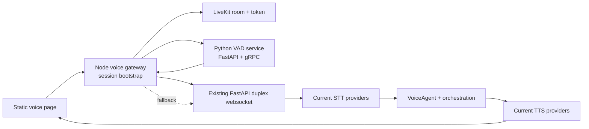

# CropFresh AI - LiveKit Voice Bridge Plan

> **Last Updated:** 2026-03-18
> **Status:** Planned next-sprint architecture, not current runtime
> **Related ADR:** `docs/decisions/ADR-015-livekit-bridge-hybrid-cutover.md`

---

## Overview

This document describes the **planned** Sprint 08 bridge architecture for introducing LiveKit and a dedicated VAD service without rewriting the repo as though that path is already live.

Current truth remains:

- `/api/v1/voice/ws/duplex` is the active realtime contract today
- current transport is JSON plus base64 audio over websocket
- current downstream providers remain Groq Whisper plus Edge/local Indic TTS

Sprint 08 adds a bridge around that runtime instead of replacing it immediately.

---

## Implementation Snapshot (2026-03-18)

The first Sprint 08 implementation slice now exists in the repo:

- `services/voice-gateway/` provides `POST /sessions/bootstrap`, `GET /health`, `GET /ready`, and `GET /metrics` plus the initial ring-buffer and RMS-gate utilities.
- `services/vad-service/` provides `/health`, `/ready`, `/v1/vad/config`, the Sprint 08 acoustic segmenter, and the initial protobuf plus gRPC service surface.
- `static/premium_voice.html` now asks the gateway for bootstrap metadata first and then visibly falls back to `/api/v1/voice/ws/duplex` when bridge mode is unavailable.

Current runtime truth still holds:

- the browser media path still uses the existing duplex websocket transport
- LiveKit token bootstrap is scaffolded, not yet the active browser media path
- the current downstream STT plus LLM plus TTS path remains the FastAPI duplex runtime

---

## Current Runtime Flow

### Current Runtime Notes

- The duplex websocket is still the truthful live path in repo docs.
- The current stack is already modular enough to reuse as a downstream engine.
- Static voice pages are the current browser test surfaces.

---

## Target Sprint 08 Bridge Flow

### Sprint 08 Intent

- Add a new Node.js/TypeScript gateway for bootstrap, buffering, and fallback coordination.
- Add a dedicated Python VAD service for acoustic segmentation.
- Keep the current FastAPI duplex runtime as the downstream speech engine.
- Keep current providers in place for Phase 1.

This is intentionally a **bridge** architecture, not a cutover claim.

---

## Browser Bootstrap Contract

Sprint 08 should lock the browser bootstrap response before deep implementation work starts.

| Field | Type | Required | Notes |
|-------|------|----------|-------|
| `session_id` | string | Yes | Shared correlation id across gateway, VAD, and downstream relay |
| `mode` | string | Yes | `bridge`, `fallback_ws`, or another explicitly documented mode |
| `livekit_url` | string | No | Present only when bridge mode is enabled and token issuance succeeds |
| `token` | string | No | Short-lived LiveKit access token |
| `fallback_ws_url` | string | Yes | Existing duplex websocket fallback path |
| `features` | object | Yes | Feature flags such as `livekit`, `vad_service`, `fallback_enabled` |

### Bootstrap Behavior Rules

1. Browser asks the gateway for a session bootstrap.
2. If bridge mode is available, the response includes `livekit_url` and `token`.
3. If bootstrap is unavailable or disabled, the response still returns a valid `fallback_ws_url`.
4. The current static voice pages must surface which mode is active.

---

## VAD gRPC Contract

Sprint 08 should lock a small acoustic contract instead of introducing semantic endpointing immediately.

### Client Stream Message

| Field | Type | Notes |
|-------|------|-------|
| `session_id` | string | Correlates frames to the browser session |
| `sequence` | integer | Monotonic frame order |
| `sample_rate` | integer | `16000` for Sprint 08 |
| `pcm16` | bytes | Raw mono PCM |

### Server Event Message

| Field | Type | Notes |
|-------|------|-------|
| `state` | string | `silence`, `speech_start`, `speech`, `speech_end` |
| `probability` | float | Silero probability for the frame |
| `rms` | float | Pre-gate energy signal |
| `segment_id` | string | Stable id for grouped speech segment |
| `sequence` | integer | Echoes or references frame order |
| `end_of_segment` | bool | Signals buffer flush to downstream STT path |

### Acoustic Settings for Sprint 08

- sample rate: `16kHz`
- frame size: `512` samples
- onset threshold: `0.5`
- offset threshold: `0.35`
- minimum speech duration: `250ms`
- trailing silence padding: `300ms`

Semantic endpointing is a later-phase follow-up and should not be implied by Sprint 08 docs.

---

## Phase Boundaries

| Area | Sprint 08 | Later Phases |
|------|-----------|--------------|
| Gateway | Bootstrap, health/readiness, ring buffer, fallback | load balancing, BullMQ/Redis Streams, advanced reconnection |
| VAD | Acoustic segmentation only | semantic endpointing, speaker diarization, wake-word |
| Downstream runtime | reuse current duplex websocket engine | eventual cutover or deeper service decomposition |
| Browser client | extend static pages minimally | Next.js app and richer voice UI |
| Mobile | none | Flutter client and background/VoIP work |
| Providers | keep current Groq plus Edge/local path | optional Deepgram/Cartesia or other provider changes |

---

## Voice Program Sequence (Sprint 08-12)

The Sprint 08 bridge plan now has explicit follow-on sprint boundaries so the next sessions do not need to rediscover the remaining voice program shape.

| Sprint | Focus | Boundary Locked Here |
|--------|-------|----------------------|
| Sprint 08 | LiveKit bridge foundation | add gateway and VAD service scaffolding without replacing the current duplex websocket runtime |
| Sprint 09 | semantic VAD, continuity, reconnect recovery | keep interruption handling, endpointing, and reconnect work out of Sprint 08 |
| Sprint 10 | orchestration, state machine, memory, tools | keep multi-agent routing and speaker-aware state work out of Sprint 08 and Sprint 09 |
| Sprint 11 | hardening, observability, load tests | keep bulkheads, circuit breakers, metrics, and k6 work in a separate hardening sprint |
| Sprint 12 | scale, security, deployment readiness | keep cluster deployment, compliance, and cutover criteria as the final voice-program step |

These boundaries are now documented in:

- `tracking/sprints/sprint-08-livekit-voice-bridge-foundation.md`
- `tracking/sprints/sprint-09-semantic-vad-continuity-and-session-recovery.md`
- `tracking/sprints/sprint-10-voice-orchestration-state-and-tools.md`
- `tracking/sprints/sprint-11-voice-load-hardening-and-observability.md`
- `tracking/sprints/sprint-12-livekit-scale-security-and-deployment.md`

---

## What This Doc Does Not Claim

- It does not claim LiveKit is already the active production runtime.
- It does not replace `docs/api/websocket-voice.md` as the source of truth for the current websocket contract.
- It does not change the current FastAPI duplex path into a legacy path yet.

---

## Related

- `tracking/sprints/sprint-08-livekit-voice-bridge-foundation.md`
- `tracking/sprints/sprint-09-semantic-vad-continuity-and-session-recovery.md`
- `tracking/sprints/sprint-10-voice-orchestration-state-and-tools.md`
- `tracking/sprints/sprint-11-voice-load-hardening-and-observability.md`
- `tracking/sprints/sprint-12-livekit-scale-security-and-deployment.md`
- `docs/decisions/ADR-015-livekit-bridge-hybrid-cutover.md`
- `tracking/daily/2026-03-18.md`
- `docs/api/websocket-voice.md`
- `docs/features/voice-pipeline.md`
