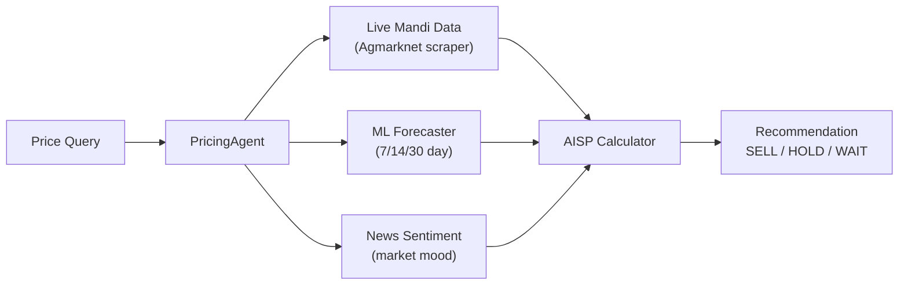

# CropFresh AI — Pricing Engine

> **Source:** `src/agents/pricing_agent.py`, `src/agents/aisp_calculator.py`, `src/tools/ml_forecaster.py`

---

## Overview

The pricing engine helps farmers understand fair prices and make sell/hold decisions using live mandi data, ML forecasting, and the AISP (Assured Intelligent Selling Price) formula.



---

## AISP Formula

**Assured Intelligent Selling Price** — the price CropFresh recommends farmers accept:

```
AISP = Farmer Ask Price
     + Logistics Cost (transport, handling)
     + Platform Margin (4-8%)
     + Risk Buffer (2%)
```

| Component | Range | Source |
|-----------|-------|--------|
| Farmer Ask Price | Input | From listing or voice |
| Logistics Cost | ₹1-5/kg | Distance-based calculation |
| Platform Margin | 4-8% | Grade-adjusted |
| Risk Buffer | 2% | Fixed |

---

## Price Prediction

Uses `MLForecaster` for time-series prediction with multiple horizons:

| Horizon | Model | Use Case |
|---------|-------|----------|
| 7-day | Linear trend + seasonality | Short-term sell decision |
| 14-day | Moving average + volatility | Medium-term planning |
| 30-day | Historical pattern matching | Crop planning |

---

## Sell/Hold Decision Logic

```
IF current_price > AISP AND trend = DECLINING  → SELL NOW
IF current_price > AISP AND trend = RISING     → HOLD (up to 3 days)
IF current_price < AISP AND trend = RISING     → WAIT (expected to improve)
IF current_price < AISP AND trend = DECLINING  → SELL NOW (cut losses)
```

Output example:
```
"ಟೊಮ್ಯಾಟೊ ಬೆಲೆ ₹25/kg (ಮೈಸೂರು). 
AISP: ₹28/kg.
Trend: ↗ Rising (+8% next 7 days).
Recommendation: HOLD for 2-3 days."
```
