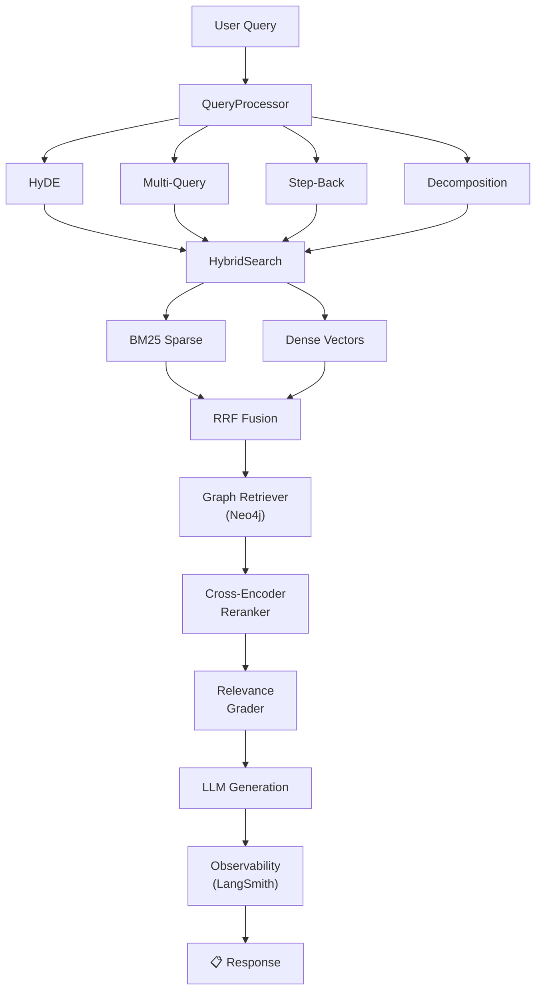

# CropFresh AI — RAG Pipeline

> **Source:** `src/rag/` (21 modules)
> **Vector DB:** Qdrant Cloud (`agri_knowledge` collection)
> **Graph DB:** Neo4j (entity relationships)
> **Embeddings:** BAAI/bge-m3 (MiniLM-L6-v2 fallback)

---

## Overview

The RAG (Retrieval-Augmented Generation) pipeline provides the knowledge layer for all agents. It retrieves relevant agricultural documents, reranks them, and injects grounded context into LLM prompts.

---

## Module Reference

| Module | File | Purpose |
|--------|------|---------|
| Knowledge Base | `knowledge_base.py` | Core KB: ingest, search, CRUD |
| Query Processor | `query_processor.py` | HyDE, multi-query, step-back, decomposition |
| Hybrid Search | `hybrid_search.py` | BM25 sparse + dense vector + RRF fusion |
| RAPTOR | `raptor.py` | Hierarchical tree indexing with GMM clustering |
| Contextual Chunker | `contextual_chunker.py` | Smart chunking with entity extraction |
| Embeddings | `embeddings.py` | BGE-M3 / MiniLM embedding provider |
| Reranker | `reranker.py` | Cross-encoder reranking (MiniLM fallback) |
| Grader | `grader.py` | Relevance scoring (LLM-based + heuristic) |
| Graph Retriever | `graph_retriever.py` | Neo4j entity traversal |
| Observability | `observability.py` | LangSmith tracing + eval metrics |
| Enhanced Retriever | `enhanced_retriever.py` | Parent Doc, Sentence Window, MMR |
| Agentic Orchestrator | `agentic_orchestrator.py` | Retrieval planning (experimental) |
| Agri Embeddings | `agri_embeddings.py` | Domain instruction prefix wrapper |
| Browser RAG | `browser_rag.py` | Live web source integration |
| Dedup | `dedup.py` | Result deduplication |
| Self-Query | `self_query.py` | Metadata filter extraction |

---

## Query Processing Strategies

| Strategy | Description | Best For |
|----------|-------------|----------|
| **HyDE** | Generate hypothetical answer, search with it | Factual questions |
| **Multi-Query** | Generate 3 query perspectives | Ambiguous questions |
| **Step-Back** | Abstract to broader concept | Technical questions |
| **Decomposition** | Split into sub-questions | Complex multi-part queries |

---

## Performance Targets

| Metric | Target | Current |
|--------|--------|---------|
| Retrieval latency (P95) | < 200ms | ~150ms (Qdrant Cloud) |
| End-to-end RAG latency | < 3s | ~2-4s |
| Relevance (RAGAS) | > 0.8 | Baseline pending |
| Cost per query | < ₹0.50 | ~₹0.44 |
