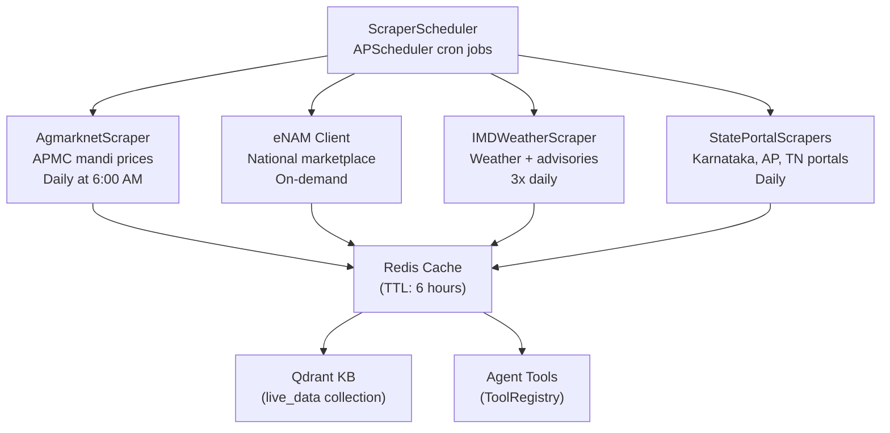

# CropFresh AI — Scraping System

> **Source:** `src/scrapers/`
> **Framework:** Scrapling + Playwright + Camoufox
> **Purpose:** Live APMC mandi prices, weather data, government portal data

---

## Overview

CropFresh scrapes 10+ agricultural data sources for real-time market intelligence. All scrapers extend a common `BaseScraper` that handles stealth browsing, caching, and error recovery.



---

## Scraper Inventory

| Scraper | Source | Data | Module |
|---------|--------|------|--------|
| **AgmarknetScraper** | agmarknet.gov.in | Daily APMC mandi prices | `src/scrapers/agmarknet.py` |
| **eNAM Client** | enam.gov.in | National e-marketplace data | `src/scrapers/enam_client.py` |
| **IMD Weather** | mausam.imd.gov.in | Forecasts + agro advisories | `src/tools/imd_weather.py` |
| **AI Kosha Client** | aikosha.kar.nic.in | Karnataka agri data | `src/scrapers/aikosha_client.py` |
| **State Portals** | Various state gov sites | State-level APMC data | `src/scrapers/state_portals/` |
| **News Sentiment** | Agri news sites | Market sentiment | `src/tools/news_sentiment.py` |

---

## BaseScraper (`src/scrapers/base_scraper.py`)

All scrapers inherit this base class which provides:

- **Stealth browsing** — Camoufox browser fingerprint rotation
- **Retry logic** — Exponential backoff with configurable retries
- **Caching** — Redis cache with TTL-based invalidation
- **Rate limiting** — Polite crawling with delays
- **Error recovery** — Graceful fallback on scrape failure

---

## Agmarknet Scraper Details

The primary scraper for APMC mandi prices:

```
URL: https://agmarknet.gov.in/
Data: commodity × market × date → (min_price, max_price, modal_price)
Cache TTL: 6 hours
Schedule: Daily at 6:00 AM IST
```

**Commodity Mapping:** Maps English/Hindi/Kannada names to Agmarknet codes.

| Commodity | Agmarknet Code | Hindi | Kannada |
|-----------|---------------|-------|---------|
| Tomato | 78 | टमाटर | ಟೊಮ�ಯಾಟೊ |
| Potato | 24 | आलू | ಆಲೂಗಡ�ಡೆ |
| Onion | 23 | प�याज़ | ಈರ�ಳ�ಳಿ |

---

## Scheduler (`src/scrapers/scraper_scheduler.py`)

Uses APScheduler for automated scraping:

```python
# Schedule configuration
APMC_PRICES:  cron(hour=6, minute=0)   # 6 AM daily
WEATHER:      cron(hour="6,12,18")      # 3x daily
STATE_DATA:   cron(hour=7, minute=0)   # 7 AM daily
```

## 2026-03-17 Update — Multi-Source Rate Hub

CropFresh now has a shared `src/rates/` domain that sits above the individual scrapers and exposes one official-first rate service to the API, tool registry, agentic planner, and scheduler.

### Source Tiers

- `official`: KRAMA daily, AGMARKNET OGD, AGMARKNET scrape, public eNAM dashboard
- `reference_official`: KRAMA floor price, KAPRICOM, PetrolDieselPrice, BusinessLine gold
- `validator`: NaPanta, AgriPlus, CommodityMarketLive, Shyali
- `retail_reference`: VegetableMarketPrice, TodayPriceRates, Park+ fuel, IIFL gold
- `pending_access`: eNAM official API, Agriwatch, NCDEX, Kisan Suvidha, app-only sources, legacy KSAMB/Maratavahini

### Shared Refresh Schedule (IST)

- Official mandi refresh: `06:15` and `12:15`
- Support/reference refresh: `07:00`
- Fuel and gold refresh: `09:00`, `13:00`, and `17:00`
- Validator and retail refresh: `13:00`
- Legacy `agmarknet_daily` and `imd_daily` jobs remain for compatibility while older consumers migrate

### Conflict Policy

- Mandi wholesale precedence: `krama_daily -> agmarknet_ogd -> agmarknet_scrape -> enam_dashboard -> validator sites`
- Support price precedence: `krama_floor_price -> kapricom_reference`
- Fuel precedence: `petroldieselprice -> parkplus_fuel`
- Gold precedence: `businessline_gold -> iifl_gold`
- Warnings are emitted for stale official data, date mismatch, unit mismatch, or source discrepancies >= 15%
