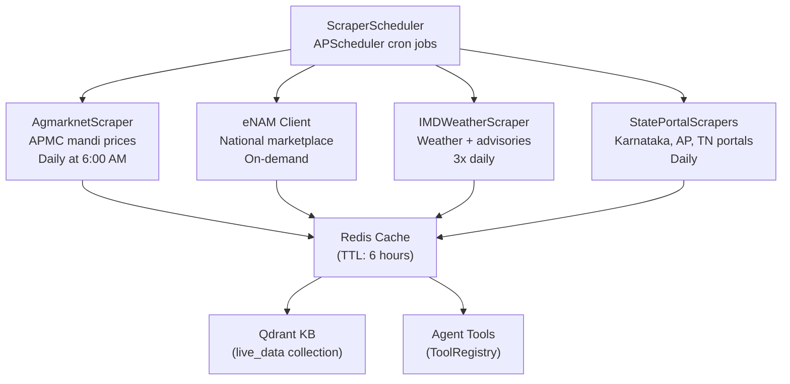

# CropFresh AI — Scraping System

> **Source:** `src/scrapers/`
> **Framework:** Scrapling + Playwright + Camoufox
> **Purpose:** Live APMC mandi prices, weather data, government portal data

---

## Overview

CropFresh scrapes 10+ agricultural data sources for real-time market intelligence. All scrapers extend a common `BaseScraper` that handles stealth browsing, caching, and error recovery.



---

## Scraper Inventory

| Scraper | Source | Data | Module |
|---------|--------|------|--------|
| **AgmarknetScraper** | agmarknet.gov.in | Daily APMC mandi prices | `src/scrapers/agmarknet.py` |
| **eNAM Client** | enam.gov.in | National e-marketplace data | `src/scrapers/enam_client.py` |
| **IMD Weather** | mausam.imd.gov.in | Forecasts + agro advisories | `src/tools/imd_weather.py` |
| **AI Kosha Client** | aikosha.kar.nic.in | Karnataka agri data | `src/scrapers/aikosha_client.py` |
| **State Portals** | Various state gov sites | State-level APMC data | `src/scrapers/state_portals/` |
| **News Sentiment** | Agri news sites | Market sentiment | `src/tools/news_sentiment.py` |

---

## BaseScraper (`src/scrapers/base_scraper.py`)

All scrapers inherit this base class which provides:

- **Stealth browsing** — Camoufox browser fingerprint rotation
- **Retry logic** — Exponential backoff with configurable retries
- **Caching** — Redis cache with TTL-based invalidation
- **Rate limiting** — Polite crawling with delays
- **Error recovery** — Graceful fallback on scrape failure

---

## Agmarknet Scraper Details

The primary scraper for APMC mandi prices:

```
URL: https://agmarknet.gov.in/
Data: commodity × market × date → (min_price, max_price, modal_price)
Cache TTL: 6 hours
Schedule: Daily at 6:00 AM IST
```

**Commodity Mapping:** Maps English/Hindi/Kannada names to Agmarknet codes.

| Commodity | Agmarknet Code | Hindi | Kannada |
|-----------|---------------|-------|---------|
| Tomato | 78 | टमाटर | ಟೊಮ್ಯಾಟೊ |
| Potato | 24 | आलू | ಆಲೂಗಡ್ಡೆ |
| Onion | 23 | प्याज़ | ಈರುಳ್ಳಿ |

---

## Scheduler (`src/scrapers/scraper_scheduler.py`)

Uses APScheduler for automated scraping:

```python
# Schedule configuration
APMC_PRICES:  cron(hour=6, minute=0)   # 6 AM daily
WEATHER:      cron(hour="6,12,18")      # 3x daily
STATE_DATA:   cron(hour=7, minute=0)   # 7 AM daily
```
