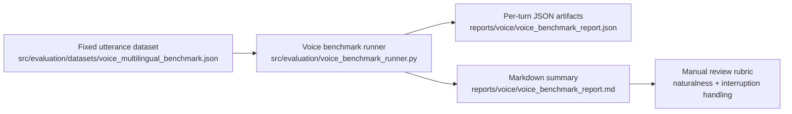

# CropFresh AI - Voice Benchmarking

> **Last Updated:** 2026-03-24
> **Sprint:** Sprint 09 - Semantic VAD, Continuity, and Session Recovery

---

## Overview

Sprint 09 needs one fixed multilingual utterance set so semantic endpointing, first-audio timing, and interruption recovery can be compared across sessions without changing the prompts every run.



---

## Current Dataset Scope

- Languages: `kn`, `hi`, `te`, `ta`
- Coverage: hesitation phrases, complete queries, and code-mixed market questions
- Output contract per turn:
  - expected endpointing outcome
  - actual endpointing decision
  - semantic hold time
  - optional first-audio timing
  - optional barge-in reaction timing
  - optional interruption recovery timing

---

## Manual Review Rubric

| Dimension | Score | What to look for |
|-----------|-------|------------------|
| Endpointing naturalness | 1-5 | Did the turn end too early, too late, or at the right moment? |
| First-audio responsiveness | 1-5 | Did playback start quickly enough to feel live? |
| Barge-in handling | 1-5 | Did interruption feel controlled instead of abrupt or laggy? |
| Language clarity | 1-5 | Was the response natural and intelligible for the target language? |
| Continuity quality | 1-5 | Did short pauses feel smooth instead of dead or broken? |

Review note format:

- `benchmark_id`
- `score_summary`
- `language`
- `operator_notes`
- `follow_up`

---

## Running the Benchmark

```bash
python ai/evals/run_voice_benchmark.py
python ai/evals/run_voice_benchmark.py --observations reports/voice/observed_metrics.json
```

Observation files are optional. When supplied, the runner merges per-turn timing metrics into the artifact report.

---

## Related

- `tracking/sprints/sprint-09-semantic-vad-continuity-and-session-recovery.md`
- `docs/features/livekit-voice-bridge.md`
- `src/evaluation/datasets/voice_multilingual_benchmark.json`
- `src/evaluation/voice_benchmark_runner.py`
