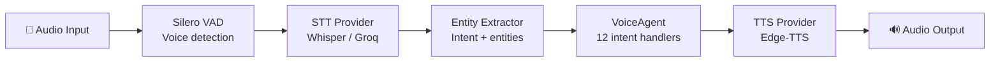

# CropFresh AI — Voice Pipeline

> **Source:** `src/voice/` + `src/agents/voice_agent.py`
> **Languages:** 10 Indian languages (Kannada-first)
> **Pipeline:** Audio → VAD → STT → Entity Extraction → Agent → TTS → Audio

---

## Overview

The voice pipeline enables Karnataka farmers to interact with CropFresh AI using voice in their native language. It handles:

- **Speech-to-Text** — IndicWhisper / Groq Whisper for transcription
- **Entity Extraction** — Regex-based extraction of crops, quantities, prices, locations
- **Multi-turn Conversations** — Track pending intents and collect missing fields
- **Agent Routing** — 12 intent handlers + fallback to supervisor
- **Text-to-Speech** — Edge-TTS / IndicTTS for audio responses



---

## Components

### 1. STT — Speech-to-Text (`src/voice/stt.py`)

**MultiProviderSTT** supports three providers with automatic fallback:

| Provider | Model | Languages | Speed | Best For |
|----------|-------|-----------|-------|----------|
| Faster Whisper (local) | `base` / `small` | All | ~1-3s | Offline, low-cost |
| Groq Whisper (cloud) | `whisper-large-v3` | All | ~0.5s | Low-latency |
| IndicWhisper | Various | Indian languages | ~2-4s | Kannada/Hindi accuracy |

### 2. TTS — Text-to-Speech (`src/voice/tts.py`)

**EdgeTTSProvider** supports 10 Indian languages:

| Language | Voice ID |
|----------|----------|
| Kannada | `kn-IN-SapnaNeural` |
| Hindi | `hi-IN-SwaraNeural` |
| English | `en-IN-NeerjaNeural` |
| Tamil | `ta-IN-PallaviNeural` |
| Telugu | `te-IN-ShrutiNeural` |

### 3. VAD — Voice Activity Detection (`src/voice/vad.py`)

Uses **Silero VAD** model for detecting speech start/end. Key settings:
- Threshold: 0.5 (configurable)
- Min speech duration: 250ms
- Silence padding: 300ms

### 4. Entity Extractor (`src/voice/entity_extractor/`)

Regex-based extraction (no LLM call):
- **Commodities:** 20+ vegetables in English, Hindi, Kannada
- **Quantities:** kg, quintal (auto-converts to kg)
- **Districts:** 25+ Karnataka districts
- **Prices:** ₹/kg format

### 5. VoiceAgent (`src/agents/voice_agent.py`)

**1,071 lines.** Handles 12 intent types with multi-turn flows:

| Intent | Flow | Required Fields |
|--------|------|----------------|
| `CREATE_LISTING` | Multi-turn | crop → quantity → price |
| `CHECK_PRICE` | Single | crop |
| `FIND_BUYER` | Multi-turn | commodity → quantity |
| `REGISTER` | Multi-turn | name → phone → district |
| `CHECK_WEATHER` | Single | location |
| `TRACK_ORDER` | Single | (optional order_id) |

---

## Multi-Turn Conversation Example

```
Farmer: "ನನ್ನ ಟೊಮ್ಯಾಟೊ ಮಾರಾಟ ಮಾಡಬೇಕು"
  → Intent: CREATE_LISTING, entities: {crop: "Tomato"}
  → Missing: quantity, price
Agent: "ಎಷ್ಟು ಕೆಜಿ ಟೊಮ್ಯಾಟೊ ಇದೆ?"

Farmer: "100 ಕೆಜಿ"
  → entities: {quantity_kg: 100}
  → Missing: price
Agent: "ಬೆಲೆ ಎಷ್ಟು ₹/ಕೆಜಿ?"

Farmer: "₹25"
  → entities: {asking_price: 25}
  → All fields collected → Create listing
Agent: "✅ ನಿಮ್ಮ 100 ಕೆಜಿ ಟೊಮ್ಯಾಟೊ ₹25/ಕೆಜಿ ಲಿಸ್ಟ್ ಆಗಿದೆ"
```

---

## Deployment Modes

| Mode | Transport | Use Case |
|------|-----------|----------|
| **REST** | HTTP POST `/api/v1/voice/process` | Single-shot voice in/out |
| **WebSocket** | `ws://host/ws/voice/{uid}` | Real-time streaming |
| **Pipecat** | WebRTC via `pipecat_bot.py` | Low-latency bidirectional |
