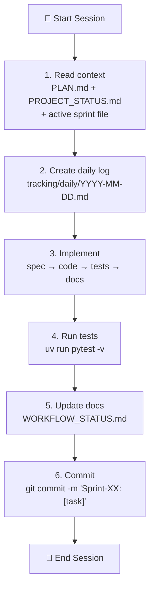

# CropFresh AI — Development Workflow

> Day-to-day development workflow for contributing to CropFresh AI.

---

## Daily Development Loop



---

## Sprint Cycle (2 Weeks)

| Day | Activity |
|-----|----------|
| **Day 1** | Create `tracking/sprints/sprint-XX-theme.md` with 5-7 goals |
| **Day 2-9** | Daily: implement → test → commit → log |
| **Day 10** | Code freeze. Focus on tests and edge cases |
| **Day 11** | Fill "Sprint Outcome" section in sprint file |
| **Day 12** | Update `tracking/PROJECT_STATUS.md` |
| **Day 13** | Create ADRs for any architecture decisions |
| **Day 14** | Retrospective in `tracking/retros/sprint-XX-retro.md` |

---

## Git Conventions

### Commit Messages

```bash
# Format: "Sprint-XX: [concise task description]"
git commit -m "Sprint-05: AgriEmbeddingWrapper with domain instructions"
git commit -m "Sprint-05: APMC scraper Redis cache integration"
git commit -m "Docs: ADR-011 - chose Edge-TTS over Google TTS"
```

### Branch Strategy

```bash
# Feature branches for risky work
git checkout -b feature/sprint-05-adaptive-router
# ... develop and test ...
git checkout main && git merge feature/sprint-05-adaptive-router

# Tag milestones
git tag -a v0.4-mvp -m "MVP: farmer listing + voice + price query"
```

---

## Common Commands

```bash
# Run development server
uv run uvicorn src.api.main:app --reload --port 8000

# Run tests
uv run pytest -v --cov=src --cov-report=term-missing

# Type checking
uv run mypy src/

# Lint + format
uv run ruff check src/
uv run ruff format src/

# Populate knowledge base
uv run python scripts/populate_qdrant.py

# Start infrastructure
docker compose up -d qdrant redis neo4j
```

---

## File Changes Log Rule

After every code change, add an entry to `WORKFLOW_STATUS.md`:

```markdown
| Action | File | Description |
| ------ | ---- | ----------- |
| CREATE | `src/agents/my_agent.py` | New agent for [purpose] |
| UPDATE | `src/agents/agent_registry.py` | Register my_agent |
```

---

## 2026-03-24 Update - CI/CD Truth

- `.github/workflows/ci.yml` now has three explicit required checks:
  - Python lint: `uv sync --group dev` then `uv run ruff check src/ ai/`
  - Python tests: `uv sync --group dev` then `uv run pytest tests/ -v --tb=short`
  - Voice gateway: `npm ci`, `npm run build`, and `npm test` in `services/voice-gateway/`
- `.github/workflows/deploy-aws.yml` is now the only live deploy workflow. It runs automatically only after a successful `CI — Lint + Test` workflow on `main`, while still allowing `workflow_dispatch` for manual deploys.
- The deprecated Cloud Run workflows were removed from `.github/workflows/` and should be treated as historical only.
- Realtime websocket smoke tests in `tests/test_voice_realtime.py` and `tests/integration/test_voice_realtime.py` are now opt-in E2E checks. Set `VOICE_REALTIME_E2E=1` and optionally `VOICE_REALTIME_E2E_URL=ws://host:port/api/v1/voice/ws` when you intentionally want to run them against a live server.
- The scheduled scraper workflow no longer starts APScheduler inside GitHub Actions. It now calls `uv run python -m src.scrapers --job-id ...` so each cron tick executes one explicit one-shot job set and exits cleanly.
- See `docs/features/ci-cd-pipeline.md` for the current workflow map and scraper cron schedule.
