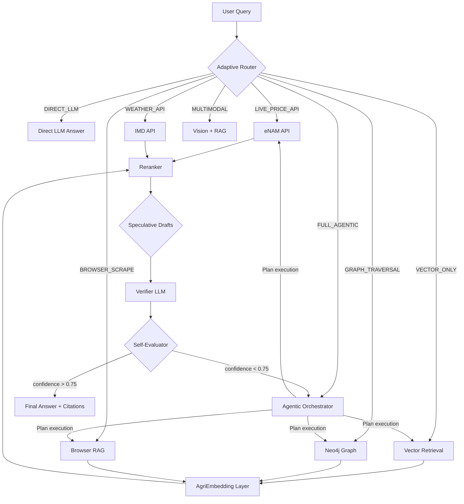

# Advanced Agentic RAG Architecture

> **Last Updated**: 2026-02-27  
> **Status**: Active — Phases 1–4 implemented; Phases 5–9 in Sprints 05–08

---

## System Overview

CropFresh AI uses a **multi-tier Agentic RAG architecture** with an adaptive entry point that routes queries to the cheapest sufficient retrieval strategy. The system is designed to outperform generic RAG systems on Indian agricultural domain queries through 2027.

```
User Query / Voice Input
         │
         ▼
┌──────────────────────┐
│  Adaptive Query      │  ← 8-strategy router (NEW — Sprint 05)
│  Router (ADR-008)    │  ← Rule-based pre-filter + Groq 8B classifier
└────────┬─────────────┘
         │
    ┌────┴───────────────────────────────────────┐
    │  Route decision determines path taken:       │
    │  DIRECT | VECTOR | GRAPH | PRICE | WEATHER  │
    │  BROWSER | MULTIMODAL | FULL_AGENTIC          │
    └────┬───────────────────────────────────────┘
         │
         ▼
┌──────────────────────┐
│  Agentic RAG         │  ← Autonomous planning orchestrator (NEW — Sprint 05)
│  Orchestrator        │  ← Only for FULL_AGENTIC / BROWSER / complex paths
│  (ADR-007)           │
└────────┬─────────────┘
         │  Parallel retrieval across tools:
    ┌────┴───────────────────────────────────────┐
    │              │              │               │
    ▼              ▼              ▼               ▼
RAPTOR + Hybrid  Graph RAG   Live APIs      Browser RAG
(Vector KB)    (Neo4j)     (eNAM/IMD)   (Scrapling) 
    │              │              │               │
    └──────────────┴──────────────┴───────────────┘
                        │
         ▼              ▼
┌──────────────────────────────┐
│  Agri Embedding Layer         │  ← Domain context injection (NEW — Sprint 05)
│  (ADR-009)                    │  ← Term normalization + domain instruction
└──────────────────────────────┘
         │
         ▼
┌──────────────────────────────┐
│  Reranking Pipeline          │
│  Cross-Encoder + Cohere      │
└──────────────────────────────┘
         │
         ▼
┌──────────────────────────────┐
│  Speculative Draft Engine    │  ← 3 parallel drafts → verifier picks best
│  (Part of Orchestrator)      │  ← –51% latency vs. sequential generation
└──────────────────────────────┘
         │
         ▼
┌──────────────────────────────┐
│  Self-Evaluator              │  ← RAGAS confidence gate
│  (CRAG + Self-RAG)           │  ← confidence < 0.75 → retry with new plan
└──────────────────────────────┘
         │
         ▼
    Final Answer (with citations)
```

---

## Architecture Components

### 1. Adaptive Query Router (NEW — Sprint 05)
**File**: `ai/rag/query_analyzer.py` → `AdaptiveQueryRouter`  
**ADR**: [ADR-008](./decisions/ADR-008-adaptive-query-router.md)  
**Doc**: [adaptive_query_router.md](./architecture/adaptive_query_router.md)

Routes queries to 8 strategies based on type + cost signal:

| Strategy | Trigger | Avg Cost |
|----------|---------|---------|
| `DIRECT_LLM` | Greetings, simple definitions | ₹0.03 |
| `VECTOR_ONLY` | Agronomy knowledge queries | ₹0.12 |
| `GRAPH_TRAVERSAL` | Entity/relational queries | ₹0.15 |
| `LIVE_PRICE_API` | Current mandi prices | ₹0.05 |
| `WEATHER_API` | Weather/forecast queries | ₹0.05 |
| `BROWSER_SCRAPE` | Scheme news, novel web data | ₹0.25 |
| `MULTIMODAL` | Crop photo attached | ₹0.35 |
| `FULL_AGENTIC` | Complex multi-step decisions | ₹0.55 |

---

### 2. Agentic RAG Orchestrator (NEW — Sprint 05-06)
**File**: `ai/rag/agentic_orchestrator.py` (new)  
**ADR**: [ADR-007](./decisions/ADR-007-agentic-rag-orchestrator.md)  
**Doc**: [agentic_rag_system.md](./architecture/agentic_rag_system.md)

An **autonomous retrieval planner** that uses Groq Llama-3.1-8B to:
1. Plan which tools to call (and in what order/parallel)
2. Execute retrieval plan across all available tools
3. Feed results to the Speculative Draft Engine
4. Self-evaluate and retry on low confidence

---

### 3. Query Processing Layer (Existing ✅ + Enhanced)
**File**: `ai/rag/query_processor.py`

- **Query Analyzer**: Now routes to 8 strategies instead of 4
- **Query Expansion**: HyDE, multi-query, step-back, decomposition, rewriting
- **Agri Context Injection**: Domain-aware query enrichment (NEW)

---

### 4. Agricultural Embedding Layer (NEW — Sprint 05)
**File**: `ai/rag/agri_embeddings.py` (new)  
**ADR**: [ADR-009](./decisions/ADR-009-agri-embeddings.md)  
**Doc**: [agri_embeddings.md](./architecture/agri_embeddings.md)

**Layer 1** (Sprint 05): `AgriEmbeddingWrapper` wraps BGE-M3 with:
- Agricultural domain instruction prefix for queries
- Hindi/Kannada → normalized English term map (50+ terms)
- Expected improvement: +8–12% context precision

**Layer 2** (Phase 4/2027): Fine-tuned `cropfresh-agri-embed-v1` on 10,000+ agri Q&A pairs.  
Expected improvement: +18–25% retrieval precision.

---

### 5. Multi-Strategy Retrieval (Existing ✅)

#### RAPTOR Tree (Hierarchical Retrieval)
Builds a tree from documents (Levels 0→N: chunks → cluster summaries → root summary).  
Enables answering both specific and abstract questions from the same index.

#### Hybrid Search
- **BM25 (Keyword)**: Sparse retrieval for exact matches
- **Dense Vectors (BGE-M3)**: Semantic similarity search
- **RRF Fusion**: Combines rankings for optimal precision+recall

#### Neo4j Graph RAG
- Entity-relationship graph (CROP, DISEASE, FARMER, MANDI, SEASON...)
- Multi-hop reasoning across related entities
- Community-level theme queries (Microsoft GraphRAG pattern)

#### Real-Time APIs
- **eNAM Client** (`src/scrapers/enam_client.py`): Live mandi prices — 1,000+ mandis
- **IMD Weather** (`src/scrapers/imd_weather.py`): District forecasts + agro-advisories

---

### 6. Browser-Augmented RAG (NEW — Sprint 06)
**File**: `ai/rag/browser_rag.py` (new)  
**ADR**: [ADR-010](./decisions/ADR-010-browser-scraping-rag.md)  
**Doc**: [browser_scraping_rag.md](./architecture/browser_scraping_rag.md)

Live web retrieval for time-sensitive data not in the static KB:
- Government scheme updates (PM-KISAN, PMFBY, eNAM onboarding)
- Novel disease alerts (icar.org.in)
- Regulatory changes (CIB-RC pesticide bans)
- Agricultural news (Krishi Jagran, AgriWatch)

Built on existing `ScraplingBaseScraper` infrastructure (circuit breaker, rate limiting, cache).  
Scraped content → temporary Qdrant `live_web_cache` collection (TTL: 2–6 hours).

---

### 7. Reranking Pipeline (Existing ✅)
- **Cross-Encoder** (MiniLM-L6-v2): Local, fast reranking
- **Cohere Rerank API**: Production-quality reranking (rerank-v3.5)
- **Ensemble + RRF**: Combines multiple reranker scores

---

### 8. Speculative Draft Engine (NEW — Sprint 06)
**Part of**: `ai/rag/agentic_orchestrator.py`

Parallel generation for –51% voice latency:
- Split retrieved documents into 3 subsets
- 3 simultaneous Groq 8B "drafter" calls
- Gemini Flash "verifier" selects best draft

---

### 9. Generation & Validation (Existing ✅ + Enhanced)
- **LLM Generation**: Groq Llama-3.3-70B / Gemini Flash 2.0
- **CRAG Document Grading**: Relevance scoring before generation
- **Self-RAG**: Hallucination checking + query rewriter
- **Citation Tracking**: Every answer cites source + freshness (NEW)

---

## Data Flow


```mermaid
flowchart TD
    A[User Query] --> B{Adaptive Router}
    
    B -->|DIRECT_LLM| Z[Direct LLM Answer]
    B -->|LIVE_PRICE_API| P[eNAM API]
    B -->|WEATHER_API| W[IMD API]
    B -->|BROWSER_SCRAPE| BR[Browser RAG]
    B -->|VECTOR_ONLY| C[Vector Retrieval]
    B -->|GRAPH_TRAVERSAL| G[Neo4j Graph]
    B -->|FULL_AGENTIC| O[Agentic Orchestrator]
    B -->|MULTIMODAL| V[Vision + RAG]
    
    O -->|Plan execution| C
    O -->|Plan execution| G
    O -->|Plan execution| P
    O -->|Plan execution| BR
    
    C --> R[AgriEmbedding Layer]
    G --> R
    BR --> R
    P --> F[Reranker]
    W --> F
    R --> F
    
    F --> D{Speculative Drafts}
    D --> VER[Verifier LLM]
    VER --> E{Self-Evaluator}
    E -->|confidence > 0.75| I[Final Answer + Citations]
    E -->|confidence < 0.75| O
```

---

## Performance Targets

| Metric | Current | Sprint 06 Target | 2027 Target |
|--------|---------|-----------------|-------------|
| Voice P95 latency | ~4.5s | < 2.0s | < 1.5s |
| Simple query latency | ~2.5s | < 0.5s | < 0.3s |
| Answer faithfulness | Unknown | > 0.82 | > 0.92 |
| API cost avg/query | ₹0.44 | ₹0.22 | ₹0.18 |
| Context precision | Unknown | → baseline | +25% |

---

## Key Features

### Implemented ✅
- Qdrant Cloud vector store (BGE-M3, 1024-dim)
- Hybrid BM25 + Dense + RRF search
- Cross-encoder + Cohere reranking
- Neo4j Graph RAG with entity extraction
- CRAG document grading
- Self-RAG hallucination checking
- LangGraph workflow orchestration
- LangSmith observability

### In Progress 🚧 (Sprint 05–06)
- Adaptive Query Router (8 strategies)
- Agentic RAG Orchestrator
- Speculative Draft Engine
- AgriEmbedding domain wrapper
- Browser-Augmented RAG (Scrapling)
- RAGAS continuous evaluation pipeline

### Planned 📋 (Sprints 07–09)
- RAPTOR full deployment
- Contextual chunking
- ColBERT late-interaction retriever
- ColPali multimodal PDF indexing
- Community-level GraphRAG
- Fine-tuned agri embeddings (Phase 4)

---

## Related Documents

| Document | Path |
|----------|------|
| Implementation Plan | [advanced_rag_implementation_plan.md](./advanced_rag_implementation_plan.md) |
| Agentic RAG System | [architecture/agentic_rag_system.md](./architecture/agentic_rag_system.md) |
| Adaptive Query Router | [architecture/adaptive_query_router.md](./architecture/adaptive_query_router.md) |
| Agri Embeddings | [architecture/agri_embeddings.md](./architecture/agri_embeddings.md) |
| Browser RAG | [architecture/browser_scraping_rag.md](./architecture/browser_scraping_rag.md) |
| ADR-007: Agentic RAG | [decisions/ADR-007](./decisions/ADR-007-agentic-rag-orchestrator.md) |
| ADR-008: Adaptive Router | [decisions/ADR-008](./decisions/ADR-008-adaptive-query-router.md) |
| ADR-009: Agri Embeddings | [decisions/ADR-009](./decisions/ADR-009-agri-embeddings.md) |
| ADR-010: Browser RAG | [decisions/ADR-010](./decisions/ADR-010-browser-scraping-rag.md) |
| RAG 2027 Research | [RAG 2027 Report](../../rag_2027_research_report.md) |
