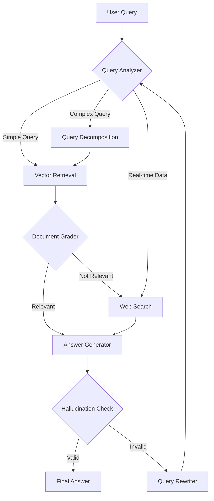

# Advanced Agentic RAG Architecture

## System Overview

This document describes the advanced RAG (Retrieval Augmented Generation) architecture for CropFresh AI.

## Architecture Components

### 1. Input Layer
- **User Query**: Accepts text and voice inputs
- **Query Processing**: Analyzes, expands, and optimizes queries

### 2. Query Processing Layer
- **Query Analyzer**: Classifies query type (vector, web, decompose, direct)
- **Query Expansion**: Generates multiple query variations for better recall
- **HyDE Generator**: Creates hypothetical document embeddings

### 3. Multi-Strategy Retrieval

#### RAPTOR Tree (Hierarchical Retrieval)

RAPTOR builds a hierarchical tree from documents:
- **Level 0**: Original document chunks (leaf nodes)
- **Level 1-N**: Cluster summaries at increasing abstraction
- **Root**: High-level document summary

#### Hybrid Search
- **BM25 (Keyword)**: Sparse retrieval for exact matches
- **Dense Vectors**: Semantic similarity via BGE-M3 embeddings
- **RRF Fusion**: Combines rankings for optimal results

#### Graph RAG
- **Neo4j Knowledge Graph**: Relationship-aware retrieval
- **Entity Extraction**: Identifies crops, farmers, buyers, locations
- **Multi-hop Reasoning**: Traverses relationships for context

#### Real-Time APIs
- **eNAM**: Live mandi prices
- **IMD Weather**: Current weather and forecasts
- **Google AMED**: Crop monitoring data

### 4. Processing Pipeline
- **Reranking**: Cross-Encoder, Cohere, ensemble methods
- **Document Grading**: CRAG pattern for relevance scoring
- **Web Search Fallback**: For real-time or missing information

### 5. Generation Layer
- **LLM Generation**: Groq/Gemini for response generation
- **Hallucination Check**: Self-RAG pattern for validation
- **Query Rewriter**: Retry mechanism for failed retrievals

## Data Flow

## Key Features

### Implemented ✅
- Qdrant Cloud vector store
- BGE-M3 multilingual embeddings (1024-dim)
- Hybrid search with BM25 + Dense + RRF
- Cross-encoder reranking
- Neo4j Graph RAG
- CRAG document grading
- Self-RAG hallucination checking
- LangGraph workflow orchestration
- LangSmith observability

### Planned 🚧
- RAPTOR hierarchical retrieval
- Contextual chunking
- Multi-query expansion
- HyDE retrieval
- Cohere reranking
- Real-time API integration (eNAM, IMD, AMED)
- RAGAS evaluation framework

## Related Documents

- [Implementation Plan](./advanced_rag_implementation_plan.md)
- [API Documentation](../src/api/routes/rag.py)
